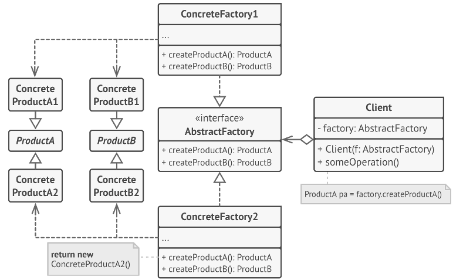

# Abstract Factory

## Prerequisite

This documents assume that
 - You have basic knowledge of c#
 - You know how to read class diagram

&nbsp;
## 1. Intent

Provide an interface for creating families of related or dependent objects without specifying their concrete classes.<sup>a)</sup>

&nbsp;
## 2. Structure
#### Class diagram
\
_BCIT COMP3522_<sup>b)</sup>


&nbsp;
## 3. Participants
There are many participants as you can see above class diagram.
- `AbstractFactory`
    - declares an interface for operations that create abstract products
- `ConcreteFactory`
    - implements the operations to create concrete product objects
- `Product`
    - defines a product object to be created by the corresponding concrete factory
    - implements the AbstractProduct interface
- `AbstractProduct`
    - declares an interface for a type of product object
- `Client`
    - uses interfaces declared by AbstractFactory and AbstractProduct classes

_https://www.dofactory.com/net/abstract-factory-design-pattern_<sup>c)</sup>


&nbsp;
## 4. Sample Code 
`Factory`
```c#
    public interface IAbstractFactory
    {
        IAbstractProductA CreateProductA();
        IAbstractProductB CreateProductB();
    }
    
    public class ConcreteFactoryA : IAbstractFactory
    {
        public IAbstractProductA CreateProductA()
        {
            return new ProductA1();
        }
        public IAbstractProductB CreateProductB()
        {
            return new ProductB1();
        }
    }
 
    public class ConcreteFactoryB : IAbstractFactory
    {
        public IAbstractProductA CreateProductA()
        {
            return new ProductA2();
        }
        public IAbstractProductB CreateProductB()
        {
            return new ProductB2();
        }
    }
```

`Product`
```c#
    public interface IAbstractProductA { }
    public class ProductA1 : IAbstractProductA { }
    public class ProductA2 : IAbstractProductA { }

    public interface IAbstractProductB { }
    public class ProductB1 : IAbstractProductB { }
    public class ProductB2 : IAbstractProductB { }
```
`Client`
```c#
    public class Client
    {
        private IAbstractProductA _productA;
        private IAbstractProductB _productB;
 
        public Client(IAbstractFactory factory)
        {
            _productA = factory.CreateProductA();
            _productB = factory.CreateProductB();
        }
    }
```

&nbsp;
## 5. Pros and Cons
### Pros 👍
- Good to use when there is chance to have more products in the future.
- Enhance product consistency by creating products from factory class.

### Cons 👎
- A number of classes and interfaces in the code can make the code complex and hard to read. 
- Hard to maintain the code because of many files.

&nbsp;
## 6. References
#### a) Erich Gamma, Richard Helm, Ralph Johnson, John Vlissides, _Design Patterns - Elements of Reusable Object-Oriented Software_ (Addison-Wesley, 1994), 87
#### b) British Columbia Institute of Technology COMP3522 Week12, DesignPatternsTable
#### c) https://www.dofactory.com/net/abstract-factory-design-pattern#participants

