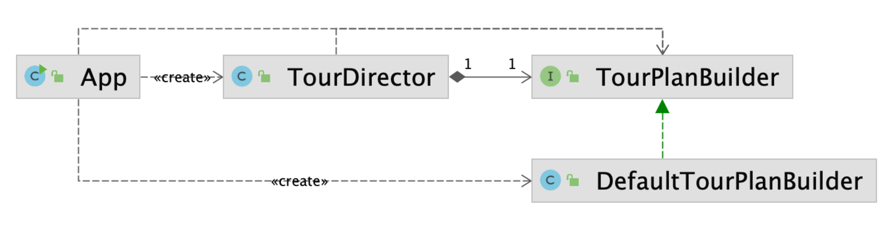

# Builder Pattern

### 📝 생성자의 매개변수가 많다면 빌더를 고려하라!

**동일한 프로세스**를 거쳐 다양한 구성의 **인스턴스를 만드는 방법**.
* (복잡한) 객체를 만드는 프로세스를 독립적으로 분리할 수 있다.

## 1. Implementation
* Fluent API(Interface) 또는  Method chaining 으로 구현한다.
* 생성자나 자바빈즈 보다 안전하다.

## 2. Pros and cons
* 장점: 
  * 만들기 복잡한 객체를 순차적으로 만들 수 있다.
  * 복잡한 객체를 만드는 구체적인 과정을 숨길 수 있다.
  * 동일한 프로세스를 통해 각기 다르게 구성된 객체를 만들 수 있다.
  * 불완전한 객체를 사용하지 못하도록 방지 할 수 있다.
  * 클래스를 불변(immutable)으로 만들 수 있다.
* 단점
  * 원하는 객체를 만들려면 빌더부터 만들어야 한다.
  * 구조가 복잡해 진다.

## 3. Example
* 자바 8 Stream.Builder API
* StringBuilder
* 롬북 @Builder
* Spring
  * UriComponentsBuilder
  * MockMvcWebClientBuilder
  * ... Builder
* ProtocolBuffers

## 4. Etc.
* 객체를 생성하는 다양한 방법
  * Constructor
  > public ClassName(int param1, String param2) { ... }
  * Static Factory Method
  > of newInstance, getInstance, getService ...
  > 
  > 
  * Builder
  > 
