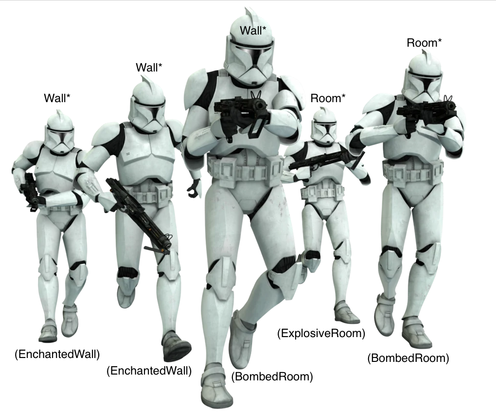

# Prototype

### In One Liner

If the objects have complex initializations, existing objects can generate a clone itself at **runtime** rather than instantiate & initialize on client side.

### Description

Instantiating and initializing of an Object can be overwhelming sometimes. It could be multiple attributes that are not easily defined or references to several compounded objects.

And secondly, best practice is not to do too many things in constructors, if possible. Memory Allocation and initialization are happening in different phase and you might face an absurd error.

[C++ std::vector deconstructor problem](https://stackoverflow.com/questions/62304795/why-does-stdvector-call-the-destructor-while-leaving-a-different-scope)

From a client standpoint, it can lead to program fatal error or unexpected result due to lack of object understaning.

Since Prototype pattern mainly focuses on *duplicating* its own instance which is <ins>pre-initialized or at least it knows what it wants to do</ins>, defining **clone()** interface can bring a solution to it.

And thanks to the clone chaining, subclasses become redundant since prototype function will handle various types. But only if when the object do not have circular references (peer-to-peer reference).

> Use the pattern when you want to reduce the number of subclasses that only differ in the way they initialize their respective objects.
[Reference](https://refactoring.guru/design-patterns/prototype)


### Pros 

- Decouple number of steps of initialization from client side into pre-generated singleton or preexisting object.
- It happens in Runtime, not in static compile time. It means it is very flexible in terms of handling dynamic runtime states. 
- It provides a better way of inheritance if the object is very complex to create. 

### Cons

- It could limit relationships of compounded objects depends on Program structures, in other word, circular referencing will kill it.

### Sample

GoF's Maze Sample

There is a Factory interface called MazeFactory.

And MazePrototypeFactory is an extension to the MazeFactory. When it is instantiated, it receives pre-generated ConcreteProducts and will reuse them when it has to.

**MazePrototypeFactory.h**
```c++
class MazeFactory
{
public:
    virtual Maze* MakeMaze() const;
    virtual Wall* MakeWall() const;
    virtual Door* MakeDoor(Room* roomA, Room* roomB) const;
    virtual Room* MakeRoom(int roomNumber) const;
}

class MazePrototypeFactory: public MazeFactory
{
public:
    MazePrototypeFactory(Maze*, Wall*, Door*, Room*);

    virtual Maze* MakeMaze() const;
    virtual Wall* MakeWall() const;
    virtual Door* MakeDoor(Room* roomA, Room* roomB) const;
    virtual Room* MakeRoom(int roomNumber) const;

private:
    Maze* _pPrototypeMaze;
    Wall* _pPrototypeWall;
    Door* _pPrototypeDoor;
    Room* _pPrototypeRoom;
}
```

Now, MazePrototypeFactory implements each virtual functions using Prototype instances that received as constructor parameters **in runtime**. The MazePrototypeFactory is having a "Prototype Manager" role as well in this example. 

**MazePrototypeFactory.cpp**
```c++
#include "MazePrototypeFactory.h"

MazePrototypeFactory::MazePrototypeFactory(
    Maze* maze, Wall* wall, Door* door, Room* room
) : _pPrototypeMaze(maze),
_pPrototypeWall(wall), 
_pPrototypeDoor(door),
_pPrototypeRoom(room)
{}

MazePrototypeFactory::~MazePrototypeFactory()
{
    delete _pPrototypeMaze;
    delete _pPrototypeWall;
    delete _pPrototypeDoor;
    delete _pPrototypeRoom;
}

Maze* MazePrototypeFactory::MakeMaze() const 
{
    return _pPrototypeMaze->Clone();
}
Wall* MazePrototypeFactory::MakeWall() const 
{
    return _pPrototypeWall->Clone();
}
Door* MazePrototypeFactory::MakeDoor(Room* roomA, Room* roomB) const
{
    Door* newDoor = _pPrototypeDoor->Clone();
    newDoor->Initialize(roomA, roomB);
    return newDoor;
}
Room* MazePrototypeFactory::MakeRoom(int roomNumber) const
{
    Room* newRoom = _pPrototypeRoom->Clone();
    newRoom->Initialize(roomNumber);
    return newRoom;
}
```

Each product will have their own clone functions defined. And depends on how they create clone, logic gets differ.

For example, BombedRoom could generate ExplosiveRoom after it is being cloned 5 times or more. 

Runtime logic gets dynamic thanks to this characteristic of the pattern.

**BombedRoom.h**
```c++
class BombedRoom: public Room
{
public:
    BombedRoom();
    BombedRoom(const BombedRoom&); // For the assign operator & clone

    virtual void Initialize(int roomID);
    virtual Room* Clone() const;
private:
    static int EXPLOSIVE_ROOM_COUNTER = 0;
}

class ExplosiveRoom: public Room
{
public:
    ExplosiveRoom();
    ExplosiveRoom(const BombedRoom&);

    virtual void Initialize(int roomID);
}

```

**BombedRoom.cpp**
```c++
#include "BombedRoom.h"

BombedRoom::BombedRoom()
{
}

// Call parent constructor
BombedRoom::BombedRoom(const BombedRoom& room)
    : Room(room)
{
}

Room* BombedRoom::Initialize(int roomID)
{
    this->roomID = roomID;
}

Room* BombedRoom::Clone() const
{
    EXPLOSIVE_ROOM_COUNTER++;
    
    srand(time(NULL))
    if (EXPLOSIVE_ROOM_COUNTER % (rand() % 5 + 1))
    {
        return new ExplosiveRoom(*this);
    }
    else
    {
        return new BombedRoom(*this);
    }
}

ExplosiveRoom::ExplosiveRoom()
{
}

ExplosiveRoom::ExplosiveRoom(const BombedRoom& room)
    : Room(room)
{
}

Room* ExplosiveRoom::Initialize(int roomID)
{
    this->roomID = roomID;
}
```

To use MazePrototypeFactory, just choose which Product Classes you want to use. Then the factory will clone each of components based on given objects.

```c++
#include "MazePrototypeFactory.h"

int main()
{
    MazePrototypeFactory newFactory(
        new Maze(),
        new EnchantedWall(),
        new BombedRoom(),
        new Door()
    );
}
```


[https://starwars.fandom.com/wiki/Clone_trooper/Legends](https://starwars.fandom.com/wiki/Clone_trooper/Legends)