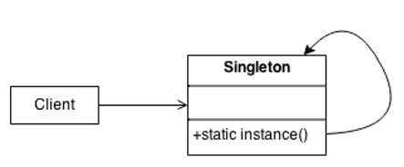

# Singleton

## Prerequisite

This documents assume that
 - You have basic knowledge of c#
 - You know how to read class diagram

&nbsp;
## 1. Intent
Ensure a class only has __one instance__, and provide a global point of access to it.<sup>a)</sup>

&nbsp;
## 2. Structure
#### Class diagram
\
_BCIT COMP3522_<sup>b)</sup>


&nbsp;
## 3. Participants
There are many participants as you can see above class diagram.
- `Singlton`
    - defines an Instance operation that lets clients access its unique instance. Instance is a class operation.
    - responsible for creating and maintaining its own unique instance.

https://www.dofactory.com/net/singleton-design-pattern<sup>c)</sup>


&nbsp;
## 4. Sample Code 
`Singlton`
```c#
using System;
namespace Singleton.Structural
{
    /// <summary>
    /// Singleton Design Pattern
    /// </summary>
    public class Program
    {
        public static void Main(string[] args)
        {
            // Constructor is protected -- cannot use new
            Singleton s1 = Singleton.Instance();
            Singleton s2 = Singleton.Instance();
            // Test for same instance
            if (s1 == s2)
            {
                Console.WriteLine("Objects are the same instance");
            }
            // Wait for user
            Console.ReadKey();
        }
    }
    /// <summary>
    /// The 'Singleton' class
    /// </summary>
    public class Singleton
    {
        static Singleton instance;
        // Constructor is 'protected'
        protected Singleton()
        {
        }
        public static Singleton Instance()
        {
            // Uses lazy initialization.
            // Note: this is not thread safe.
            if (instance == null)
            {
                instance = new Singleton();
            }
            return instance;
        }
    }
}
```

`Realworld Example`
```c#
using System;
using System.Collections.Generic;

namespace Singleton.RealWorld
{
    /// <summary>
    /// Singleton Design Pattern
    /// </summary>

    public class Program
    {
        public static void Main(string[] args)
        {
            LoadBalancer b1 = LoadBalancer.GetLoadBalancer();
            LoadBalancer b2 = LoadBalancer.GetLoadBalancer();
            LoadBalancer b3 = LoadBalancer.GetLoadBalancer();
            LoadBalancer b4 = LoadBalancer.GetLoadBalancer();

            // Same instance?

            if (b1 == b2 && b2 == b3 && b3 == b4)
            {
                Console.WriteLine("Same instance\n");
            }

            // Load balance 15 server requests

            LoadBalancer balancer = LoadBalancer.GetLoadBalancer();
            for (int i = 0; i < 15; i++)
            {
                string server = balancer.Server;
                Console.WriteLine("Dispatch Request to: " + server);
            }

            // Wait for user

            Console.ReadKey();
        }
    }

    /// <summary>
    /// The 'Singleton' class
    /// </summary>

    public class LoadBalancer
    {
        static LoadBalancer instance;
        List<string> servers = new List<string>();
        Random random = new Random();

        // Lock synchronization object

        private static object locker = new object();

        // Constructor (protected)

        protected LoadBalancer()
        {
            // List of available servers
            servers.Add("ServerI");
            servers.Add("ServerII");
            servers.Add("ServerIII");
            servers.Add("ServerIV");
            servers.Add("ServerV");
        }

        public static LoadBalancer GetLoadBalancer()
        {
            // Support multithreaded applications through
            // 'Double checked locking' pattern which (once
            // the instance exists) avoids locking each
            // time the method is invoked

            if (instance == null)
            {
                lock (locker)
                {
                    if (instance == null)
                    {
                        instance = new LoadBalancer();
                    }
                }
            }

            return instance;
        }

        // Simple, but effective random load balancer

        public string Server
        {
            get
            {
                int r = random.Next(servers.Count);
                return servers[r].ToString();
            }
        }
    }
}
```
https://www.dofactory.com/net/singleton-design-pattern<sup>c)</sup>

&nbsp;
## 5. Pros and Cons
### Pros 👍
- Memory efficiency
- Can be used anywhere in a project

### Cons 👎
- Can interact with other objects resulting SOLID principle violation
- Need to handle multi-Thread environment

&nbsp;
## 6. References
#### a) Erich Gamma, Richard Helm, Ralph Johnson, John Vlissides, _Design Patterns - Elements of Reusable Object-Oriented Software_ (Addison-Wesley, 1994), 127
#### b) British Columbia Institute of Technology COMP3522 Week12, DesignPatternsTable
#### c) https://www.dofactory.com/net/singleton-design-pattern
