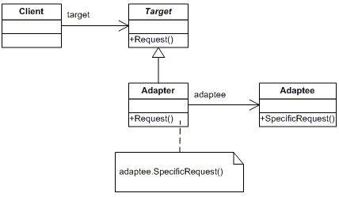

# Adaptor

## Prerequisite

This documents assume that
 - You have basic knowledge of c#
 - You know how to read class diagram

&nbsp;
## 1. Intent

Convert the interface of a class into another interface clients expect. Adapter lets classes work together that couldn't otherwise because of incompatible interfaces.<sup>a)</sup> This pattern also known as 'Wrapper'.

&nbsp;
## 2. Structure
#### Class diagram
\
https://www.dofactory.com/net/adapter-design-pattern#uml<sup>b)</sup>


&nbsp;
## 3. Participants
- `Target`
    - defines the domain-specific interface that Client uses.
- `Adapter`
    - adapts the interface Adaptee to the Target interface.
- `Adaptee`
    - defines an existing interface that needs adapting.
- `Client`
    - collaborates with objects conforming to the Target interface.

https://www.dofactory.com/net/adapter-design-pattern#participants<sup>c)</sup>


&nbsp;
## 4. Sample Code 
`Adaptor`
```c#
using System;

namespace Adapter.Structural
{
    /// <summary>
    /// Adapter Design Pattern
    /// </summary>
    public class Program
    {
        public static void Main(string[] args)
        {
            // Create adapter and place a request

            Target target = new Adapter();
            target.Request();
        }
    }

    /// <summary>
    /// The 'Target' class
    /// </summary>
    public class Target
    {
        public virtual void Request()
        {
            Console.WriteLine("Called Target Request()");
        }
    }

    /// <summary>
    /// The 'Adapter' class
    /// </summary>
    public class Adapter : Target
    {
        private Adaptee adaptee = new Adaptee();

        public override void Request()
        {
            // Possibly do some other work
            // and then call SpecificRequest
            adaptee.SpecificRequest();
        }
    }

    /// <summary>
    /// The 'Adaptee' class
    /// </summary>
    public class Adaptee
    {
        public void SpecificRequest()
        {
            Console.WriteLine("Called SpecificRequest()");
        }
    }
}
```

Output
```
Called SpecificRequest()
```

`Realworld Example`
```c#
using System;

namespace Adapter.RealWorld
{
    /// <summary>
    /// Adapter Design Pattern
    /// </summary>
    public class Program
    {
        public static void Main(string[] args)
        {
            // Non-adapted chemical compound
            Compound unknown = new Compound();
            unknown.Display();

            // Adapted chemical compounds
            Compound water = new RichCompound("Water");
            water.Display();
            Compound benzene = new RichCompound("Benzene");
            benzene.Display();
            Compound ethanol = new RichCompound("Ethanol");
            ethanol.Display();
        }
    }

    /// <summary>
    /// The 'Target' class
    /// </summary>
    public class Compound
    {
        protected float boilingPoint;
        protected float meltingPoint;
        protected double molecularWeight;
        protected string molecularFormula;

        public virtual void Display()
        {
            Console.WriteLine("\nCompound: Unknown ------ ");
        }
    }

    /// <summary>
    /// The 'Adapter' class
    /// </summary>
    public class RichCompound : Compound
    {
        private string chemical;
        private ChemicalDatabank bank;

        // Constructor
        public RichCompound(string chemical)
        {
            this.chemical = chemical;
        }

        public override void Display()
        {
            // The Adaptee
            bank = new ChemicalDatabank();

            boilingPoint = bank.GetCriticalPoint(chemical, "B");
            meltingPoint = bank.GetCriticalPoint(chemical, "M");
            molecularWeight = bank.GetMolecularWeight(chemical);
            molecularFormula = bank.GetMolecularStructure(chemical);

            Console.WriteLine("\nCompound: {0} ------ ", chemical);
            Console.WriteLine(" Formula: {0}", molecularFormula);
            Console.WriteLine(" Weight : {0}", molecularWeight);
            Console.WriteLine(" Melting Pt: {0}", meltingPoint);
            Console.WriteLine(" Boiling Pt: {0}", boilingPoint);
        }
    }

    /// <summary>
    /// The 'Adaptee' class
    /// </summary>
    public class ChemicalDatabank
    {
        // The databank 'legacy API'
        public float GetCriticalPoint(string compound, string point)
        {
            // Melting Point
            if (point == "M")
            {
                switch (compound.ToLower())
                {
                    case "water": return 0.0f;
                    case "benzene": return 5.5f;
                    case "ethanol": return -114.1f;
                    default: return 0f;
                }
            }

            // Boiling Point
            else
            {
                switch (compound.ToLower())
                {
                    case "water": return 100.0f;
                    case "benzene": return 80.1f;
                    case "ethanol": return 78.3f;
                    default: return 0f;
                }
            }
        }

        public string GetMolecularStructure(string compound)
        {
            switch (compound.ToLower())
            {
                case "water": return "H20";
                case "benzene": return "C6H6";
                case "ethanol": return "C2H5OH";
                default: return "";
            }
        }

        public double GetMolecularWeight(string compound)
        {
            switch (compound.ToLower())
            {
                case "water": return 18.015;
                case "benzene": return 78.1134;
                case "ethanol": return 46.0688;
                default: return 0d;
            }
        }
    }
}
```

Output
```
Compound: Unknown ------

Compound: Water ------
 Formula: H20
 Weight : 18.015
 Melting Pt: 0
 Boiling Pt: 100

Compound: Benzene ------
 Formula: C6H6
 Weight : 78.1134
 Melting Pt: 5.5
 Boiling Pt: 80.1

Compound: Alcohol ------
 Formula: C2H6O2
 Weight : 46.0688
 Melting Pt: -114.1
 Boiling Pt: 78.3
```
https://www.dofactory.com/net/adapter-design-pattern#structural<sup>d)</sup>

&nbsp;
## 5. Pros and Cons
### Pros 👍
- No modification is needed for all the existing classes.
- Easy to implement and increase reusability.

### Cons 👎
- Cannot override methods in Adaptee.
- Adapter and Adaptee are different objects. There is no relation between Wrappee and Wrapper.

&nbsp;
## 6. References
#### a) Erich Gamma, Richard Helm, Ralph Johnson, John Vlissides, _Design Patterns - Elements of Reusable Object-Oriented Software_ (Addison-Wesley, 1994), 139
#### b) https://www.dofactory.com/net/adapter-design-pattern#uml
#### c) https://www.dofactory.com/net/adapter-design-pattern#participants
#### d) https://www.dofactory.com/net/adapter-design-pattern#structural
