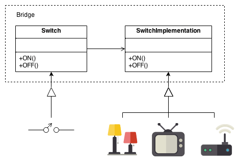

#  Bridge (or Handle/Body)

### In One Liner

Simple Abstraction-Implementation is just providing an interface and relating ConcreteObjects that implement the interface.

Bridge Pattern is providing **a bit massive** abstraction layers they talk to other abstraction layers which contain interfaces of independent implementations.

Hence, each abstraction layer is connected by bridges and the main abstract interfaces (which a client uses) conform features by using compositions.


[Reference](https://refactoring.guru/design-patterns/bridge)


[Reference](https://sourcemaking.com/design_patterns/bridge)


### Pros 

- Provides platform independent, implementation independent structure that separate out any relationship in between them.
- Change behavior of actual implementation in runtime.
- Encapsulate any dependencies or information from client side.

### Cons

- You might not need this extra flexibility from paying complexity of the code.  

### Sample

The Abstraction (user side) and Implementation (concrete side) might not share any interfaces since Implementation layer will provide primitive controls of platform dependent codes while Abstraction layer will provide application (higher level) level of operations based on those primitive apis.

**Implementation layer**
```c++
#include <string>

class Implementation
{
public:
    virtual ~Implementation() {}
    virtual std::string PrimitiveOperation() const = 0;
}

class WindowImplementation
{
public:
    std::string PrimitiveOperation() const
    {
        return "I am Window dependent Concrete Implementation";
    }
}
class LinuxImplementation
{
public:
    std::string PrimitiveOperation() const
    {
        return "I am Linux dependent Concrete Implementation";
    }
}
class MacImplementation
{
public:
    std::string PrimitiveOperation() const
    {
        return "I am Mac dependent Concrete Implementation";
    }
}
```

**Abstraction layer**
```c++
#include "Implementation.h"

class DefaultGUIForm
{
public:
    DefaultGUIForm(Implementation* impl) : _pImpl(impl)
    {

    }

    virtual ~DefaultGUIForm() {}
    virtual std::string Operate() const
    {
        return "Basic GUI Layer ... " + _pImpl->PrimitiveOperation();
    }
protected:
    Implementation* _pImpl;
}

class MetroFormStyleGUI : public DefaultGUIForm
{
public:
    MetroFormStyleGUI(Implementation* impl) : _pImpl(impl)
    {

    }
    std::string Operate() const
    {
        return "MetroForm Style GUI ... " + _pImpl->PrimitiveOperation();
    }
}
```

### IRL Example

If you think about Graphics card implementation, it is exactly Bridge pattern.

Multiple Graphics Card should work in multiple operating systems.

How they talk to each other is bi-directional bridging by defining abstraction layer of hardware control and hardware access apis. At the end, DirectX9, DirectX11, Vulcan, Metal, etcs are all different version of **Abstract Classes** and graphics cards are **Concrete Objects**
