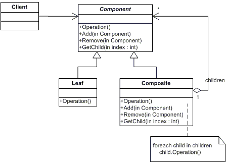

# Composite

## Prerequisite

This documents assume that
 - You have basic knowledge of c#
 - You know how to read class diagram

&nbsp;
## 1. Intent

Compose objects into tree structures to represent part-whole hierachies. Composite lets clients treat individual objects and compositions of objects uniformly.<sup>a)</sup>

&nbsp;
## 2. Structure
#### Class diagram
\
https://www.dofactory.com/net/composite-design-pattern#uml<sup>b)</sup>


&nbsp;
## 3. Participants
- `Component`
    - declares the interface for objects in the composition.
    - implements default behavior for the interface common to all classes, as appropriate.
    - declares an interface for accessing and managing its child components.
    - (optional) defines an interface for accessing a component's parent in the recursive structure, and implements it if that's appropriate.
- `Leaf`
    - represents leaf objects in the composition. A leaf has no children.
    - defines behavior for primitive objects in the composition.
- `Composite`
    - defines behavior for components having children.
    - stores child components.
    - implements child-related operations in the Component interface.
- `Client`
    - manipulates objects in the composition through the Component interface.

https://www.dofactory.com/net/composite-design-pattern#participants<sup>c)</sup>


&nbsp;
## 4. Sample Code 
`Composite`
```c#
using System;
using System.Collections.Generic;

namespace Composite.Structural
{
    /// <summary>
    /// Composite Design Pattern
    /// </summary>

    public class Program
    {
        public static void Main(string[] args)
        {
            // Create a tree structure

            Composite root = new Composite("root");
            root.Add(new Leaf("Leaf A"));
            root.Add(new Leaf("Leaf B"));

            Composite comp = new Composite("Composite X");
            comp.Add(new Leaf("Leaf XA"));
            comp.Add(new Leaf("Leaf XB"));

            root.Add(comp);
            root.Add(new Leaf("Leaf C"));

            // Add and remove a leaf

            Leaf leaf = new Leaf("Leaf D");
            root.Add(leaf);
            root.Remove(leaf);

            // Recursively display tree

            root.Display(1);

            // Wait for user

            Console.ReadKey();
        }
    }

    /// <summary>
    /// The 'Component' abstract class
    /// </summary>

    public abstract class Component
    {
        protected string name;

        // Constructor

        public Component(string name)
        {
            this.name = name;
        }

        public abstract void Add(Component c);
        public abstract void Remove(Component c);
        public abstract void Display(int depth);
    }

    /// <summary>
    /// The 'Composite' class
    /// </summary>

    public class Composite : Component
    {
        List<Component> children = new List<Component>();

        // Constructor

        public Composite(string name)
            : base(name)
        {
        }

        public override void Add(Component component)
        {
            children.Add(component);
        }

        public override void Remove(Component component)
        {
            children.Remove(component);
        }

        public override void Display(int depth)
        {
            Console.WriteLine(new String('-', depth) + name);

            // Recursively display child nodes

            foreach (Component component in children)
            {
                component.Display(depth + 2);
            }
        }
    }

    /// <summary>
    /// The 'Leaf' class
    /// </summary>

    public class Leaf : Component
    {
        // Constructor

        public Leaf(string name)
            : base(name)
        {
        }

        public override void Add(Component c)
        {
            Console.WriteLine("Cannot add to a leaf");
        }

        public override void Remove(Component c)
        {
            Console.WriteLine("Cannot remove from a leaf");
        }

        public override void Display(int depth)
        {
            Console.WriteLine(new String('-', depth) + name);
        }
    }
}
```
Output
```
-root
---Leaf A
---Leaf B
---Composite X
-----Leaf XA
-----Leaf XB
---Leaf C
```
---
`Realworld Example`
```c#
using System;
using System.Collections.Generic;

namespace Composite.RealWorld
{
    /// <summary>
    /// Composite Design Pattern
    /// </summary>

    public class Program
    {
        public static void Main(string[] args)
        {
            // Create a tree structure 

            CompositeElement root = new CompositeElement("Picture");
            root.Add(new PrimitiveElement("Red Line"));
            root.Add(new PrimitiveElement("Blue Circle"));
            root.Add(new PrimitiveElement("Green Box"));

            // Create a branch

            CompositeElement comp = new CompositeElement("Two Circles");
            comp.Add(new PrimitiveElement("Black Circle"));
            comp.Add(new PrimitiveElement("White Circle"));
            root.Add(comp);

            // Add and remove a PrimitiveElement

            PrimitiveElement pe = new PrimitiveElement("Yellow Line");
            root.Add(pe);
            root.Remove(pe);

            // Recursively display nodes

            root.Display(1);

            // Wait for user

            Console.ReadKey();
        }
    }

    /// <summary>
    /// The 'Component' Treenode
    /// </summary>

    public abstract class DrawingElement
    {
        protected string name;

        // Constructor

        public DrawingElement(string name)
        {
            this.name = name;
        }

        public abstract void Add(DrawingElement d);
        public abstract void Remove(DrawingElement d);
        public abstract void Display(int indent);
    }

    /// <summary>
    /// The 'Leaf' class
    /// </summary>

    public class PrimitiveElement : DrawingElement
    {
        // Constructor

        public PrimitiveElement(string name)
            : base(name)
        {
        }

        public override void Add(DrawingElement c)
        {
            Console.WriteLine(
                "Cannot add to a PrimitiveElement");
        }

        public override void Remove(DrawingElement c)
        {
            Console.WriteLine(
                "Cannot remove from a PrimitiveElement");
        }

        public override void Display(int indent)
        {
            Console.WriteLine(
                new String('-', indent) + " " + name);
        }
    }

    /// <summary>
    /// The 'Composite' class
    /// </summary>

    public class CompositeElement : DrawingElement
    {
        List<DrawingElement> elements = new List<DrawingElement>();

        // Constructor

        public CompositeElement(string name)
            : base(name)
        {
        }

        public override void Add(DrawingElement d)
        {
            elements.Add(d);
        }

        public override void Remove(DrawingElement d)
        {
            elements.Remove(d);
        }

        public override void Display(int indent)
        {
            Console.WriteLine(new String('-', indent) +
                "+ " + name);

            // Display each child element on this node

            foreach (DrawingElement d in elements)
            {
                d.Display(indent + 2);
            }
        }
    }
}
```
Output
```
-+ Picture
--- Red Line
--- Blue Circle
--- Green Box
---+ Two Circles
----- Black Circle
----- White Circle
```

&nbsp;
## 5. Pros and Cons
### Pros 👍
- New classes can be added easily because all the classes are inherited from Component.
- Easy to understand compare to other design patterns.

### Cons 👎
- It can lead to overly general classes because all classes in the hierarchy must follow the abstract interface.
- Hard to distinguish between objects.

&nbsp;
## 6. References
#### a) Erich Gamma, Richard Helm, Ralph Johnson, John Vlissides, _Design Patterns - Elements of Reusable Object-Oriented Software_ (Addison-Wesley, 1994), 163
#### b) https://www.dofactory.com/net/composite-design-pattern#uml
#### c) https://www.dofactory.com/net/composite-design-pattern#participants
#### d) https://www.dofactory.com/net/composite-design-pattern#structural
#### e) https://www.dofactory.com/net/composite-design-pattern#realworld

