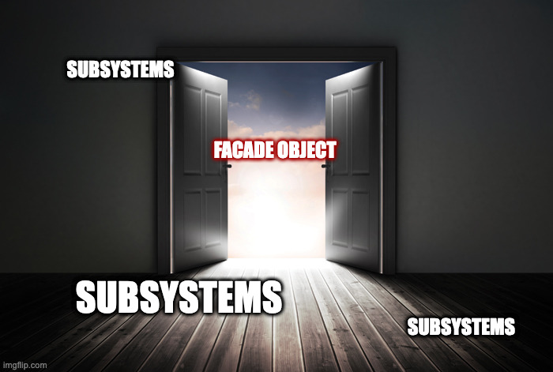

# Facade

(m. The face of a building, especially the principal front that looks onto a street or open space)

### In One Liner

Open a facade (entrance) for the subsystems.

By using Facade object, it hides lots of complex subsystems' APIs and provide integrated & neat interface to control the overall system.



### Pros 

- Define concise and controlled interface of the system that what clients only care about. 
- By protecting its subsystems' structure, it tends to have less bug or behavioral problems since clients do not have access to them.

### Cons

- Facade can grow really fast or get really fat, being a god object 

### IRL Example

**Projector Subsystem**
```c++
class IProjector 
{
public:
    virtual void setGamma(float gamma) = 0;
    virtual float getGamma() = 0;
    virtual void setPattern(int patternType) = 0;
    virtual int getPattern() = 0;
    virtual void setColor(int colorType) = 0;
    virtual int getColor() = 0;
};

class ProjectorDriverA : public IProjector
{
public:    
    void setGamma(float gamma) {}
    float getGamma() {}
    void setPattern(int patternType) {}
    int getPattern()  {}
    void setColor(int colorType) {}
    int getColor() {}
};
class ProjectorDriverB : public IProjector
{
public:    
    void setGamma(float gamma) {}
    float getGamma() {}
    void setPattern(int patternType) {}
    int getPattern()  {}
    void setColor(int colorType) {}
    int getColor() {}
};
```

**Camera Subsystem**
```c++
class ICamera 
{
public:
    virtual void setGain(float gain) = 0;
    virtual float getGain() = 0;
    virtual void setExposure(float exposure) = 0;
    virtual float getExposure() = 0;
};
class CameraDriverA : public ICamera
{
public:    
    void setGain(float gain) {}
    float getGain() {}
    void setExposure(float exposure) {}
    float getExposure() {}
};
class CameraDriverB : public ICamera
{
public:    
    void setGain(float gain) {}
    float getGain() {}
    void setExposure(float exposure) {}
    float getExposure() {}
};
```

**Scanner**
```c++
class IScanner
{
public:
    virtual bool initialize() = 0;
    virtual bool connectComponents() = 0;
    virtual std::string modelName() = 0;
    virtual bool scan() = 0;
    virtual void startLiveImageUpdate() = 0;
    virtual void whiteBalance() = 0;
};

class ScannerTypeA : public IScanner
{
public:
    bool initialize() {}
    bool connectComponents() {}
    std::string modelName() {}
    bool scan() {}
    void startLiveImageUpdate() {}
    void whiteBalance() {}
};
```

