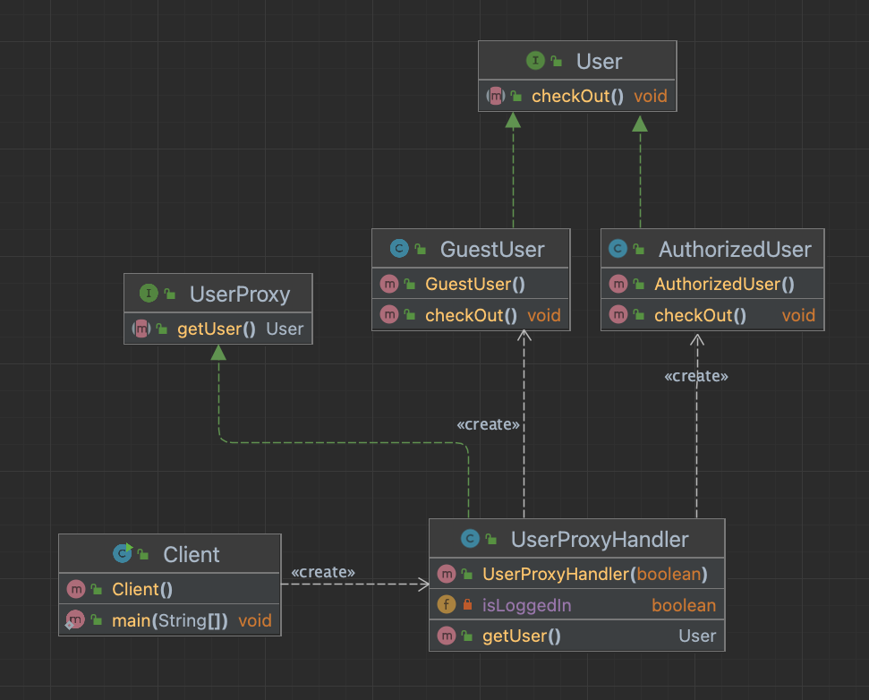

# Proxy design pattern example

#### Protection proxy

<div style="text-align:center">

</div>

- Client
```java
public class Client {
    public static void main(String[] args) {
        boolean isUserLoggedIn = UserManagerService.isUserLoggedIn(); // UserManagerService (not implemented)
        User user = new UserProxyHandler(isUserLoggedIn).getUser();

        user.checkOut();
    }
}
```

- User (interface)
```java
public interface User {
    void checkOut();
}
```

- AuthorizedUser
```java
public class AuthorizedUser implements User {
    @Override
    public void checkOut() {
        System.out.println("Checking out...");
    }
}
```

- GuestUser
```java
public class GuestUser implements User {
    @Override
    public void checkOut() {
        System.out.println("Redirecting to registration page...");
    }
}
```

- UserProxy (Optional)
```java
public interface UserProxy {
    User getUser();
}
```

- UserProxyHandler
```java
public class UserProxyHandler implements UserProxy {

    private boolean isLoggedIn;

    public UserProxyHandler(boolean isLoggedIn) {
        this.isLoggedIn = isLoggedIn;
    }

    @Override
    public User getUser() {
        return isLoggedIn ? new AuthorizedUser() : new GuestUser();
    }
}
```