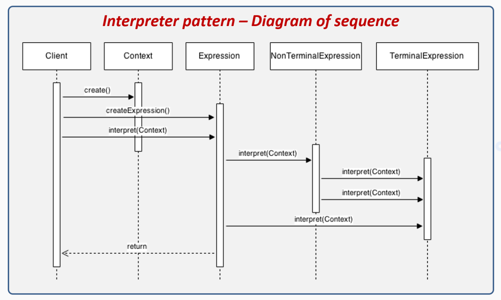
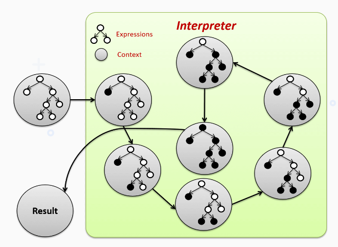

# Interpreter pattern example

```java
/*
  https://sourcemaking.com/design_patterns/interpreter/java/2
*/

// Stack Char (Structure to store characters)
class StkChar {
    private char[] arr = new char[9];
    private int sp  = -1;

    void push(char ch) {
        if (!isFull()) {
            arr[++sp] = ch;
        }
    }

    char pop() {
        if (isEmpty()) {
            return '\0'; // null character
        }
        return arr[sp--];
    }

    boolean isFull() {
        return sp == arr.length-1;
    }

    boolean isEmpty() {
        return sp == -1;
    }
}

// Stack Integer (Structure to store integers)
class StkInt {
    private int[] arr = new int[9];
    private int   sp  = -1;

    void push(int ch) {
        if (!isFull()) {
            arr[++sp] = ch;
        }
    }

    int pop() {
        if (isEmpty()) {
            return 0;
        }
        return arr[sp--];
    }

    boolean isFull() {
        return sp == arr.length-1;
    }

    boolean isEmpty() {
        return sp == -1;
    }
}

public class InterpreterDemo {

    public static boolean precedence(char a, char b) {
        String high = "*/", low = "+-";
        if (a == '(') {
            return false;
        }
        if (a == ')' && b == '(') {
            System.out.println(")-(");
            return false;
        }
        if (b == '(') {
            return false;
        }
        if (b == ')') {
            return true;
        }
        if (high.indexOf(a) >  - 1 && low.indexOf(b) >  - 1) {
            return true;
        }
        if (high.indexOf(a) >  - 1 && high.indexOf(b) >  - 1) {
            return true;
        }
        //noinspection RedundantIfStatement
        if (low.indexOf(a) >  - 1 && low.indexOf(b) >  - 1) {
            return true;
        }
        return false;
    }

    public static String convertToPostfix(String in) {
        StkChar       operationsStack  = new StkChar();
        StringBuilder out              = new StringBuilder();
        String        operations       = "+-*/()";
        char          topSymbol        = '+';
        boolean       empty;

        for (int i = 0; i < in.length(); i++) {
            // if not operation, append it to out (StringBuilder)
            if (operations.indexOf(in.charAt(i)) == -1)
                out.append(in.charAt(i));
            else { // if it's an operation
                while (!(empty = operationsStack.isEmpty()) // operation exists and if it precedes the current top symbol
                        && interpreter.precedence(topSymbol = operationsStack.pop(), in.charAt(i)))
                    out.append(topSymbol); // append it to top symbol
                if (!empty) { 
                    operationsStack.push(topSymbol);
                }
                if (empty || in.charAt(i) != ')') {
                    operationsStack.push(in.charAt(i));
                }
                else topSymbol = operationsStack.pop();
            }
        }
        while (!operationsStack.isEmpty()) {
            out.append( operationsStack.pop() );
        }
        return out.toString();
    }

    public static int evaluate( String in ) {
        StkInt stkInt = new StkInt();
        String operations = "+-*/";
        for (int a, b, i=0; i < in.length(); i++) {
            if (operations.indexOf(in.charAt(i)) == -1) {
                stkInt.push(in.charAt(i) - 48);
            } else {
                b = stkInt.pop();
                a = stkInt.pop();
                if (in.charAt(i) == '+') {
                    a = a + b;
                }
                if (in.charAt(i) == '-') {
                    a = a - b;
                }
                if (in.charAt(i) == '*') {
                    a = a * b;
                }
                if (in.charAt(i) == '/') {
                    a = a / b;
                }
                stkInt.push(a);
            }
        }
        return stkInt.pop();
    }

    public static void main( String[] args ) {
        System.out.print(args[0]);

        String postfix = convertToPostfix(args[0]);

        System.out.print( " -- " + postfix );
        System.out.println( " -- " + evaluate( postfix ) );
    }
}
```



_https://reactiveprogramming.io/blog/en/design-patterns/interpreter_


_https://reactiveprogramming.io/blog/en/design-patterns/interpreter_