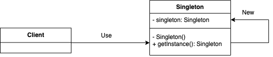

# Singleton
Singleton guarantees the uniqueness of class instance and provide global access point.

## Diagram


### Pattern Component
* <strong> Singleton </strong>
  * define an instance operation and method to access a unique class instance
  * create its unique instance
* Client: use singleton instance by calling `getInstance()` method

## Implementation
### Singleton with Lazy Initialization
```
public class SingletonA {
  private static SingletonA singleton;

  private SingletonA(){};
  
  public static SingletonA getInstance() {
    if (singleton == null) {
      singleton = new SingletonA();
    }
    return singleton;
  }
}
```
:white_check_mark: Initialize the class instance on demand
:negative_squared_cross_mark: In multi-threading environment, it doesn't guarantee the uniqueness of class instance

### Thread Safe Singleton
```
public class SingletonB {
  private static SingletonB singleton;
  
  private SingletonB(){}
  
  public static synchronized SingletonB getInstance(){
    if (singleton == null) {
      singleton = new SingletonB(); 
    }
    return singleton;
  }
}
```
:white_check_mark: In multi-threading environment, it guarantees the uniqueness of class instance
:negative_squared_cross_mark: It can reduce the performance due to the cost of associated with the synchronized method

### Singleton with Static Initialization
```
public class SingletonC {
  private static SingletonC singleton = new SingletonC();
  
  private SingletonC(){}

  public static SingletonC getInstance() {
      return singleton;
  }
}
```
:white_check_mark: It guarantees the uniqueness of class instance because the instance is initialized while loading a class. If two threads call `getInstance()` simultaneously, the class is loaded once. Therefore, `new Singleton()` is executed once.
:negative_squared_cross_mark: It initializes the instance and allocate to the memory even though it is never used.

### Client
```
public class SingletonTest {
  public static void main(String[] args) {
    SingletonA singA1 = SingletonA.getInstance();
    SingletonA singA2 = SingletonA.getInstance();

    System.out.println("Lazy initialization singleton: " + isEqualInstance(singA1, singA2)); // return true

    SingletonB singB1 = SingletonB.getInstance();
    SingletonB singB2 = SingletonB.getInstance();

    System.out.println("Thread safe initialization singleton: " + isEqualInstance(singB1, singB2)); // return true

    SingletonC singC1 = SingletonC.getInstance();
    SingletonC singC2 = SingletonC.getInstance();

    System.out.println("Eager initialization singleton: " + isEqualInstance(singC1, singC2)); // return true
  }

  public static boolean isEqualInstance(Object a, Object b) {
    return a.hashCode() == b.hashCode();
  }
}
```

### Pros
* Control the access to the shared resource
* Guarantee the uniqueness of a instance
* Provide a global access point the singleton instance (handy)

### Cons
* Provide a global access point the singleton instance (unsafe)
* Difficult to figure out its dependency chains
* Difficult to do unit testing because of static declaration of `getInstance()` method

### Others
* Lifecycle of singleton instance?

## Reference
* Design Patterns: Elements of Reusable Object-Oriented Software
* https://stackoverflow.com/questions/137975/what-are-drawbacks-or-disadvantages-of-singleton-pattern
* https://refactoring.guru/design-patterns/singleton
* https://www.digitalocean.com/community/tutorials/java-singleton-design-pattern-best-practices-examples
