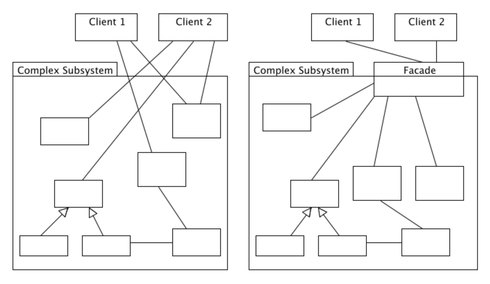
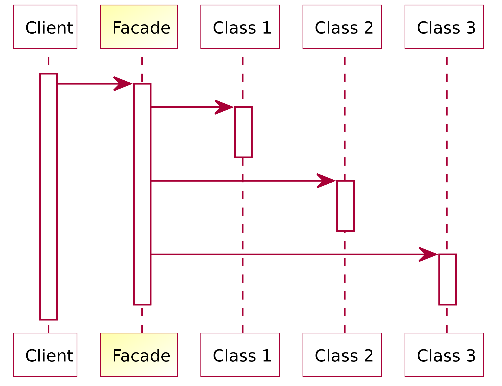

# Facade

### 1. What is Facade?

- Facade is a front part or exterior of a building. It is from French façade of which origin is 'Front' or 'Face'
- An unified interface of subsystem's interfaces


<div style="text-align:center">
  
</div>

### 2. Sample code

```java
/* 
Client class

Doesn't have any dependencies with Subsystem's classes, only interacts with Facade
*/
public class Client {
  public static void main(String[] args) {
    // Facade
    Computer computer = new Computer();

    // Start Computer
    computer.start();
  }
}

// Computer (Facade)
public class Computer {

  private BiosController bios;
  private CPU            cpu;
  private IODriver       ioDriver;

  public Computer() {
    bios     = new BiosController();
    cpu      = new CPU();
    ioDriver = new IODriver();
  }

  public void start() {
    bios.start();
    cpu.fetchInstruction();
    ioDriver.start();
    bios.boot();
    bios.loadOSIntoRam();
    bios.transferControlToOS();
  }

  public void shutDown() {
    // shutdown processes..
  }
}

// BiosController (Subsystem class)
public class BiosController {

  public BiosController() {}

  public void start() {
    System.out.println("Starting up BIOS controller...");
  }

  public void boot() {
    System.out.println("Starting the boot sequence...");
  }

  public void fetchOS() {
    System.out.println("Fetching OS...");
  }

  public void loadOSIntoRam() {
    System.out.println("Loading OS in to RAM...");
  }

  public void transferControlToOS() {
    System.out.println("Transferring the control to OS...");
  }
}

// CPU (Subsystem class)
public class CPU {

  public void fetchInstruction() {
    System.out.println("Fetching instructions into RAM...");
  }
}

// IODriver (Subsystem class)
public class IODriver {

  public void start() {
    System.out.println("Starting up I/O driver...");
  }
}


/*
Computer.start()

Starting up BIOS controller...
Fetching instructions into RAM...
Starting up I/O driver...
Starting the boot sequence...
Loading OS in to RAM...
Transferring the control to OS...
*/
```

### 3. When to use Facade?

1) We want to provide a simple interface to a complex subsystem
  👉🏻 Make clients to easily use the subsystem 
2) Many dependencies exist between clients and implementation classes
  👉🏻 promotes weak coupling between the clients and subsystem
  👉🏻 even loose coupling between subsystem's classes by moving its dependencies to Facade

##### Possible mistake

- Create a class and force others to use this class as a facade
 👉🏻 Facade should be optional. If clients want to directly interact with components, it should be allowed for the clients to bypass the facade layer

### 4. Disadvantages

- Facade requires an additional class which is a layer of indirection which may affect performance
- The code may get bigger 
