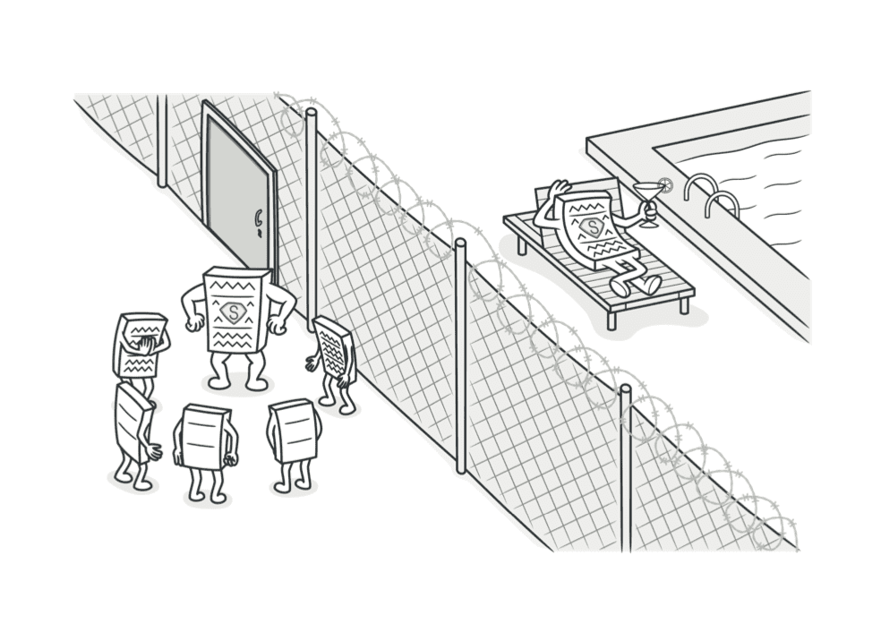
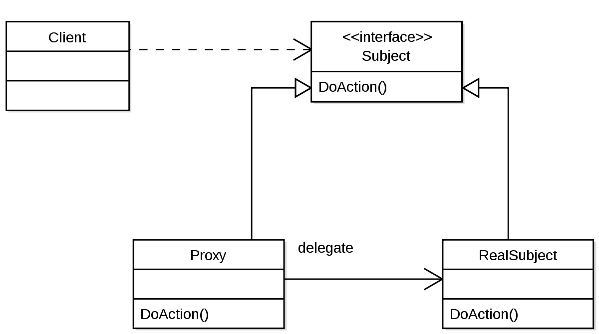

# Proxy Pattern

> 거대한 객체는 매번 생성하기 부담스럽기 때문에, 가벼운일은 프록시가 맡는다  
> 이후 필요한 경우 원본을 불러오게된다



## Diagram

- 프록시와 실제객체는 같은 인터페이스를 따른다
- 프록시는 실제객체에 대한 참조를 갖고있다. 필요할때 실제객체를 생성한다
- 클라이언트는 동일한 인터페이스를 통해 프록시와 실제객체와 동작한다


## Implementation
영상 제목만 보여주다가, 마우스가 올라가면 영상을 재생하는 예시

```java
// 프록시와 실제객체 모두 같은 인터페이스를 구현
interface Thumbnail {
    public void showTitle();
    public void showPreview();
}

// 실제객체
class RealThumbnail implements Thumbnail{
    private String title;
    private String movieUrl;

    public RealThumbnail(String _title, String _movieUrl) {
        title = _title;
        movieUrl = _movieUrl;

        // 시간이 오래걸리는 무거운작업
        System.out.println(movieUrl + "로부터" + title + "의 영상 데이터 다운로드");
    }

    public void showTitle() {
        System.out.println("제목:" + title);
    }

    public void showPreview() {
        System.out.println(title +"의 프리뷰 재생");
    }
}

// 프록시 객체
class ProxyThumbnail implements Thumbnail {
    private String title;
    private String movieUrl;

    private RealThumbnail realThumbnail;

    public ProxyThumbnail(String _title, String _movieUrl) {
        title = _title;
        movieUrl = _movieUrl;
    }

    public void showTitle() {
        System.out.println("제목:" + title);
    }

    // 필요한경우 실제객체 생성
    public void showPreview() {
        if(realThumbnail == null) {
            realThumbnail = new RealThumbnail(title, movieUrl); 
        }
        realThumbnail.showPreview();
    }

}
```


```java
package proxy;
import java.util.ArrayList;


public class MyProgram {
    public static void main(String[] args) {

        ArrayList<Thumbnail> thumbnails = new ArrayList<Thumbnail>();

        thumbnails.add(new ProxyThumbnail("Decorator", "/Decorator.mp4"));
        thumbnails.add(new ProxyThumbnail("Facade", "/Facade.mp4"));
        thumbnails.add(new ProxyThumbnail("Flyweight", "/Flyweight.mp4"));
        thumbnails.add(new ProxyThumbnail("Proxy", "/Proxy.mp4"));


        // 제목 출력
        for (Thumbnail thumbnail : thumbnails) {
            thumbnail.showTitle();
        }
        // 제목:Decorator
        // 제목:Facade
        // 제목:Flyweight
        // 제목:Proxy

        
        // preview 출력
        thumbnails.get(1).showPreview();
        thumbnails.get(2).showPreview();
        thumbnails.get(3).showPreview();
        thumbnails.get(3).showPreview();

        // /Facade.mp4로부터Facade의 영상 데이터 다운로드
        // Facade의 프리뷰 재생
        // /Flyweight.mp4로부터Flyweight의 영상 데이터 다운로드
        // Flyweight의 프리뷰 재생
        // /Proxy.mp4로부터Proxy의 영상 데이터 다운로드
        // Proxy의 프리뷰 재생
        // Proxy의 프리뷰 재생
        
    }
}


```

## Ref
- [ref](https://youtu.be/lJES5TQTTWE)