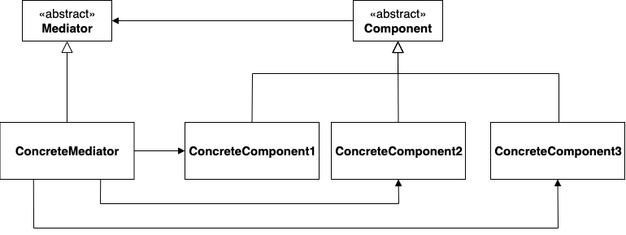
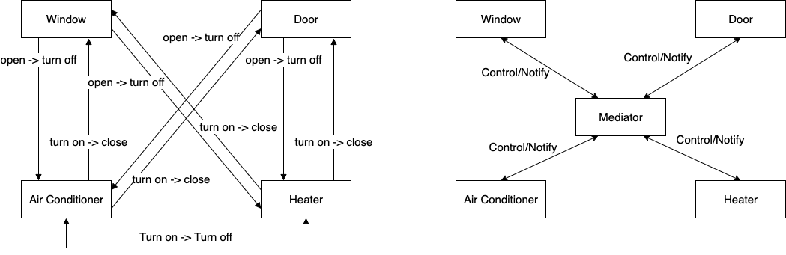

# Mediator


* Encapsulates how a set of objects interact
* Each object communicates with others via mediator object
* Achieve loose coupling of objects by placing mediator 

### Diagram

### Components
* <strong>Mediator</strong>
  * define an interface for communicating with Component objects
* <strong>ConcreteMediator</strong>
  * implement interface
  * have Component object's reference and manage them
* <strong>Component</strong>
  * define an interface for communicating with Mediator object
* <strong>Concrete Component</strong>
  * implement interface
  * have reference for its Mediator object


## Implementation
### Example

### Code
#### Mediator
`onChanged(Component componet)` is being called when participated component state is changed
```
public interface Mediator {
  public void onChanged(Component componet);
}
```
#### Concrete Mediator
```
public class AutoHomeSystem implements Mediator {
  public Door door = new Door(this);
  public Window window = new Window(this);
  public Heater heater = new Heater(this);
  public AirConditioner airConditioner = new AirConditioner(this);

  @Override
  public void onChanged(Component component) {
    if (component == door && ((Door) component).isOpened()) {
      airConditioner.turnOff();
      heater.turnOff();
    }
    if (component == window && ((Window) component).isOpened()) {
      airConditioner.turnOff();
      heater.turnOff();
    }
    if (component == airConditioner && ((AirConditioner) component).isOn()) {
      door.close();
      window.close();
      heater.turnOff();
    }
    if (component == heater && ((Heater) component).isOn()) {
      door.close();
      window.close();
      airConditioner.turnOff();
    }
  }

  public void printState() {
    System.out.println("Door is open? " + door.isOpened());
    System.out.println("Window is open? " + window.isOpened());
    System.out.println("Heater is on? " + heater.isOn());
    System.out.println("Air conditioner is on? " + airConditioner.isOn());
  }
}
```

#### Component
```
public interface Component {
  public void update();
}
```

#### Concrete Component
```
public class Door implements Component {
  private boolean isOpened;
  private Mediator mediator;

  public Door(Mediator mediator) {
    this.mediator = mediator;
    this.isOpened = true;
  }
  
  @Override
  public void update() {
    mediator.onChanged(this);  
  }
  
  public void open() {
    if (isOpened) return;
    isOpened = true;
    update();
  }

  public void close() {
    if (!isOpened) return;
    isOpened = false;
    update();
  }
  
  public boolean isOpened() {return isOpened;}
}
```

### Pros
* Component only depends on the mediator (from many-to-many to many-to-one)
* Reusable individual component
* Easy to maintain

### Cons
* Mediator can evolve into a God Object

### Related Patterns
<strong>The Facde pattern</strong>
 Facade object can make requests of the subsystem but not vice versa (Signle direction)

<strong>The Observer pattern</strong>
 Defines a one-to-many dependency between objects so that when one object changes its state, all dependent objects are notified and updated automatically.

## Reference
https://refactoring.guru/design-patterns/mediator
http://www.gisdeveloper.co.kr/?p=10541
http://gisdeveloper.co.kr/?p=10541
https://stackoverflow.com/questions/9226479/mediator-vs-observer-object-oriented-design-patterns
Gang of Four Design Patterns