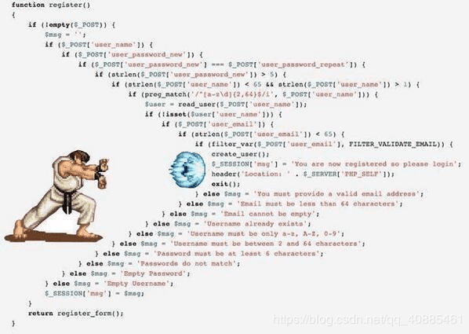
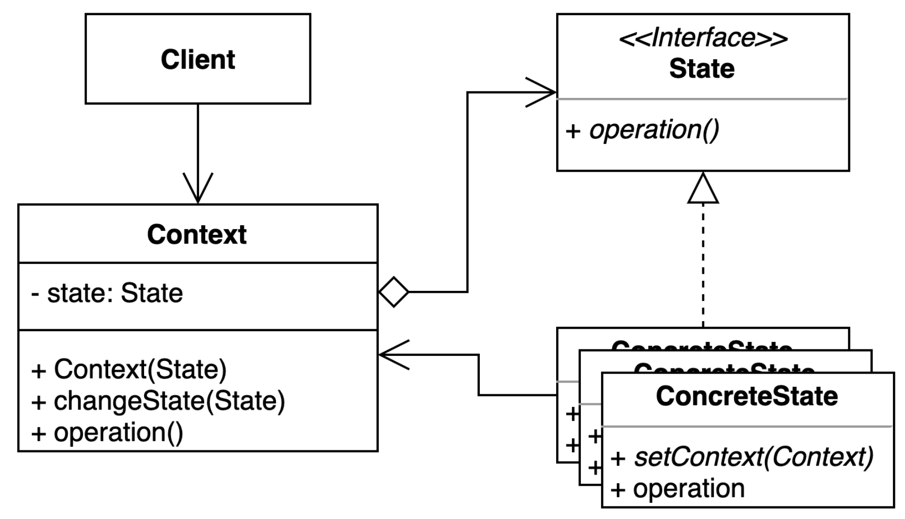
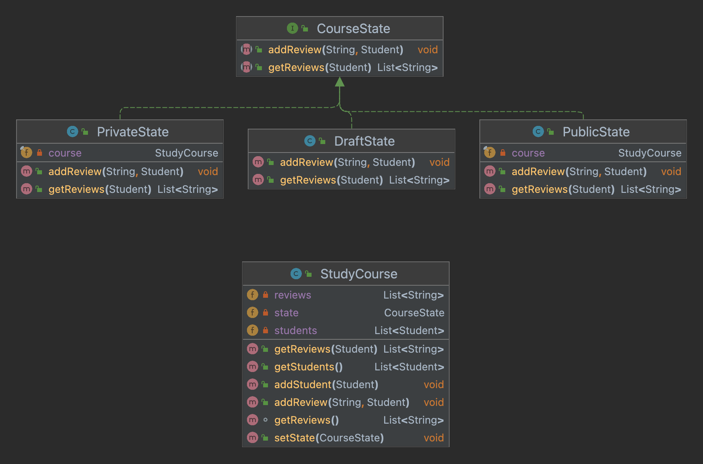

<style>
red { color: red }
yellow { color: yellow }
blue { color: blue }
green { color: green }
</style>

# State

### 📝 언제까지 if else 로 모든 상태 관리를 할것인가?!


## State Pattern: 객체 내부 <ins>상태 변경</ins>에 따라 객체의 <ins>행동이 달라지는</ins> 패턴
* 상태에 특화된 <red>행동들을 분리해</red> 낼 수 있으며, <yellow>새로운 행동</yellow>을 추가 하더라도 다른 행동에 <green>영향을 주지 않는다</green>.

### If statement / Switch Case statement 예제
```
Class StudyCourse {
    enum CourseState {
        DRAFT, RRIVATE, PUBLIC
    } 

    CourseState state;
    Set<Student> students;
    List<String> reviews;
    
    public List<String> getReviews(Student student) {
        switch (state){
            case DRAFT: 
            case PRIVATE: 
                if(students.contain(student)) return reviews; 
            case PUBLIC: return reviews;
            default:
                 return Collections.emptyList();
        }
    }  
}
```
### 문제점
* CourseState 가 하나 늘어날 때마다 기존 코드인 getReviews 함수를 변경 해야함

### 개선 코드
```
Class StudyCourse {

    CourseState state;
    Set<Student> students;
    List<String> reviews;
    
    public void setState(CourseState state) {
        this.state = state;
    }
    
    public List<String> getReviews(Student student) {
        return state.getReviews(stduent);
    }
}
```

## Class Diagram


## Implementation


## Pros and cons
* Pros
  * 상태에 따른 동작을 개별 클래스로 옮겨서 관리 (Single Responsibility)
    * unit test 관리가 쉬워짐
  * 기존의 특정 상태에 따른 동작을 변경하지 않고 새로운 상태를 추가 할 수 있다. (Open-Closed)
  * 코드의 복잡도를 줄 일 수 있다.
* Cons
  * 간단 한 코드에 적용하면 클래스와 코드가 늘어난다.
  * context 를 잘못 관리하면 method call 할때 cycle 이 생길 수 있다.