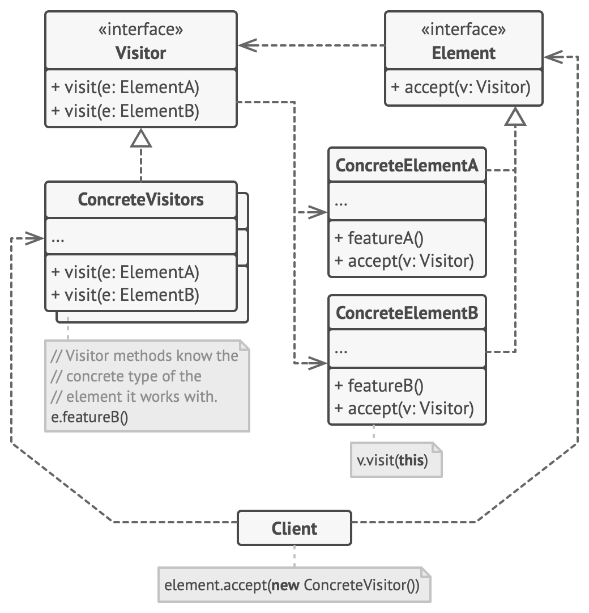
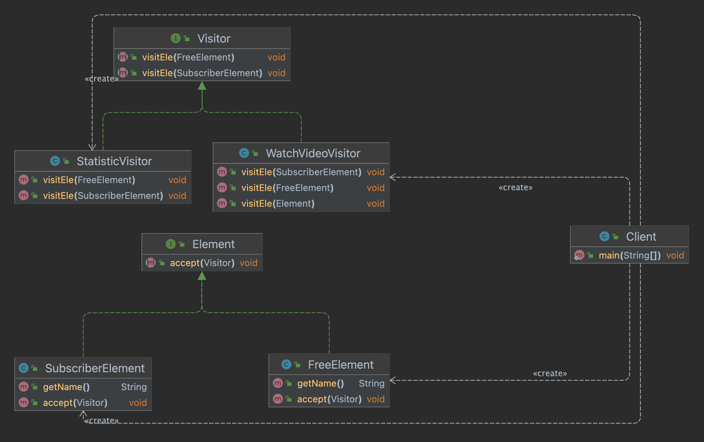

# Visitor
A behavioural design pattern that separate different types of logic from the different types of object.

Visitor pattern in GOF
The visitor performs some logic for different types of objects. The visitor pattern uses <Strong>double dispatch</Strong> method to receive the data from element object. 
1. pass the visitor object to the element through the interface `accept(Visitor v)` (identifying visitor)
2. Element class call method `v.visitElement(this)` (identifying element)

## Structure


## Component
* Visitor declares interface of several visit methods for each objects
* Concrete Visitor implements several version of logics for each objects
* Element declares interface for accepting visitor.
* Concrete element implements the interface and methods for handling data inside of the element.
## Implementation

### Diagram


### Code

### Element
```
/* Common interface of element */
public interface Element {
  public void accept(Visitor visitor);
}
```

#### FreeElement
```
/* Concrete element for free tier user */
public class FreeElement implements Element {
  private String name;

  public FreeElement(String name) {
    this.name = name;
  }

  public String getName() {
    return name;
  }

  @Override
  public void accept(Visitor visitor) {
    visitor.visitEle(this);
  }
}
```

#### Visitor
```
/* declare visit interface for each type of element */
public interface Visitor {
  public void visitEle(SubscriberElement ele);
  public void visitEle(FreeElement ele);
}
```

#### Watch Video Visitor
```
/* Concrete visitor to operate playing video */
public class WatchVideoVisitor implements Visitor {

  @Override
  public void visitEle(SubscriberElement ele) {
    System.out.println("Watch the video without ads");
  }

  @Override
  public void visitEle(FreeElement ele) {
    System.out.println("Watch the ads before watching video");
  }

  // another implementation option with type checking
  /* one interface for handling all type of elements */
  public void visitEle(Element ele) {
    if (ele instanceof FreeElement) {
      System.out.println("Watch the ads before watching video");
      return;
    }
    if (ele instanceof SubscriberElement) {
      System.out.println("Watch the video without ads");
      return;
    }
  }
  
}
```

### Client
```
public class Client {
  public static void main(String[] args) {
    Visitor watch = new WatchVideoVisitor();
    Visitor stat = new StatisticVisitor();

    Element freeEle = new FreeElement("sunwoo");
    Element subsEle = new SubscriberElement("choi");
    
    freeEle.accept(watch); // Watch the ads before watching video
    freeEle.accept(stat); // provide monthly statistics for sunwoo

    subsEle.accept(watch); // Watch the video without ads
    subsEle.accept(stat); // provide monthly, weekly, daily statistics for choi
  }
}
```

### Pros
* Open/Closed Principle: introduce new operation to data objects without changing the object
* Single Responsibility: Each visitor contains same behaviours for different types of object
* Can reduce size of class

### Cons
* Hard to add element - Adding new element requires new interface in visitor
* Obey Encapsulation - The structure of element object is open to visitor pattern
* Additional methods require in element object to expose their status

### Related Patterns
#### Command - M:1


#### Strategy - 1:N


### Reference
Gof Design pattern
https://johngrib.github.io/wiki/pattern/visitor/#fn:joshua-424
https://blog.naver.com/2feelus/220664244510
https://refactoring.guru/design-patterns/visitor

