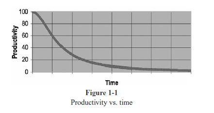

# 1. Clean Code
### There Will Be Code
Remember that code is really the laguage in which we ultimately express the requirements. We may create languages that are closer to the requirements. We may create tools that help us parse and assemble those requirements into formal structures. But we will never eliminate *necessary precision* - **so there will always be code.**

### Bad Code
We've all looked at the mess we've just made and then have chosen to leave it for another day. We've all felt the relief of seeing our messy program work and deciding that a working mess is better than nothing. ==Later equals never.==

### The Total Cost of Owning a Mess

### The Grand Redesign in the Sky
1. Developers inform management that they cannot continue to develop in this odious code base.
2. Management cannot deny that productivity is terrible and authorize the grand redesign in the sky.
3. A new team is created and get to start over and create something truly beautiful. But only the best and brightest are chosen for the new team.
4. Management will not replace the old system until the new system can do everything that the old system does.
5. By the time it's done, the original members of the new team are long gone.
6. The current members are demanding that the new system be redesigned.
7. Go back to Step 1.

> Spending time keeping your code clean is not just code effective; it's a matter of professional survival.

### Attitude
We should not be shy about telling them what we think and should not wade through a mess so grave. It is unprofessional for programmers to bend to the will of manages who don't understand the risks of making messes.

### The Primal Conundrum
The only way to make the deadline - the only way to go fast - is to keep the code as clean as possible at all times.

### The Art of Clean Code?
A programmer who writes clean code is an artist who can take a blank screen through a series of transformations until it is an elegantly coded system.

### What Is Clean Code?
##### Bjarne Stroustrub
"I like my cod eto be elegant and efficient. The logic should be straightforward to make it hard for bugs to hide, the dependencies minimal to ease maintenance, error handling complete according to an articulated strategy, and performance close to optimal so as not to tempt people to make the code messy with unprincipled optimizations. Clean code does one thing well."

##### Grady Booch
"Clean code is simple and direct. Clean code reads like well-written prose. Clean code never obscures the designers's intent but rather is full of crisp abstractions and straightforward lines of control."

##### "Big" Dave Thomas
"Clean code can be rea, and enhanced by a developer other than its original author. It has unit and acceptance tests. It has meaningful names. It provides one way rather than many ways for doing one thing. It has minimal dependencies, which are explicitly defined, and provides a clear and minimal API. Code should be literate since depending on the language, not all necessary information can be expressed clearly in the code alone."

##### Michael Feathers
"I could list all of the qualities that I notice in clean code, but there is one overarching quality that leads to all of them. Clean code always looks like it was written by someone who cares. There is nothing obvious that you can do to make it better: All of those things were thought about by the code's author; and if you tri to imagine improvements, you're led back to where you are, sitting in appreciation of the code someone left for you - code left by someone who cares deeply about the craft."

##### Ron Jeffries
No duplication, one thing, expressiveness, tiny abstractions.

##### Ward Cunnignham
"You know you are working on clean code when each routine you read turns out to be pretty much what you expected. You can call it beautiful code when the code also makes it look like the language was made for the problem.

### Schools of Thought
What we think makes a clean variable name, a clean function, a clean class, etc.

### We Are Authors
Authors are responsible for communicating well with their readers. If you want to go fast, if you want to get done quickly, if you want your code to be easy to write, **make it easy to read.**

### The Boy Scout Rule
"Leave the campground cleaner than you found it"

### Prequel and Principles
- Agile Software Development: Principles, Patterns, and Practices (PPP)
- Single Responsibility Principle (SRP)
- Open Closed Principle (OCP)
- Dependency Inversion Principle (DIP)

### Conclusion
"**Practice, son. Practice!**"
