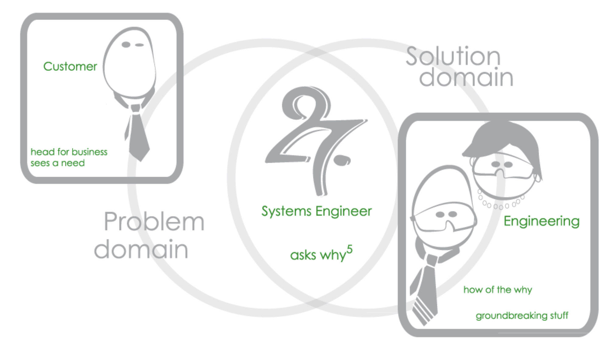
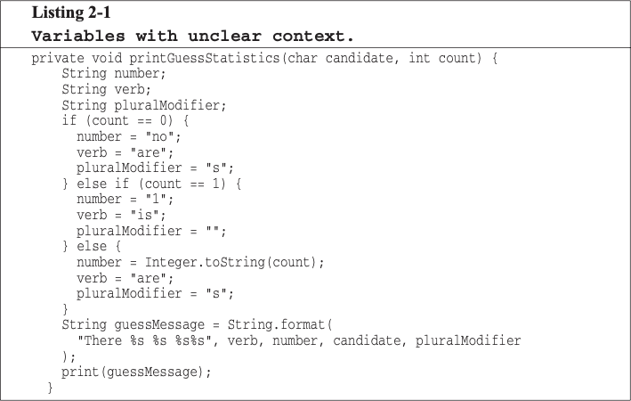
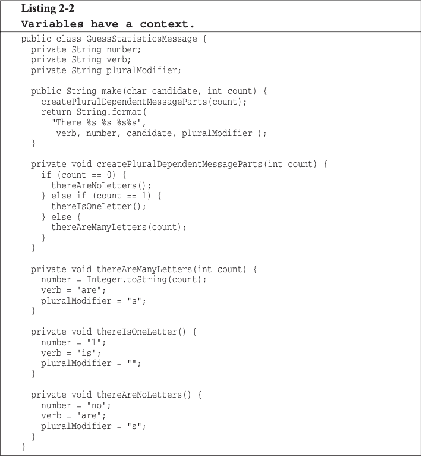

# Meaningful names

## Use Intention-Revealing Names
```java
int d; // elapsed time in days
// VS
int elapsedTimeInDays;
```

```java
public List<int[]> getThem() {
    List<int[]> list1 = new ArrayList<int[]>();
    for(int[] x : theList) {
        if(x[0] == 4) list1.add(x);
    }
    return list1;
}
```
```java
public List<int[]> getFlaggedCells() {
    List<int[]> flaggedCells = new ArrayList<int[]>();
    for(int[] cell : gameBoard) {
        if(cell[STATUS_VALUE] == FLAGGED) flaggedCells.add(cell);
    }
    return flaggedCells;
}
```
```java
public List<Cell> getFlaggedCells() {
    List<Cell> flaggedCells = new ArrayList<Cell>();
    for(Cell cell : gameBoard) {
        if(cell[STATUS_VALUE] == FLAGGED) flaggedCells.add(cell);
    }
    return flaggedCells;
}
```

## Avoid Disinformation
### Bad examples
- Is 'hp' good variable name for hypotenuse?
- What about accountList?
- l(letter) vs 1(digit) / O(letter) vs O(digit) 
### Good examples
- XYZControllerForEfficientHandlingOfStrings
- XYZControllerForEfficientStorageOfStrings


## Make Meaningful Distinctions
1. Number-series naming
   - ex) a1, a2, .. aN
2. Noise words
   - ex) aUserData theUserData, userData, userInfo, userObject, ...

## Use Pronounceable Names
```java
class DtaRerd102 {
    //...
}
```

## Use Searchable Names
```java
for(int j=0; j < 34; j++) {
    s += (t[j]*4)/5;
}
```
```java
int realDaysPerIdealDay = 4;
const int WORK_DAYS_PER_WEEK = 5;
for(int j=0; j < NUMBER_OF_TASKS; j++) {
    int realTaskDays = taskEstimate[j] * realDaysPerIdealDay;
    int realTaskWeeks = (realDays / WORK_DAYS_PER_WEEK);
    sum += realTaskWeeks;
}
```

## Avoid Encodings
### Hungarian Notation
- bBusy : boolean, chInitial : char, cApples : count of items, dwLightYears : double word (Systems) ...
### Member Prefixes 
```java
public class Part {
    private String m_dsc; // The textual description
    void setName(String name) {
        m_dsc = name;
    }
}
```
```java
public class Part {
    private String description;
    void setDescription(String description) {
        this.description = description;
    }
}
```
### Interfaces and Implementations
IShapeFactory vs ShapeFactoryImp VS CShapeFactory

## Avoid Mental Mapping
- Smart Programmer VS Professional Programmer
- except Problem Domain & Solution Domain

* https://www.letter27-se.com/single-post/2016-1-27-problem-domain-to-solution-domain-its-all-about-communication

## Class Names
- noun or noun phrase names
  - Good: Customer, WikiPage, Account and AddressParser
  - Bad: Manager, Processor, Data or Info
- should not be a verb

## Method Names
- verb or verb phrase names
  - Good postPayment, deletePage or save
- get, set, and is according to the javabean standard
- constructor VS static factory method
  - Complex fulcrumPoint = Complex.FromRealNumber(23.0);
  - Complex fulcrumPoint = new Complex(23.0)

## Don't Be Cute
- HolyHandGrenade vs DeleteItems
- whack() vs kill()
- eatMyShorts vs abort()

## Pick One Word per Concept
- fetch, retrieve and get
- controller, manager and driver

## Don't Pun
add vs insert or append
- create a new value by adding
- put its single parameter into a collection

## Use Solution Domain Names
Computer Science Terms
- ex) algorithm names, pattern names, math therms ...

## Use Problem Domain Names
Programmer, Designer, and other domain exports can understand them

## Add Meaningful Context



## Don't Add Gratuitous Context
- GSDAccountAddress class (GSD = Gas Station Deluxe application)
- AccountAddress and CustomerAddress VS Address
- MAC addresses, Port Addresses, and Web Addresses
  - => MAC, PostalAddress, and URI