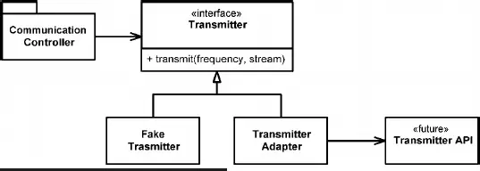

# Boundaries
우리는 소프트웨어를 scratch부터 전부 작성하지 않는다.
시스템을 빌드하면서 많은 foreign code와의 integration이 필요한데,
어떻게 하면 우리 내부의 코드와 foreign code가 맞닫는 부분, 즉 boundaries을 어떻게 clean하게 관리할지를 알아보자.

## Using Third-Party Code
3rd party code의 provider의 목표는 provider의 코드가 최대한 많은 환경이나 상황에서 사용되기를 바란다.
3rd part code를 사용하는 user는 자신들의 목적에만 맞는 기능이나 interface만을 원한다.
이러한 상반되는 목표의 차이가 boundary를 작성하는데 문제를 일으킨다.

예를 들어 `Java.Utils.Map`의 Map은 많은 interface를 제공한다 또한 다른 종류의 Object도 Map에 저장을 할 수 있다.
높은 자유도와 많은 기능들은 그것을 사용하는 개발자들에게 편리함을 제공하지만,
높은 자유도와 기능들은 시스템이 일으킬수 있는 잠재적인 문제점의 숫자가 증가하는 trade-off가 존재한다.

예를 들어, 
`sensors`라는 `Map<Object>`가 system 안을 돌면서 어떠한 특정한 코드가 `Sensor`라는 object에 access한다면 다음과 같은 코드일것이다.
```Java
Sensor s = (Sensor) sensors.get(sensorId);
```
이 경우 client가 type cast에 관한 책임을 지고, 핸들링한다.

```Java
Map<Sensor> sensors = new HashMap();
...
Sensor s = sensors.get(sensorId);
```
이 경우 client는 type cast를 하지 않지만, 
하지만 여전히 `sensors`를 통해서, 필요하지 않은 기능 혹은 문제를 일으킬 수 있는 리스크에 access가 가능하다. ex) `sensors.clear()`

```Java
public class Sensors {
    private Map sensors = new HashMap();

    public Sensor getById(String id) {
        return (Sensor) sensors.get(id);
    }
}

Sensor s = sensors.getById(sensorId);
```
Sensors라는 class를 통해서, Map이 가지고 있는 interface 혹은 capabilities를 제한 할 수있다.
Client는 Map에 관한 접근이 불가능하고, 또한 정의된 interface를 통해서만 Sensor object에 접근 할 수 있다.

## Exploring and Learning Boundaries
3rd party code를 사용하는 이유는 분명하다.
이 코드들은 같은 기능을 더 적은 시간과 노력으로 deliver가능 하다는 점이다.
3rd party code를 배우고, integration하는 것은 쉬운 일이 아니다.
만약 3rd party code를 처음부터 production code에 적용해보는 것은 배우는 것과 integration하는 것을 동시에 하는 것과 같다.

learning tests는 제한된 환경(test code)에서 우리에게 필요한 코드들이 어떻게 작동하는지 확인하며 3rd party API를 배우는 과정이다.
## Learning log4j
log4j는 자바에서 사용되는 로그 프레임워크이다. log4j의 API에 대한 사용법을 learning tests를 통해서 알아보자.

목표: log4j를 통해 "hello"를 콘솔에 프린트하기.
```Java
@Test
public void testLogCreate() {
    Logger logger = Logger.getLogger("MyLogger");
    logger.info("hello");
}
```
이 코드는 `ConsoleAppender`라는 dependency를 `Logger`가 필요로 한다는 것을 exception을 통해 알려준다.

```Java
@Test
public void testLogAddAppender() {
    Logger logger = Logger.getLogger("MyLogger");
    ConsoleAppender appender = new ConsoleAppender();
    logger.addAppender(appender);
    logger.info("hello");
}
```
이 코드는 `appender`가 output stream를 가지고 있지 않다는 것을 알려준다.

```Java
@Test
public void testLogAddAppender2() {
    Logger logger = Logger.getLogger("MyLogger");
    logger.removeAllAppenders();
    logger.addAppender(
        new ConsoleAppender(
            new PatternLayout("%p %t %m%n"),
            ConsoleAppender.SYSTEM_OUT)
    );
    logger.info("hello");
}
```
이 코드는 콘솔에 성공적으로 "hello"를 프린트하게 된다.

이러한 과정을 통해서 어떻게 log4j를 사용을 할 지, 어떠한 문서를 찾아야 할지 개발자에게 guidline을 제공해줄수 있다.
결과적으로 우리는 이러한 과정을 통해 얻은 지식을 코드로 변환시킬수 있다.

```Java
public class LogTest { 
    private Logger logger;
     @Before 
     public void initialize() { 
        logger = Logger.getLogger("logger"); 
        logger.removeAllAppenders(); 
        Logger.getRootLogger().removeAllAppenders(); 
    } 
    
    @Test public void basicLogger() { 
        BasicConfigurator.configure(); 
        logger.info("basicLogger");
    } 
    
    @Test 
    public void addAppenderWithStream() {
        logger.addAppender(
            new ConsoleAppender(
                new PatternLayout("%p %t %m%n"),
                ConsoleAppender.SYSTEM_OUT
            )
        ); 
        logger.info("addAppenderWithStream"); 
    }
    
    @Test 
    public void addAppenderWithoutStream() {
        logger.addAppender(
            new ConsoleAppender(
                new PatternLayout("%p %t %m%n")
            )
        ); 
        logger.info("addAppenderWithoutStream");
    }
}
```
이렇게 얻은 정보들을 boudary class에 적용시켜, 나머지 시스템의 코드가 log4j interface에서 일어날수 있는 boundary 문제들을 예방 할 수있다.

## Learning Tests Are Better Than Free
Learning tests를 통해서, 3rd party의 API를 쉽게 이해할 수 있을뿐아니라, 또한 실질적인 이득도 있다.
예를 들어, 만약 새로운 버전의 log4j를 새롭게 사용한다고 했을때,
우리가 사용하는 새로운 버전의 기능들이 현재 boundary class와 compatible한지 만들어 놓은 테스트를 통해서 알 수 있다.

## Using Code That Does Not Yet Exist
또다른 하나의 boundary는 아직 존재하지 않는 system에 대한 코드를 작성 할 때이다.
지금 작성하고 있는 system이 만약 아직 존재하지 않는 subsystem에 의존하고 있다면 어떻게 해야할까?

[[Reference]](https://www.academia.edu/43595825/_PROGRAMMING_Clean_Code_by_Robert_C_Martin_)

1. 팀에서 생각하는 이상적인 interface `Transmitter`를 정의한다.
2. `CommunicationController`는 아직 정의되지 않은 API와 위에서 정의한 `Transmitter`를 통해서만 대화 할 수있다.
3. 서브 시스템의 API가 정의되면, `TransmitterAdapter` 클래스(Boundary class)를 통해서 위에서 정의한 interface와 맞춘다.
4. `FakeTransmitter`를 통해서 가상의 implementation을 통해 `CommunicationController`를 좀더 isolate한 환경에서 테스트를 할 수 있다.

## Clean Boundaries
코드의 boundary는 system failure의 weak point중의 하나이다.
foreign code는 encapsulation되어 client 코드와 명확히 분리되어 있어야 하고, foreign code의 예상되는 행동은 테스트로 정의되어 있어야 한다.
이렇게 함으로써, foreign code의 변화를 최소한의 코드의 변경으로 적응할수 있다.


