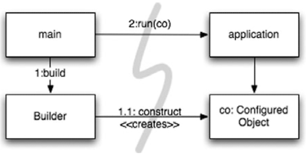
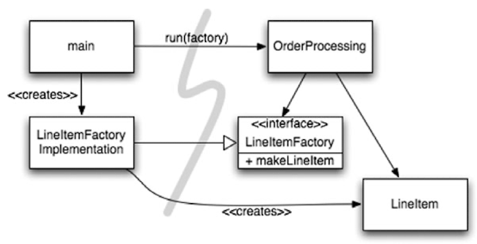
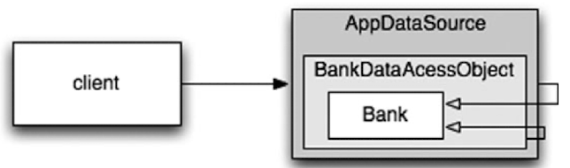

# Systems
## How Would You Build a City?
- In this chapter let us consider how to stay clean at higher levels of abstraction, the system level.

## Separate Constructing a System from Using It 
- Construction(생성) <-> Use(사용)
- The separation of concerns is one of the oldest and most important design techniques in our craft.
1. hard-coded dependency problem
```java
public Service getService() {
  if (service == null)
    service = new MyServiceImpl(...);  // Good enough default for most cases?
  return service;
}
```
### Separation of Main
2. Main VS Application


### Factories
3. Factory


### Dependency Injection
4. Inversion of Control(IoC) Frameworks
   - Ex) Spring, Google Guice, etc.
```java
// JNDI: Java Naming and Directory Interface
MyService myService = (MyService)(jndiContext.lookup(“NameOfMyService”));
```
## Scaling Up
- Software systems are unique compared to physical systems. 
- Their architectures can grow incrementally, if we maintain the proper separation of concerns.
### Cross-Cutting Concerns
- aspect-oriented programming (AOP)

## Java Proxies
-  To proxy classes, you have to use a byte-code manipulation library, such as CGLIB, ASM, or Javassist.
```java
// Bank.java (suppressing package names...) 
import java.utils.*;
// The abstraction of a bank. 
public interface Bank {
    Collection<Account> getAccounts();   
    void setAccounts(Collection<Account> accounts); 
}

// BankImpl.java 
import java.utils.*;
// The “Plain Old Java Object” (POJO) implementing the abstraction. 
public class BankImpl implements Bank {
    private List<Account> accounts;

    public Collection<Account> getAccounts() {
        return accounts;  
    }   
    public void setAccounts(Collection<Account> accounts) {
        this.accounts = new ArrayList<Account>();
        for (Account account: accounts) {
            this.accounts.add(account);
        }  
    } 
}

// BankProxyHandler.java 
import java.lang.reflect.*; 
import java.util.*;
// “InvocationHandler” required by the proxy API. 
public class BankProxyHandler implements InvocationHandler {
    private Bank bank;

    public BankHandler(Bank bank) {
        this.bank = bank;
    }

    // Method defined in InvocationHandler
    public Object invoke(Object proxy, Method method, Object[] args)
            throws Throwable {
        String methodName = method.getName();
        if (methodName.equals("getAccounts")) {
            bank.setAccounts(getAccountsFromDatabase());
            return bank.getAccounts();
        } else if (methodName.equals("setAccounts")) {
            bank.setAccounts((Collection<Account>) args[0]);
            setAccountsToDatabase(bank.getAccounts());
            return null;
        } else {
            ...
        }
    }

    // Lots of details here:   
    protected Collection<Account> getAccountsFromDatabase() { ...}
    protected void setAccountsToDatabase(Collection<Account> accounts) { ...}
}

// Somewhere else...

Bank bank = (Bank) Proxy.newProxyInstance(
        Bank.class.getClassLoader(),
        new Class[] { Bank.class },
        new BankProxyHandler(new BankImpl()));
```
## Pure Java AOP Frameworks
- eliminating all the tight-coupling problems of systems
```xml
<beans>   
    ...   
    <bean id="appDataSource" 
          class="org.apache.commons.dbcp.BasicDataSource"
          destroy-method="close"
          p:driverClassName="com.mysql.jdbc.Driver"
          p:url="jdbc:mysql://localhost:3306/mydb"
          p:username="me"/>   
    <bean id="bankDataAccessObject" 
          class="com.example.banking.persistence.BankDataAccessObject"
          p:dataSource-ref="appDataSource"/>   
    <bean id="bank"
          class="com.example.banking.model.Bank" 
          p:dataAccessObject-ref="bankDataAccessObject"/>
    ...
</beans>
```

```java
XmlBeanFactory bf =new XmlBeanFactory(new ClassPathResource("app.xml", getClass())); 
Bank bank = (Bank) bf.getBean("bank");
```
```java
package com.example.banking.model; 
import javax.persistence.*; 
import java.util.ArrayList; 
import java.util.Collection;
@Entity @Table(name = "BANKS") 
public class Bank implements java.io.Serializable {
    @Id @GeneratedValue(strategy=GenerationType.AUTO)
    private int id;
    
    @Embeddable // An object “inlined” in Bank’s DB row
    public class Address {       
        protected String streetAddr1;
        protected String streetAddr2;
        protected String city;
        protected String state;
        protected String zipCode;
    }
    
    @Embedded    
    private Address address;
   
    @OneToMany(cascade = CascadeType.ALL, fetch = FetchType.EAGER,
            mappedBy="bank")    
    private Collection<Account> accounts = new ArrayList<Account>();
   
    public int getId() {
        return id;
    }
   
    public void setId(int id) {
        this.id = id;
    }
   
    public void addAccount(Account account) {
        account.setBank(this);
        accounts.add(account);
    }
   
    public Collection<Account> getAccounts() {
        return accounts;
    }

    public void setAccounts(Collection<Account> accounts) {
        this.accounts = accounts;
    } 
}

```
## AspectJ Aspects
- AspectJ provides a very rich and powerful tool set for separating concerns.
- The drawback of AspectJ is the need to adopt several new tools and to learn new language constructs and usage idioms.

## Test Drive the System Architecture
- This means we can start a software project with a “naively simple” but nicely decoupled architecture, 
  - delivering working user stories quickly, 
    - then adding more infrastructure as we scale up.
    
## Optimize Decision-Making
- We often forget that it is also best to postpone decisions until the last possible moment. 
  - This isn’t lazy or irresponsible; 
  - it lets us make informed choices with the best possible information.
  
## Use Standards Wisely, When They Add Demonstrable Value
- the process of creating standards can sometimes 
  - take too long for industry to wait
-  some standards lose touch with the real needs

## Systems Need Domain-Specific Languages
- A good DSL minimizes the “communication gap” between a domain concept and the code that implements it
- Domain-Specific Languages allow all levels of abstraction