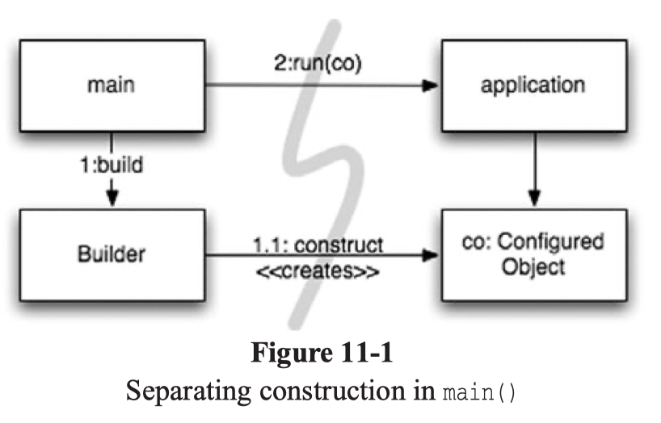
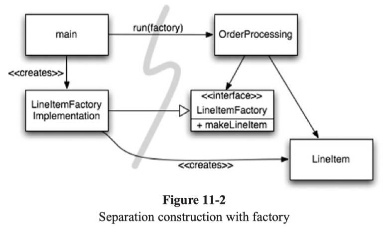

# Chapter 11. Systems

#### How Would you Build a City?
- 도시를 위해 일하는 개인들이 전체적인 구조를 파악하지 않아도 도시가 적절한 정도의 abstraction과 modularity를 설정해 놓았기 때문에 그 구성원들이 효과적으로 일을 하며 도시가 돌아갈 수 있다.
- 소트프웨어 팀도 같은 방식으로 구성되어 있지만, 우리가 관리하는 시스템은 종종 같은 방식(separation of concerns & levels of abstraction)을 가지고 있지 않기도 한다

#### Separate Constructing a System from Using It
- 소트프웨어 시스템은 시작 준비 과정(startup process)과 시작 준비 과정 이후의 런타임 로직을 구분해야 한다
- 시작 준비 과정
```java
public Service getService() { 
  if (service == null) 
    service = new MyServiceImpl(...); // Good enough default for most case?
  return service; 
}
```
위 코드는 Lazy initialization/evaluation이라고 불리는데, 몇 가지 장점이 있다.
  - 해당 오브젝트를 사용하지 않으면, 생성하지 않으므로 startup 과정이 더 빠르다
  - null을 return 하지 않는다

하지만, 이 오브젝트를 런타임에서 사용하지 않는데도 불구하고 MyServiceImpl에 dependency가 생겼고, 그 dependency를 해결하지 않는 한 컴파일 되지 않을 것이다.
테스트 또한 문제가 되는데, 만약 MyServiceImpl이 무거운 오브젝트라면 *Test Double이나 Mock Object를 만들어서 unit test를 진행해야 한다. 또한 생성로직과 런타임로직이 섞임으로써 두 가지 책임(responsibility)을 가지게 되었으므로 모든 경우의 수를 테스트해야 한다. 결국 이 메소드는 한 가지 이상의 일을 하므로 Single Responsibility Principle을 작게나마 위반한다.
[*Test Double](https://martinfowler.com/bliki/TestDouble.html)

한 번의 Lazy initialization은 괜찮을 지 모르지만, 보통은 이런 코드는 어플리케이션 곧곧에 산재하고, 코드의 중복을 가져온다.
시작 준비 과정은 런타임 로직과 분리되어야 하며, dependency를 해결하기 위한 일관성 있고 시스템 전체적인 로직이 필요하다.

#### Separation of Main
생성로직을 분리하는 한 가지 방법은 모든 생성로직을 main메소드나 main이 호출하는 module로 옮기고, 모든 오브젝트들이 생성되었고 의존성도 해결이 되었다는 가정 하에 시스템을 디자인하는 것이다.
1. main 메소드가 시스템에 필요한 모든 오브젝트를 만들고
2. 어플리케이션에 그 오브젝트들을 던진후
3. 사용한다
이 과정을 아래 그림으로 보면 main 메소드로부터 한 방향으로 이루어진다. 즉, 어플리케이션은 main 메소드나 그 안에서의 생성로직에 대해서는 단지 그것들이 제대로 생성되었다고 가정하에 아예 알 수가 없다는 뜻이다. 


#### Factories
어플리케이션이 오브젝트들이 **언제** 만들어질지 결정하게 할 수도 있다.


위 그림을 보면, 모든 dependency가 main에서 OrderProcessing으로 향하는 것을 볼 수 있다. 즉, 어플리케이션은 LineItem이 어떻게 만들어지는 지 알지 못한 채로 decoupled되었다고 볼 수 있고, 그 생성과정은 LineItemFactoryImplementation이 관리한다. 그러면서도 어플리케이션은 LineItem이 언제 만들어지는지 관리할 뿐 아니라, 어플리케이션-specific한 argument도 전달할 수 있다.


#### Dependency Injection
Dependency Injection(application of Inversion of Control, IoC)은 생성로직을 분리하는 효과적인 방법이다. Inversion of Control은 한 오브젝트가 가지고 있는 두번째(sub) 책임을 다른 오브젝트로 넘김으로써 Single Responsibility Principle을 따른다. 의존성 관리(dependency management)면에서, 오브젝트는 자기 자신의 의존성을 만드는 책임을 가져서는 안되고, 그 책임을 다른 "authoritative" 방법에 맡겨야 한다. 설정 자체는 시스템 전체적으로 이루어져야 하기 떄문에 "authoritative mechanism"은 보통 main이나 다른 특정한 목적의 container가 된다.

```java
MyService myService = (MyService)(jndiContext.lookup("NameOfMyService"));
```
JNDI(Java Naming and Directory Interface)는 부분적 DI로, 오브젝트가 directory server에 특정 이름과 부합한 서비스를 제공하게끔 묻는다.

보다 완벽한 Dependency Injection은 한 단계 더 나아가서, 클래스가 의존성을 직접 해결하지 않고 완벽하게 수동적으로 작동한다. Setter method나 constructor arguments를 통해서 의존성을 주입(inject)한다. 생성과정 중 DI container는 필요한 오브젝트들을 instantiate하고, 주어진 arguments들이나 setter메소드를 이용해서 의존성을 연결한다. 어떤 의존관계의 오브젝트들이 사용되는 지는 configuration 파일이나, 특정 module에 의해 정의된다. (아래의 Spring Framework 예제 참고)
많은 종류의 DI container들은 오브젝트가 필요할 때까지 생성하지 않고, factory나 proxy 패턴을 이용해 lazy evaluation이나 비슷한 최적화를 이룬다.

#### Scaling Up
하루 아침에 딱 맞는 시스템을 만들 수 는 없기 때문에 우리는 오늘의 상황에 맞게 개발하고 난 후, 리팩토링과 시스템 확장을 통해 나중의 상황에 맞춰야 한다. TDD, refactoring 그리고 clean code는 그 과정을 code 레벨에서 해결 할 수 있도록 도와준다.
그렇다면 시스템 레벨은 미리 계획할 수 있지 않을까? 시스템 레벨(architecture)은 우리가 concern들을 적절한 분리를 통해 관리한다면 점진적으로 확장이 가능하다.

먼저 나쁜 경우부터 보도록 하자.
Entity Bean을 데이터베이스 table 의 한 row라고 생각해보자.
```java
// EJB2 local interface for a Bank EJB
package com.example.banking; 
import java.util.Collections; 
import javax.ejb.*;

public interface BankLocal extends java.ejb.EJBLocalObject { 
  String getStreetAddr1() throws EJBException; 
  String getStreetAddr2() throws EJBException; 
  String getCity() throws EJBException; 
  String getState() throws EJBException; 
  String getZipCode() throws EJBException; 
  void setStreetAddr1(String street1) throws EJBException; 
  void setStreetAddr2(String street2) throws EJBException; 
  void setCity(String city) throws EJBException; 
  void setState(String state) throws EJBException;
  void setZipCode(String zip) throws EJBException; 
  Collection getAccounts() throws EJBException; 
  void setAccounts(Collection accounts) throws EJBException;
  void addAccount(AccountDTO accountDTO) throws EJBException;
}
```

```java
// The corresponding EJB2 Entity Bean Implementation
package com.example.banking; 
import java.util.Collections; 
import javax.ejb.*;

public abstract class Bank implements javax.ejb.EntityBean {
  // Business logic...
  public abstract String getStreetAddr1(); 
  public abstract String getStreetAddr2();
  public abstract String getCity();
  public abstract String getState(); 
  public abstract String getZipCode(); 
  public abstract void setStreetAddr1(String street1); 
  public abstract void setStreetAddr2(String street2); 
  public abstract void setCity(String city); 
  public abstract void setState(String state); 
  public abstract void setZipCode(String zip); 
  public abstract Collection getAccounts(); 
  public abstract void setAccounts(Collection accounts); 
  public void addAccount(AccountDTO accountDTO) {
    InitialContext context = new InitialContext();
    AccountHomeLocal accountHome = context.lookup("AccountHomeLocal");
    AccountLocal account = accountHome.create(accountDTO);
    Collection accounts = getAccounts();
    accounts.add(account); 
  } 
  // EJB container logic 
  public abstract void setId(Integer id); 
  public abstract Integer getId(); 
  public Integer ejbCreate(Integer id) { ... } 
  public void ejbPostCreate(Integer id) { ... } 
  // The rest had to be implemented but were usually empty: 
  public void setEntityContext(EntityContext ctx) {} 
  public void unsetEntityContext() {} 
  public void ejbActivate() {}
  public void ejbPassivate() {} 
  public void ejbLoad() {} 
  public void ejbStore() {} 
  public void ejbRemove() {}
}
```
문제점: 
- 하나 또는 그 이상의 XML 파일에 object-relational mapping이나 필요한 transactional behaviour, security contraints등을 표기해야한다.
- EJB2 컨테이너와 비지니스 로직이 타이트하게 결합되어 있다. subclass의 컨테이너 타입들을 반드시 표기하고, 그 컨테이너의 많은 life cycle 메소드들도 만들어야 한다
- 이 무거운 컨테이너와의 타이트한 결합때문에 테스트하기가 어렵다. Mock 컨테이너가 필요한데 당연히 어렵고, EJB를 서버에 deploy하기에는 시간 낭비가 심하다. 재사용하는 방법 역시 타이트한 결합때문에 불가능하다
- OOP또한 등한시 되고 있다. 하나의 bean은 다른 bean을 상속받을 수 없고, 불필요한 Data Transfer Objects(DTOs)를 만들어낸다

#### Cross-Cutting Concerns


- EJB2는 사실 transactional, security 그리고 [persistance](https://en.wikipedia.org/wiki/Persistence_(computer_science)) 같은 영역에서는 separation of concerns를 잘 이행하고 있다. 이런 concern들은 한 오브젝트의 영역을 넘어서서 시스템 전체적으로 같은 방법이 사용되는 경향이 있다. 
- 이론적으로, 이런 concern들은 encapsulate되어 한 모듈에서 관리될 수 있지만 결국 이 모듈은 한 시스템 안의 많은 오브젝트 내에서 똑같이 사용될 것이다. 우리는 이걸 cross-cutting concerns라고 부른다.
- 사실, EJB가 cross-cutting concerns를 관리하는 방법은 AOP(Aspect-Oriented Programming)이다.
- Aspects라고 불리는 모듈 구조는 시스템 안의 어느 지점에서, 특정한 concern을 해결하기 위해 일관성있게 동작하는것을 정의한다
- 지속성을 예로 들면, 우리는 persistance framework에 지속하기를 원하는 오브젝트나 attributes를 전달하고 해당 framework가 그것을 위임 받아 task를 마무리한다. AOP framework는 target code의 변경 없이 이 작업을 해낸다

아래에서 세 가지 Aspects 혹은 Aspects-like mechanism을 알아보자. 

#### Java Proxies
아래는 JDK proxy가 위의 Bank 어플리케이션에 persistence 기능을 제공하는 코드이다.

```java
// Bank.java (suppressing package names...) 
import java.utils.*;

// The abstraction of a bank. 
public interface Bank {
  Collection<Account> getAccounts();
  void setAccounts(Collection<Account> accounts); 
}

// BankImpl.java import 
java.utils.*;

// The “Plain Old Java Object” (POJO) implementing the abstraction. 
public class BankImpl implements Bank { 
  private List<Account> accounts;
  public Collection<Account> getAccounts() { return accounts; } 
  public void setAccounts(Collection<Account> accounts) {
    this.accounts = new ArrayList<Account>();
    for (Account account: accounts) { this.accounts.add(account); }
  }
}

// BankProxyHandler.java 
import java.lang.reflect.*; 
import java.util.*;

// “InvocationHandler” required by the proxy API.
public class BankProxyHandler implements InvocationHandler {
  private Bank bank;
  public BankHandler(Bank bank) { this.bank = bank; }

// Method defined in InvocationHandler 
public Object invoke(Object proxy, Method method, Object[] args) throws Throwable { 
  String methodName = method.getName(); 
  if (methodName.equals("getAccounts")) { 
    bank.setAccounts(getAccountsFromDatabase()); 
    return bank.getAccounts(); 
  } else if (methodName.equals("setAccounts")) {
    bank.setAccounts((Collection<Account>) args[0]);  
    setAccountsToDatabase(bank.getAccounts()); 
    return null; 
  } else { ... }
}

  // Lots of details here:
  protected Collection<Account> getAccountsFromDatabase() { ... } 
  protected void setAccountsToDatabase(Collection<Account> accounts) { ... }
}

// Somewhere else...
Bank bank = (Bank) Proxy.newProxyInstance( 
    Bank.class.getClassLoader(), 
    new Class[] { Bank.class }, 
    new BankProxyHandler(new BankImpl())
  );
```
1. 먼저 proxy로 감쌀 Bank interface를 만든다
2. Bank interface를 implements한 BankImpl(POJO, Plain Old Java Object)를 만든다
3. Proxy API가 필요로 하는 InvocationHandler를 implements하는 BankProxyHandler를 만든다
    - BankProxyHandler는 Java Reflection API를 이용해서 BankImpl에 해당하는 메소드들을 mapping한다
4. 

Proxy의 단점으로는 
- 간단한 상황에서도 복잡하고 많은 코드가 필요하다
- AOP에서 필요한 시스템 전체적에서의 실행 시점에 대한 mechanism을 제공하지 않는다

[참고](https://github.com/Yooii-Studios/Clean-Code/blob/master/Chapter%2011%20-%20%EC%8B%9C%EC%8A%A4%ED%85%9C.md)

#### Pure Java AOP Frameworks
다행스럽게도, Spring AOP나 JBoss AOP는 aspects를 순수 자바로 만들기 때문에 proxy의 단점들을 해결할 수 있다. 예들 들어, Spring에서는 비지니스 로직을 POJO로 작성해서 도메인에 집중할 수 있게 한다. Framework나 다른 도메인에 의존성이 없기 떄문에 간단하고, 테스트하기가 쉽다.

우리는 어플리케이션 infrastructure를 configuration 파일이나 API를 이용해서 관리한다. 
아래의 예를 보자.
```java
<beans>
...
  <bean id="appDataSource" class="org.apache.commons.dbcp.BasicDataSource" destroy-method="close"
  p:driverClassName="com.mysql.jdbc.Driver" p:url="jdbc:mysql://localhost:3306/mydb" p:username="me"/>

  <bean id="bankDataAccessObject" class="com.example.banking.persistence.BankDataAccessObject" 
  p:dataSource-ref="appDataSource"/>

  <bean id="bank" class="com.example.banking.model.Bank" p:dataAccessObject-ref="bankDataAccessObject"/> 
  ...
</beans>
```
Bank는 BankDataAccessObject에 의해, BankDataAccessObject는 AppDataSource에 의해 감싸져서 각각의 **bean**이 마치 러시안 인형안에 있는 또다른 인형같다.

클라이언트는 Bank안의 getAccounts()를 부른다고 생각하겠지만 실제로는 가장 바깥쪽에 있는, Bank POJO의 동작을 확장한 AppDataSource과 소통하고 있는 것이다.
어플리케이션 안에서 DI container에서 최상위 레벨의 오브젝트를 가져오기 위해서는 XML 파일에 필요한 코드가 있다.
```java
XmlBeanFactory bf = new XmlBeanFactory(new ClassPathResource("app.xml", getClass()));
Bank bank = (Bank) bf.getBean("bank");
```
고작 몇 줄의 Spring 관련 코드가 필요하기 떄문에 어플리케이션은 Spring에서 거의 decoupled된다. 
XML파일 자체가 길어지고 읽기 어려울 수는 있어도, proxy나 aspect logic을 작성하는 것보다는 간단한다.
이런 구조는 EJB version 3를 개편하는 데에 많은 기여를 했다. 
```java
//EJB3 Bank EJB
package com.example.banking.model; 
import javax.persistence.*; 
import java.util.ArrayList; 
import java.util.Collection;

@Entity 
@Table(name = "BANKS") 
public class Bank implements java.io.Serializable {

  @Id 
  @GeneratedValue(strategy=GenerationType.AUTO) 
  private int id;

  @Embeddable // An object “inlined” in Bank’s DB row 
  public class Address { 
    protected String streetAddr1; 
    protected String streetAddr2; 
    protected String city; 
    protected String state; 
    protected String zipCode; 
  }

  @Embedded 
  private Address address;

  @OneToMany(cascade = CascadeType.ALL, fetch = FetchType.EAGER, mappedBy="bank")
  private Collection<Account> accounts = new ArrayList<Account>();

  public int getId() { return id; }

  public void setId(int id) { this.id = id; }

  public void addAccount(Account account) { 
    account.setBank(this); 
    accounts.add(account); 
  }

  public Collection<Account> getAccounts() { return accounts; }
  public void setAccounts(Collection<Account> accounts) { this.accounts = accounts; }
}
```
EJB2코드에 비해서 훨씬 깔끔해진 코드를 볼 수 있다. 몇몇 detail은 annotation에 담겨있지만, 그 boundary를 벗어나지 않기 떄문에 코드가 깔끔하고, 덕분에 관리하기도 테스트하기도 쉽다. 순수 POJO만 남기고 annotation이 가진 persistence 정보 중 부분적으로 혹은 전부 XML파일로 옮겨갈 수도 있다. 

#### AspectJ Aspects
Spring AOP나 JBoss AOP가 aspects가 유용하게 사용되는 경우 중 8-90%를 채워줄 수 있다면, AspectJ는 the most full-featured tool이라고 불리며 concerns를 나누는 데에 가장 강력한 도구이다. AspectJ의 단점으로는 새로운 tool, 새로운 언어나 usage idiom을 사용해야 한다는 점이 있다.

#### Test Drive the System Architecture
만약 우리가 어플리케이션의 도메인 로직을 code level에서 모든 구조적 concern을 decouple한 채로 POJO를 이용해 작성할 수 있다면 우리의 architecture를 전체적으로 test하는 것이 가능할 것이다. 
Big Design Up Front(BDUF)는 필요하지 않을뿐더러, 변화를 받아들이는 데에 있어서 보수적이고, 유연하지 못하기 떄문에 오히려 나쁠 수도 있다.
건물을 짓는 건축가와는 달리 소프트웨어 프로젝트는 작은 것부터 시작해서, 요구사항들을 빠르게 전달해가며 점점 확장시킬 수 있다. 물론, 방향성 없이 프로젝트를 시작하라는 것이 아니라, 항상 상황에 따라 변화할 수 있는 능력을 가지고 있어야 한다.

> 최적의 시스템 구조는 각각 POJO로 작성된 모듈화가 완료된 domains of concern으로 이루어져 있다. 다른 도메인들은 최소한의 Aspects나 Aspect-like tool을 이용해 결합되어야 한다. 이런 구조는 다른 코드처럼 test-driven될 수 있다.

#### Optimize Decision Making
- 모듈화와 concern의 분리는 탈중앙화된(decentralized) 관리와 결정을 가능케 한다. 
- 종종 마지막 순간까지 결정을 미루는 것이 가장 좋은 옵션이라는 것을 잊을 떄가 있다. 결정을 미룸으로써 가질 수 있는 가장 적합한 정보를 얻게 되고, 그 정보를 가지고 결정권은 적합한 사람에게 주는 것이 부족한 정보들을 가지고 섣부른 판단에 의해 내린 결정에 비해 낫다.

- 모듈화된 concern으로 이루어진 POJO 시스템이 주는 신속성은 우리가 가장 최신의 정보를 가지고 최적의, 최선의 결정을 내릴 수 있게 도와준다.

#### Use Standards Wisely, When They Add Demonstrable Value
- 많은 팀들이 더 가볍고, 명확한 디자인이 충분할 수 도 있었음에도 EJB2 architecture를 사용했던 이유는 그 구조가 기준이었기 때문이다. 

> 표준(기준)은 아이디어와 컴포넌트의 재사용, 관련 경험이 있는 사람들의 채용, 좋은 아이디어를 encapsulate하기 쉽게 만들어준다. 하지만, 표준을 세우는 시간은 오래 걸리고, 몇몇 표준들은 본래 전하고자 했던 기능들을 잃고 만다.

#### Systems Need Domain-Specific Languages
- 좋은 Domain-Specific Languages(DSLs)는 도메인 컨셉과 그것을 반영하는 코드사이의 소통 갭을 최소화한다
- 또한 DSL을 잘 사용하면, 코드나 디자인 패턴에 abstraction 레벨을 올려줘서 개발자가 의도하는 코드를 적당한 abstraction을 이용해 보여줄 수 있다

> Domain-Specific Languages는 가장 높은 규칙부터 가장 낮은 디테일까지 모든 abstraction 레벨과 모든 도메인이 POJO로 표현될 수 있도록 도와준다

#### Conclusion
- 커져가는 구조는 도메인 로직에 영향을 주고, 신속성에 영향을 준다. 모든 abstraction은 명확해야하고, 그것을 이루기 위해서는 우리가 POJO를 사용하고 aspect-like 구조를 이용해 concern들을 잘 관리해야 한다
- 시스템을 디자인하던, 개별 모듈을 만들던 돌아갈 수 있는 가장 간단한 것을 사용하는 것을 잊지 말자