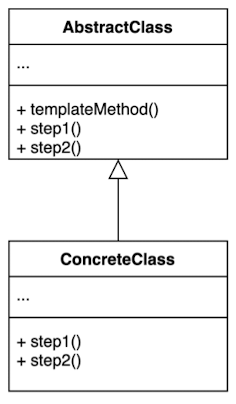
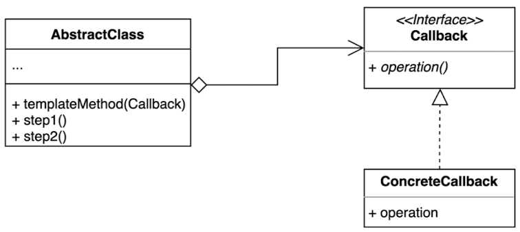
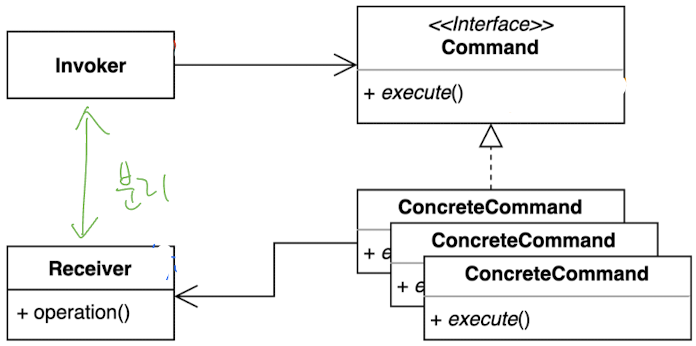
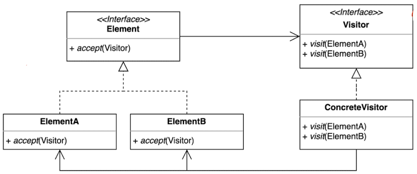

# Emergence (창발성)
- Emergence: when something begins to be known or noticed. when someone or something comes out of a difficult experience.
- 창발성: 남이 모르거나 하지 아니한 것을 처음으로 또는 새롭게 밝혀내거나 이루어 내는 성질.

## Getting Clean via Emergent Design
- Kent Beck’s four rules of Simple Design
  1. Runs all the tests 
  2. Contains no duplication 
  3. Expresses the intent of the programmer 
  4. Minimizes the number of classes and methods

## Simple Design Rule 1: Runs All the Tests
- Systems that aren’t testable aren’t verifiable.
- Making our systems testable pushes us toward a design where our classes are small and single purpose. 
  - => SRP => High Cohesion
- Tight coupling makes it difficult to write tests 
  - => DIP => Low Coupling

## Simple Design Rules 2–4: Refactoring
- The fact that we have these tests eliminates the fear that cleaning up the code will break it!
### No Duplication
```java
class SimpleList {
    ...
    public int size() {
      ...
    }
    
    public boolean isEmpty() {
        return 0 == size();
    }
    ...
}
```
```java
public void scaleToOneDimension(float desiredDimension, float imageDimension) {
    if (Math.abs(desiredDimension - imageDimension) < errorThreshold)
       return;
    float scalingFactor = desiredDimension / imageDimension;
    scalingFactor = (float)(Math.floor(scalingFactor * 100) * 0.01f);
    RenderedOp newImage = ImageUtilities.getScaledImage(
       image, scalingFactor, scalingFactor);
    // from here
    image.dispose();
    System.gc();
    image = newImage;
    // to
 }
 public synchronized void rotate(int degrees) {
    RenderedOp newImage = ImageUtilities.getRotatedImage(
       image, degrees);
    // from here
    image.dispose();
    System.gc();
    image = newImage;
    // to
 }
```
```java
public void scaleToOneDimension(
         float desiredDimension, float imageDimension) {
      if (Math.abs(desiredDimension - imageDimension) < errorThreshold)
         return;
      float scalingFactor = desiredDimension / imageDimension;
      scalingFactor = (float)(Math.floor(scalingFactor * 100) * 0.01f);
      replaceImage(ImageUtilities.getScaledImage(image, scalingFactor, scalingFactor));
}    

public synchronized void rotate(int degrees) {
    replaceImage(ImageUtilities.getRotatedImage(image, degrees));
}

private void replaceImage(RenderedOp newImage) {
    image.dispose();       
    System.gc();
    image = newImage;
}
```
- Template Method Pattern
  - 추상 클래스는 템플릿을 제공하고 하위 클래스는 구제적인 구현을 제공한다
    - Template Method
      - 
    - Template Callback (Lambda or Anonymous class)
      - 
```java
public class VacationPolicy {
   public void accrueUSDivisionVacation() {
      // code to calculate vacation based on hours worked to date
      // ...
      // code to ensure vacation meets US minimums
      // ...
      // code to apply vaction to payroll record
      // ...
   }
   public void accrueEUDivisionVacation() {
      // code to calculate vacation based on hours worked to date
      // ...
      // code to ensure vacation meets EU minimums
      // ...
      // code to apply vaction to payroll record
      // ...
   }
}
```
```java
abstract public class VacationPolicy {
   public void accrueVacation() {
      calculateBaseVacationHours();
      alterForLegalMinimums();       
      applyToPayroll();    
   }    
   
   private void calculateBaseVacationHours() { /* ... */ };
   abstract protected void alterForLegalMinimums();
   private void applyToPayroll() { /* ... */ };
}

public class USVacationPolicy extends VacationPolicy {
    @Override protected void alterForLegalMinimums() {
        // US specific logic    
    } 
}

public class EUVacationPolicy extends VacationPolicy {
    @Override protected void alterForLegalMinimums() {
        // EU specific logic    
    } 
}
```
- cons
  - LSP(Liskov Substitution Principle) 위반할 수 있다
  - 알고리즘 구조가 복잡할 수록 유지가 어려움

### Expressive
1. Good names
2. Small functions and classes => easy to name, easy to write, and easy to understand
3. Standard pattern names (ex: Command, Visitor)
   - Command Pattern: 호출자(Invoker) 와 수신자(Receiver)를 분리하는 패턴
   - 
     - Pros
       - 기존 코드 변경 없이 새로운 커맨드를 만들 수 있다. 
       - 수신자의 코드가 변경되어도 호출자의 코드는 변경되지 않는다.
       - ex) 로깅, DB 저장, 네크워크 전송 등 
   - Visitor Pattern: 기존 코드를 변경하지 않고 새로운 기능을 추가 하는 방법
   - 
     - Cons
       - Element를 추가하거나 제거할때 모든 visitor 코드 변경 필요
4. Well-written unit test
5. Try (effort)

### Minimal Classes and Methods
- Pointless dogmatism
  - ex1: creating an interface for each and every class
  - ex2: always be separated into data classes and behavior classes
- this rule is the lowest priority of the four rules 