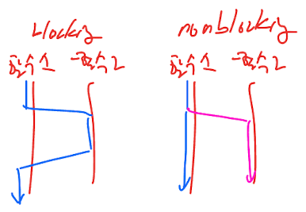

# Concurrency
## Why Concurrency?
- Decoupling **what** from **when** can dramatically improve both the throughput and structures of an application.
### Myths and Misconceptions
1. No
   1. Concurrency always improves performance.
      - only when there is a lot of wiat time
   2. Design does not change when writing concurrent programs.
      - The decoupling of what from when usually has a huge effect
   3. Understanding concurrency issues is not important when working with a container such as a Web or EJB container.
       - know what your container is doing and how to guard against concurrent issues
2. Yes
   1. Concurrency incurs some overhead.
   2. Concurrency is complex
   3. The bugs aren't usually repeatable
   4. Concurrency often requires a fundamental change

## Concurrency Defense Principles
### Single Responsibility Principle
- own life cycle of development, change, and tuning
- own challenges, which are different from and difficult than single thread problems
- challenging enough without the other codes
#### Recommendation 1:
    Keep your concurrency-related code separate from other code
### Corollary: Limit the Scope of Data
- restrict the number of critical sections 
  - (Critical Section: Race condition 현상이 발생할 수 있는 코드/ 부분/ 영역)
    - you will forget to protect some of those place
    - hard to guard the places effectively with duplication
    - difficult to determine and find concurrent issues
#### Recommendation 2:
    encapsulation and limit the access of any data that may be shared

### Corollary: Use Copies of Data
- copy objects and treat them as read-only
  - -> immutable data
- synchronized locking VS copy object creation and deletion from GC
### Corollary: Threads Should Be as Independent as Possible
- sharing no data with any other thread
#### Recommendation 3:
    Attampt to partition data in independent thread, in different processros

## Know Your  Library
1. thread-safe collections
2. executor framework
    ```java
    public interface Executor {
        void execute(Runnable command);
    } 
   ```
   ```java
   class TaskExecutionWebServer {
       private static final int NTHREADS = 100;
       private static final Executor exec = Executors.newFixedThreadPool(NTHREADS);

       public static void main(String[] args) throws IOException {
           ServerSocker socker = new ServerSocker(80);
           while(true) {
               final Socket connection = socker.accept();
               exec.execute(() -> handleRequest(connection));
           }
       }
   }
   ```
3. nonblocking solutions
- 
4. no thread safe library classes
### Thread-Safe Collections
- java.util.concurrent
  - Locks : 상호 배제를 사용할 수 있는 클래스를 제공한다. 
  - Atomic : 동기화가 되어있는 변수를 제공한다. 
  - Executors : 쓰레드 풀 생성, 쓰레드 생명주기 관리, Task 등록과 실행 등을 간편하게 처리할 수 있다. 
  - Queue : thread-safe한 FIFO 큐를 제공한다. 
  - Synchronizers : 특수한 목적의 동기화를 처리하는 5개의 클래스를 제공한다. 
    - Semaphroe, CountDownLatch, CyclicBarrier, Phaser, Exchanger
- Collections
  ```java
    List<Object> objList = Collections.synchronizedList(new ArrayList<Object>());
    Map<Integer, String> syncMap = Collections.synchronizedMap(new HashMap<>());
    Set<Integer> syncSet = Collections.synchronizedSet(new HashSet<>());
    ...
  ```
- Thread 생명 주기: https://github.com/wjdrbs96/Today-I-Learn/blob/master/Java/Thread/Thread%20%EC%83%81%ED%83%9C%2C%20%ED%95%B4%EC%A7%80%20%EC%A1%B0%EA%B1%B4.md
- Lock and Condition: https://github.com/wjdrbs96/Today-I-Learn/blob/master/Java/Thread/java.util.concurrent.locks/ReentrantLock%EC%9D%B4%EB%9E%80%3F.md
  - Lock, Condition은 wait(), notify()로는 불가능한 선별적인 통지가 가능
- ReentrankLock = Mutex
- Mutex(for 1) <= Semaphor(for n)
- CountDownLatch: https://stackoverflow.com/questions/184147/countdownlatch-vs-semaphore
```java
final CountDownLatch countdown = new CountDownLatch(1);

for (int i = 0; i < 10; ++ i) {
   Thread racecar = new Thread() {    
      public void run() {
         countdown.await(); //all threads waiting
         System.out.println("Vroom!");
      }
   };
   racecar.start();
}
System.out.println("Go");
countdown.countDown();   //all threads start now!
```
```java
final CountDownLatch countdown = new CountDownLatch(num_thread);

for (int i = 0; i < num_thread; ++ i) {
   Thread t= new Thread() {    
      public void run() {
         doSomething();
         countdown.countDown();
         System.out.printf("Waiting on %d other threads.",countdown.getCount());
         countdown.await();     //waits until everyone reaches this point
         finish();
      }
   };
   t.start();
}
```
#### Recommendation 4:
     java.util.concurrent, java.util.concurrent.atomic, java.util.concurrent.locks

## Know Your Execution Models
- Bound Resources: fixed-size read/write
- Mutual Exclusion: one by one
- Starvation: can not access data
- Deadlock: waiting for each other to finish
- Livelock: trying to do work but finding another
  - Ex) Police(인질을 풀어달라) <-> Criminal(돈달라)
    - https://remotelegs.tistory.com/13
    - 서로 요구만 하고 그 요구가 들어지지 않은 경우
### Producer-Consumer
- Producer = bound resource
- it can become livelock
### Readers-Writers
- throughput <-> starvation
### Dining Philosophers
- deadlock

## Beware Dependencies Between Synchronized Methods
- if there is more than one synchronized method on the same shared class, 
  - then your system may be written incorrectly
#### Recommendation 5: 
    Avoid using more than one method on a shared object.
- if you must use more than one method, 
  - there are 3 ways to make the code correct
    1. Client-Based Locking:
       1.  the client lock the server before calling the first method
       2.  the client unlock the server after calling the last method
    2. Server-Based Locking:
       1. the server create a method that locks the server with call all the methods
       2. the client use the method
    3. Adapted Server: when original server cannot be changed 

## Keep Synchronized Sections Small
#### Recommendation 5:
    Keep your synchronized sections as small as possible.
## Writing Correct Shut-Down Code Is Hard
#### Recommendation 6: 
    Think about shut-down early and get it working early. It’s going to take longer than you expect. 
    Review existing algorithms because this is probably harder than you think.

## Testing Threaded Code
#### Recommendation 7:
    Write tests that have the potential to expose problems and then run them frequently, 
    with different programatic configurations and system configurations and load. 
    If tests ever fail, track down the failure. 
    Don’t ignore a failure just because the tests pass on a subsequent run.
1. Treat spurious failures as candidate threading issues.
2. Get your nonthreaded code working first.
3. Make your threaded code pluggable. (다른 환경에서도 쉽게 끼워 넣을 수 있게 만들라)
4. Make your threaded code tunable.
5. Run with more threads than processors.
6. Run on different platforms.
7. Instrument your code to try and force failures. (실패 조건을 코드에 넣어 실험하자)

### T1. Treat Spurious Failures as Candidate Threading Issues
#### Recommendation: 
    Do not ignore system failures as one-offs.(일회성)

### T2. Get Your Nonthreaded Code Working First
#### Recommendation 8: 
    Do not try to chase down nonthreading bugs and threading bugs at the same time. 
    Make sure your code works outside of threads.

### T3. Make Your Threaded Code Pluggable(다른 환경에 쉽게 끼워 넣을 수 있게)
1. One thread, several threads, varied as it executes
2. Threaded code interacts with something that can be both real or a test double.
3. Execute with test doubles that run quickly, slowly, variable.
4. Configure tests so they can run for a number of iterations.
#### Recommendation 9: 
    Make your thread-based code especially pluggable 
    so that you can run it in various configurations.

### T4. Make Your Threaded Code Tunable
### T5. Run with More Threads Than Processors
### T6. Run on Different Platforms
#### Recommendation 10: 
    Run your threaded code on all target platforms early and often.

### T7. Instrument Your Code to Try and Force Failures
### T7-1. Hand-Coded
- You can insert calls to wait(), sleep(), yield(), and priority() in your code by hand.
  - wait(), sleep(), yield(), and priority()가 있더라도 코드는 온전히 동작해야한다.
  - 문제가 발생한다면 기존 코드에 문제가 있는 것이다.
  - 테스트 후에 프러덕션 코드에는 테스트 코드를 삭제 해야한다.
```java
public synchronized String nextUrlOrNull() {
    if(hasNext()) {
        String url = urlGenerator.next();
        Thread.yield(); // inserted for testing.
        updateHasNext();
        return url;
    }
    return null;
}
```
- There are many problems with this approach:
  1. You have to manually find appropriate places to do this. 
  2. How do you know where to put the call and what kind of call to use? 
  3. Leaving such code in a production environment unnecessarily slows the code down. 
  4. It’s a shotgun approach. You may or may not find flaws. Indeed, the odds aren’t with you.

### T7-2.Automated
- You could use tools like an Aspect-Oriented Framework, CGLIB, or ASM to programmatically instrument your code.
- 프러덕션에서는 동작하지 않게 만들고 
- 테스트 환경에서는 랜덤하게 wait(), sleep(), yield(), and priority()을 실행한다.
- jiggle을 하는 이유는 스레더의 순서를 랜덤하게 바꾸기 위해서다.
```java
public class ThreadJigglePoint {
    public static void jiggle() {
    }
}
```
```java
public synchronized String nextUrlOrNull() {
    if(hasNext()) {
        ThreadJiglePoint.jiggle();
        String url = urlGenerator.next();
        ThreadJiglePoint.jiggle();
        updateHasNext();
        ThreadJiglePoint.jiggle();
        return url;
    }
    return null;
}
```
#### Recommendation 4: 
    Use jiggling strategies to ferret out errors.
