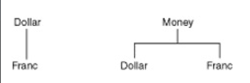

# 6장 돌아온 '모두를 위한 평등'

## 목록
- $5 + 10CHF = $10(환율 2:1일 경우)
- ~~$5 x 2 = $10~~
- ~~amount를 private로 만들기~~
- ~~Dollar 부작용?~~
- Money 반올림?
- ~~equals()~~
- hashCode()
- Equal null
- Equal object
- ~~5CHF x 2 = 10CHF~~
- Dollar/Franc 중복
- 공용 equals
- 공용 times

### 두 클래스의 상위 클래스


```java
abstract class Money {    
    protected int amount;
    Money(int amount) {
        this.amount= amount;
    }
   
    public boolean equals(Object object) {
        Money money = (Money) object;
        return amount == money.amount;
    }
}
```

```java
class Franc extends Money {
    
    Franc times(int multiplier) {
        return new Franc(amount * multiplier);
    }
}
```

## 목록
- $5 + 10CHF = $10(환율 2:1일 경우)
- ~~$5 x 2 = $10~~
- ~~amount를 private로 만들기~~
- ~~Dollar 부작용?~~
- Money 반올림?
- ~~equals()~~
- hashCode()
- Equal null
- Equal object
- ~~5CHF x 2 = 10CHF~~
- Dollar/Franc 중복
- ~~공용 equals~~
- 공용 times
- Franc와 Dollar 비교하기 (추가)

## 배운점
- 공통된 코드를 첫 번째 클래스(Dollar)에서 상위 클래스(Money)로 단계적으로 옮겼다.
- 두 번째 클래스(Franc)도 Money의 하위 클래스로 만들었다.
- 불필요한 구현을 제거하기 전에 두 equals()구현을 일치 시켰다.