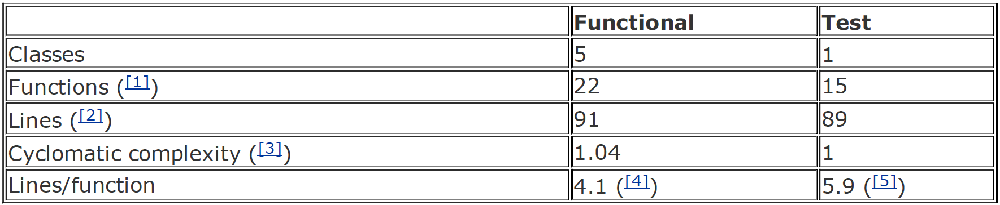

# Chapter 17. Money Retrospective

### What's Next?
---
코드가 모두 완료됐나? 아니다. 아직 Sum.plus()와 Money.plus()의 중복이 남아있다. 인터페이스 대신 Expression 클래스를 만든다면, common code를 갖게 될 것이다.
어떤 추가 테스트가 필요한가? 작동하지 않아야 하는 테스트에 대해서 생각하고 왜 작동하는지를 알아야 한다. 작동하지 않아야 하는 테스트는 실제로 작동하지 않으며, 알려진 제한이나 나중에 할 작업으로 기록할 수 있다.
마지막으로, 그 리스트가 비었을때는 디자인을 리뷰할 때이다. 단어와 개념이 함께 잘 어우러지는지? 현재 디자인을 고려할 때 제거하지 어려운 중복이 있는지?

### Metaphor
---
저자가 Money 예시를 코딩하는데에 있어서 여러번 리뷰하고 반복하는 작업을 거쳤다. 그리고 책을 집필하는 동안 expression을 은유로 사용하는 것을 생각했고 디자인은 이전과 완전 다른 방향으로 갔다. 저자는 한동안 MoneySum을 사용하다가, MoneyBag을 사용했고, 결국엔 대부분의 사람들의 경험에서 더 흔한 wallet을 사용했다. 은유라는 표현은 중복된 통화를 병합하는 것에 대한 많은 불쾌한 문제에서 저자를 해방시켰다. 
만약 저자가 20번이나 다시 작업했는데도 또 다시 작업하게 된다면 어떻게 될까? 새로운 인사이트를 발견할까? 아님 처음 생각했던대로 돌아갈까?

### JUnit Usage
---
Money 예제를 사용하는 동안 JUnit이 로그를 기록하게 두었다. 실행 버튼을 정확히 125번 눌렀었고 코딩하는 동안에 이 글을 쓰는 일도 같이 했다. 저자는 코딩을 하면서 동시에 글을 쓰고 있었기 때문에 실행 사이의 간격은 대표성이 없지만, 프로그래밍 하는 동안에는 분당 한 번 정도 테스트를 실행했다.

위 그림은 테스트 실행 간 인터벌을 보여주는 히스토그램이다. 많은 수의 긴 간격은 저자가 글 쓰는 데 소비한 시간 때문일 가능성이 크다.

### Code Metrics
---

1. 전체 API를 구현하지 않았기 때문에 절대적인 함수 수나 클래스당 함수 수 또는 클래스당 줄 수를 평가할 수 없다. 하지만 비율은 유익하다. 테스트 및 기능 코드에는 대략 많은 라인과 함수가 있다.
2. 공통 Fixture들을 추출하여 테스트 코드의 줄 수를 줄일 수 있다. 하지만 모델 코드 행과 테스트 코드 행 사이의 대략적인 대응 관계는 유지된다.
3. 회기성 복잡도(cyclomatic complexity)는 기존 흐름 복잡도(flow complexity)와 같다.. 테스트 코드에는 분기나 루프가 없기 때문에 테스트 복잡도는 1이다. 기능적 코드 복잡도는 명시적 제어 흐름 대신 다형성을 많이 사용하기 때문에 낮다.
4. 여기에는 함수 헤더와 후행 중괄호가 포함된다.
5. JUnit 사용 섹션에 설명된 대로 일반적인 Fixture 빌드 코드를 제외하지 않았기 때문에 테스트에서 함수당 라인 수가 부풀려졌다.

### Process
---
* TDD cycle
    - 작은 테스트 추가하기
    - 모든 테스트 실행하고 실패 확인하기
    - 수정하기
    - 모든 테스트 실행하고 성공 확인하기
    - 중복을 제거하기 위해 리팩토링하기

### Test Quality
---
TDD의 부산물로 자연히 생기는 테스트들은 시스템의 수명이 다할 때까지 함께 유지돼야 할 만큼 유용하다.하지만 이 테스트들이 다음과 같은 다른 종류의 테스트들을 대체할 것이라고 생각해서는 안된다.
- Performance
- Stress
- Usability

### One Last Review
---
TDD를 가르칠 때 사람들이 자주 놀라는 세 가지는
- 테스트를 확실히 돌아가게 만드는 세 가지 접근법: 가짜로 구현하기(fake it), 삼각측량법(triangulation), 명백하게 구현하기(obvious implementation)
- 설계를 주도하기 위한 방법으로 테스트 코드와 실제 코드 사이의 중복을 제거하기
- 길이 미끄러우면 속도를 줄이고 상황이 좋으면 속도를 높이는 식으로 테스트 사이의 간격을 조절할 수 있는 능력
