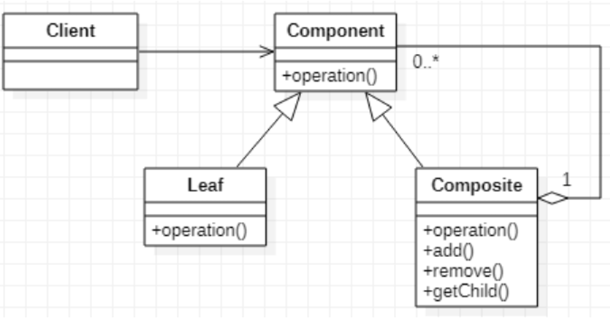
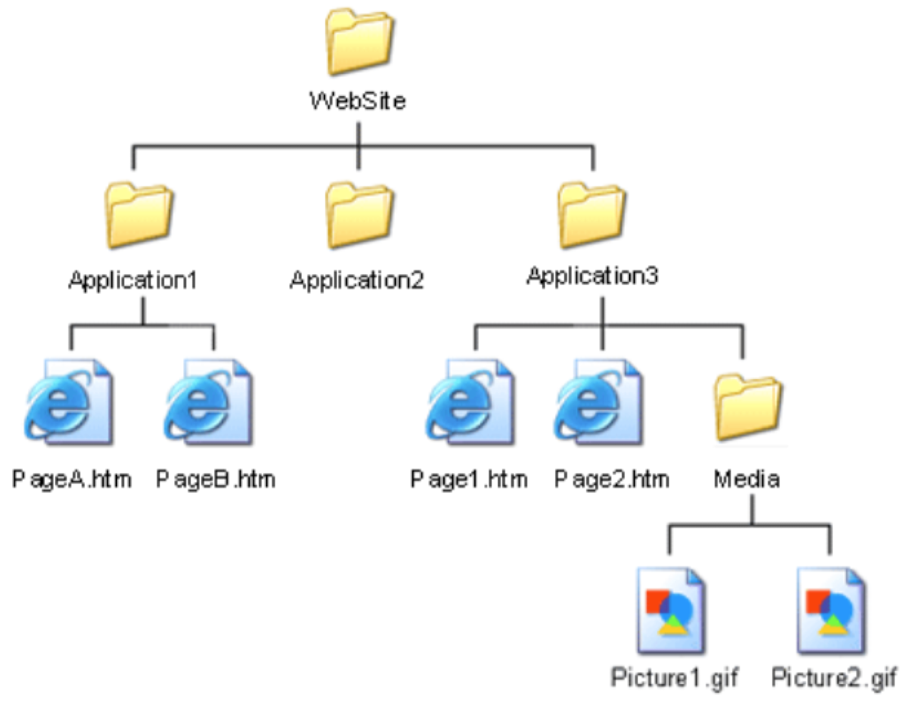

# 얼마나 달콤한지

## Current Todo
- ~~테스트 메서드 호출하기~~
- ~~먼저 setUp 호출하기~~
- ~~나중에 tearDown 호출하기~~
- 테스트 메서드가 실패하더라도 tearDown 호출하기
- 테스트 여러 개 실행하기
- ~~수집한 결과를 출력하기~~
- ~~WasRun에 로그 문자열 남기기~~
- ~~실패한 테스트 보고하기~~
- setUp 에러를 잡아서 보고하기

## Sum이 Composite 같다. Composite 패턴 이란?
- 클라이언트 입장에서는 ‘전체’나 ‘부분’이나 모두 동일한 컴포넌트로 인식할 수는 계층 구조 를 만든다.
- UML
    - 
- Example
    - 

## Collecting Parameter
```java
class test {
    void test() {
        StringBuilder sb = new StringBuilder();
        sb.append("Parameter1, " );
        sb.append("Parameter2, ");
        sb.append("and Parameter3 ");
        sb.append("were collected!");
        System.out.println(sb.toString());
        // Parameter1, Parameter2, and Parameter3 were collected! 
    }
}
```

## 코드
```Python
#ch23
class TestSuite:
    def __init__(self):
        self.tests = []
    def add(self, test):
        self.tests.append(test)
    def run(self, result):
        for test in self.tests:
            test.run(result)

class TestCase:
    def __init__(self, name):
        self.name = name
    def setUp(self):
        pass
    def tearDown(self):
        pass
    def run(self, result):             # ch23
        # result = TestResult()        # removed in ch23
        result.testStarted()
        self.setUp()
        try:
            method = getattr(self, self.name)
            method()
        except:
            result.testFailed()
        self.tearDown()
        # return result                # removed in ch23
        
class WasRun(TestCase):
    def __init__(self, name):
        TestCase.__init__(self, name)
    def setUp(self):
        self.log = "setUp "
    def tearDown(self):
        self.log = self.log + "tearDown "
    def testMethod(self):
        self.log = self.log + "testMethod "
    def testBrokenMethod(self):
        raise Exception

class TestResult:
    def __init__(self):
        self.runCount = 0
        self.errorCount = 0
    def testStarted(self):
        self.runCount = self.runCount + 1
    def testFailed(self):
        self.errorCount= self.errorCount + 1
    def summary(self):
        return "%d run, %d failed" % (self.runCount, self.errorCount)
        
class TestCaseTest(TestCase):
    def setUp(self):                        # ch23
        self.result= TestResult()           # ch23
    def testTemplateMethod(self):
        test = WasRun("testMethod")
        # result = test.run()
        test.run(self.result)                    # replaced in ch23
        assert("setUp testMethod tearDown " == test.log)
    def testResult(self):
        test = WasRun("testMethod")
        test.run(self.result)                    # ch23
        assert("1 run, 0 failed" == self.result.summary()) # ch23
    def testFailedResult(self):
        test = WasRun("testBrokenMethod")
        test.run(self.result)                    # ch23
        assert("1 run, 1 failed", self.result.summary()) # ch23
    def testFailedResultFormatting(self):
        # result = TestResult()            # removed in ch23
        self.result.testStarted()               # ch23
        self.result.testFailed()                # ch23
        assert("1 run, 1 failed" == self.result.summary()) # ch23
    # ch23
    def testSuite(self):
        suite = TestSuite()
        suite.add(WasRun("testMethod"))
        suite.add(WasRun("testBrokenMethod"))
        suite.run(self.result)
        assert("2 run, 1 failed" == self.result.summary())

suite = TestSuite()                         # ch23
# TestCaseTest("testTemplateMethod").run()
suite.add(TestCaseTest("testTemplateMethod")) # replaced in ch23
suite.add(TestCaseTest("testResult"))         # replaced in ch23
suite.add(TestCaseTest("testFailedResult"))   # replaced in ch23
suite.add(TestCaseTest("testFailedResultFormatting"))  # replaced in ch23
suite.add(TestCaseTest("testSuite"))        # ch23
result = TestResult()                       # ch23
suite.run(result)                           # ch23
print(result.summary())                     # ch23
# 5 run, 0 failed
```

## Current Todo
- ~~테스트 메서드 호출하기~~
- ~~먼저 setUp 호출하기~~
- ~~나중에 tearDown 호출하기~~
- 테스트 메서드가 실패하더라도 tearDown 호출하기
- ~~테스트 여러 개 실행하기~~
- ~~수집한 결과를 출력하기~~
- ~~WasRun에 로그 문자열 남기기~~
- ~~실패한 테스트 보고하기~~
- setUp 에러를 잡아서 보고하기
- TestCase 클래스에서 TestSuite 생성하기