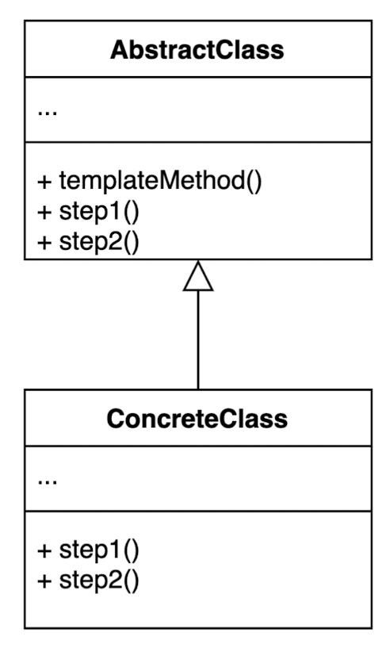
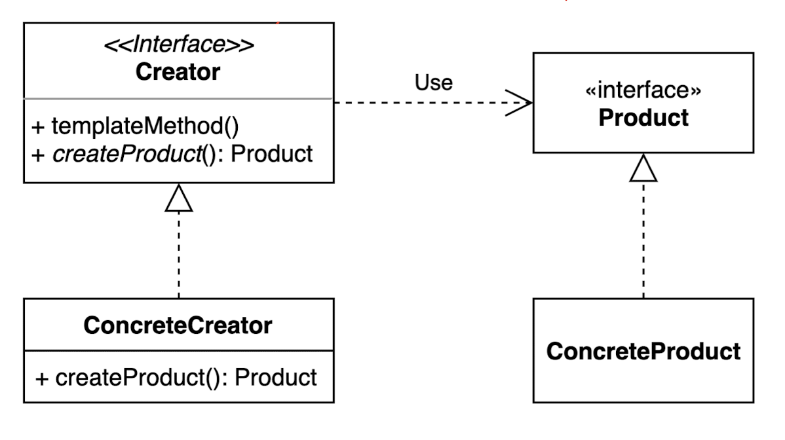

# 디자인 패턴
## TDD에서 디자인 패턴의 쓰인새
| 패턴                   | 테스트 작성 | 리팩토링 |
|----------------------|--------|------|
| Command              | X      |      |
| Value Object         | X      |      |
| Null Object          |        | X    |
| Template Method      |        | X    |
| Pluggable Object     |        | X    |
| Pluggable Selector   |        | X    |
| Factory Method       | X      | X    |
| Imposter             | X      | X    |
| Composite            | X      | X    |
| Collecting Parameter | X      | X    |


## Command
```java
interface Runnable {
    public abstract void run();
}
```
- Functional Interface

| 함수형 인터페이스      | Descripter      | Method                  |
|----------------|-----------------|-------------------------|
| Predicate      | T -> boolean    | boolean test(T t)       | 
| Consumer       | T -> void       | void accept(T t)        | 
| Supplier       | () -> T         | T get()                 | 
| Function<T, R> | T -> R          | R apply(T t)            | 
| Comparator     | (T, T) -> int   | int compare(T o1, T o2) |
| Runnable       | () -> void      | void run()              | 
| Callable       | () -> T         | V call()                |

## Value Object
- Value Object VS Reference Value
- Aliasing Problem
  - java에서는 하나의 객체를 서로 다른 변수가 참조할 수 있다. 
  - 이처럼 동일한 객체를 서로 다른 변수가 참조하는 것을 별칭(aliasing)이라고 한다.
  - 별칭을 가진 객체의 상태를 변경할 경우 골치 아픈 버그가 발생할 수 있다.
- equals 와 hash를 구현해야한다. 

## Null Object
- Null대신 기본값이나 빈값을 리턴한다.
- NPE 를 피할 수 있고 If문을 삭제 할 수 있다.

## Template Method


## Pluggable Object
```java
if(figure.isCircle()) {
    //. . . circley stuff. . . 
} else {
    //. . . non circley stuff
}
```
```java
interface Figure {
    public double getArea();
}

class Circle implements Figure {
    @Override
    public double getArea() {
        //. . . circley stuff. . .
    }
}
class Rectangle implements Figure {
  @Override
  public double getArea() {
    //. . . ractangle stuff. . .
  }
}
```
## Pluggable Selector
- Pluggable Object VS Pluggable Selector
```java
abstract class Report {    
    String printMessage; // 저장
    Report(String printMessage) {
        this.printMessage= printMessage; // 지정
    }
   void print() {       
        switch (printMessage) {
            case "printHTML" :
                printHTML(); // 실행
                break; 
            case "printXML" :
                printXML(); // 실행
              break;       
        }    
    };
    void printHTML() {
        // do
    }
    void printXML() {
      // do
    }
}
```
```java
void print() {
    // printMessage == 메서드 명(printHTML() or printXML()) 
    Method runMethod= getClass().getMethod(printMessage, null);
    runMethod.invoke(this, new Class[0]); 
}

```
## Factory Method


## Imposter
- 현존하는 프로토콜을 가진 다른 구현을 추가하여 새로운 시스템으로 차츰 변이한다.
- Ex)
  - Null Object
  - Composite

## Composite
- 하나의 객체로 여러 객체의 행위 조합을 표현한다.
- Ex) 폴더는 객체는 다른 폴더와 파일들의 조합으로 표현된다.


## Collecting Parameter
```java
class test {
    void test() {
        StringBuilder sb = new StringBuilder();
        sb.append("Parameter1, " );
        sb.append("Parameter2, ");
        sb.append("and Parameter3 ");
        sb.append("were collected!");
        System.out.println(sb.toString());
        // Parameter1, Parameter2, and Parameter3 were collected! 
    }
}
```

## Singleton
- 언어에서 지원하지 않으면 쓰지 마라