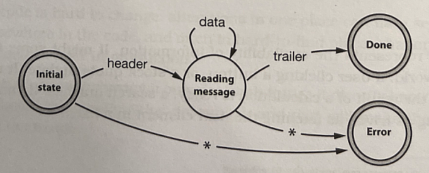
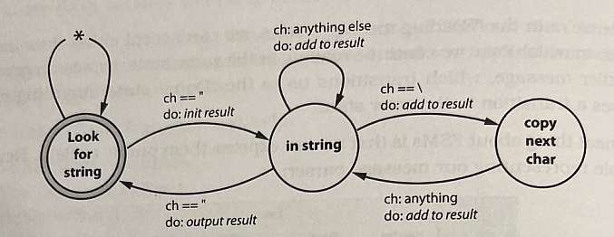
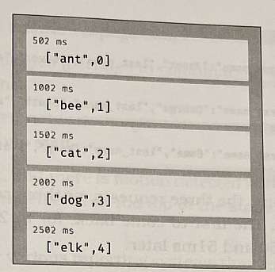
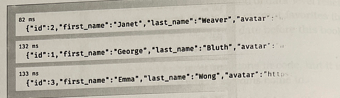

# Juggling the Real World

#### Responsive application
- Today, computers have to integrate into our world
- Our world is messy
- Things are constantly happening, stuff gets moved around
- The application we write somehow have to work out what to do

## Events
- An event represents the availability of information (Might come from the outside world)
  - A user clicking a button
  - A stock quote update
  - It can even be something as trivial as fetching the next element in a list

- Respond to events
  - Whatever the source, applications respond to events, and adjust what they do based on those events

- How can we write responsive application?
  - Without some kind of strategy, it will be easy to make messy application or tightly coupled code 
  - Four strategies to make responsive application
    1. Finite State Machines
    2. The Observer Pattern
    3. Publish/Subscribe
    4. Reactive Programming and Streams

## Finite State Machines (FSM)
- Quite often, the FSM implementation will be just a couple of lines of code, but those few lines help untangle a whole lot of potential mess.

- Misunderstanding for FSM
  - There seems to be a belief that they are difficult
  - They only apply if you're working with hardward
  - You need to use some hard-to-understand library
  - None of these are true

### The Anatomy of a Pragmatic FSM
- A state machine is basically just a specification of how to handle events
- It consist of a set of states
  - One of which is the current state
  - For each state, we list the events that are significant to that state
- For each of those event
  - we define the new current state of the system

#### Example : Receiving multipart messages from a websocket

- Start in the "Initial state"
- If receive a header message, transition to the "Reading message" state
- If receive anything else while in the initial state, transition to the "Error" state
- While in the "Reading message" state, can accept either data message, trailer message
- Table representing this parser

| state | Event   |         |         |       |
|-------|---------|---------|---------|-------|
|       | Header  | Data    | Trailer | Other |
|Initial| Reading | Error   | Error   | Error |
|Reading| Error   | Reading | Done    | Error |

- Rows in the table represent the states
- To find out what to do when an event occurs, look up the row for the current state, scan along for the column representing the event, the contents of that cell are the new state

- Code for this FSM (ruby)
```
TRANSITIONS = {
  initial : {header::reading},
  reading : {data::reading, trailer::done}
}

state =: initial

while state != :done && state != :error
  msg = get_next_message()
  state = TRANSITIONS[state][msg.msg_type] || :error
end
```
- If there is no matching new state, it sets the state to :error

### Adding Actions
- A pure FSM is an event stream parser.
- Its only output is the final state
- We can beef it up by adding actions that are triggered on certain transitions
  
#### Example
- We might need to extract all of the string in a source file
- A string is text between quotes, but a backslash in a string escapes the next character, so "Ignore \\"quotes\\"" is a single string
- Here's an FSM that does this



- This time, each transition has two labels
- The top one is the event that triggers it, the bottom one is the action to take as we move between states. 
  
- Express in a table
  - Not like previous example, this case each entry in the table is a two-element list containing the next *state* and the *name of an action*
  - event => ch : ", \ , anything else, ...
  - action => do :add to result, ...

```
TRANSITIONS = {
# current new state action to take
#---------------------------------------------------------
  look_for_string: {
    '"' => [ :in_string, :start_new_string ],
    :default => [ :look_for_string, :ignore ],
  },

  in_string: {
    '"' => [ :look_for_string, :finish_current_string ],
    '\\' => [ :copy_next_char, :add_current_to_string ],
    :default => [ :in_string, :add_current_to_string ],
  },

  copy_next_char: {
    :default => [ :in_string, :add_current_to_string ],
  },
}
```
- Also added the ability to specify a default transition, taken if the event doesn't match any of the other transitions for this state.

```
state = :look_for_string
result = []

while ch = STDIN.getc
  state, action = TRANSITIONS[state][ch] || TRANSITIONS[state][:default]
  case action
    when :ignore
    when :start_new_string
      result = []
    when :add_current_to_string
      result << ch
    when :finish_current_string
      puts result.join
    end
end
```
- Similar to the previous example
  - loop through the vent (the characters in the input)
  - triggering transitions
- Different 
  - The result of each transition is both a new state and the name of an action
  - Use the action name to select the code to run before we go back around the loop

#### Variants of FSM
- the transition table could use anonymouse functions of function pointers for the action
- Wrap the code that implements the state machine in a seperate class with its own state

### State Machines Are a Start 
- State machines are underused by developers, and we'd like to encourage you to look for opporutnities to apply them
- But they don't solve all the problems associated with events


## The Observer Pattern
#### keyword
- observable : a source of events
- observers : a list of clients who are interested in those events

##### How it works
- An observer registers its interest with the observable, typically by passing a reference to a function to be called
- When the events occurs, the observable iterates down its list of observers and calls the function that each passed it
- The event is given as a parameter to that call

#### Example
```
module Terminator
  CALLBACKS = []

  def self.register(callback)
    CALLBACKS << callback
  end

  def self.exit(exit_status)
    CALLBACKS.each { |callback| callback.(exit_status) }
    exit!(exit_status)
  end
end

Terminator.register(-> (status) { puts "callback 1 sees #{status}" })
Terminator.register(-> (status) { puts "callback 2 sees #{status}" })
Terminator.exit(99)
```
```
$ ruby event/observer.rb
callback 1 sees 99
callback 2 sees 99
```
- The Terminator module is used to terminate the application
- It notifies all its observers that the application is going to exit
- They might use this notification to tidy up temporary resources, commit data, and so on.

- The observer/observable pattern has been used for decades, and it has served us well.
  - In user interface system, where the callbacks are used to inform the application that some interaction has occurred

#### Problem of observer pattern
- Because each of the observers has to register with the observable, it introduces coupling.
- It can introduce performance bottlenecks
- This is solved by the next strategy, Publish/Subscribe

## Publish/Subscribe
Publish/Subscribe(pubsub) generalizes the observer pattern, at the same time solving the problems of coupling and performance

#### keyword
- publishers
  - Write events to channels
- subscribers
  - register interest in one or more of channels
- channels
  - implemented in a seperate body of code
  - library, process, distributed infrastructure
  - All this implementation detail is hidden from code
  - Every channel has a name
- Unlikely the observer pattern, the communication between the publisher and subscriber is handled outside your code, and is potentially asynchronous.

#### Pros
- Most cloud service providers have pubsub offering, allowing you to connect applications around the world
- Every popular language will have at least one pubsub library
- Pubsub is a good technology for decoupling the handling of asynchronous events
- It allows code to be added and replaced, potentially while the application is running without altering existing code.
  
#### Cons
- It can be hard to see what is going on in a system that uses pubsub heavily
- You can't look at a publisher and immediately see which subscribers are involved with a particular message

#### Summary
- Compared to the observer pattern, pubsub is a great example of reducing coupling by abstracting up through a shared interface (the channel)
- But it is stil basically just a message passing system

## Reactive Programming, Streams, and Events

#### Reactive Programming
- Similar with spreadsheet, a cell contains a formula which refers to the other cell
- Value is updated by the changed value of referring cell
- There are many framework that can help data-level reactivity
  - React
  - Vue.js

#### Streams
- Necessary of Streams
  - It's clear that events can also be used to trigger reactions in code
  - But it isn't necessarily easy to plumb them in. 
  - That's where streams come in
- How it works
  - Streams let us treat events as if they were a collection of data
  - If there is long list of event, streams can treat just like any other collection
    - manipulate 
    - combine
    - filter 
    - do all the other data-ish things we know.
  - Can even combine event streams and regular collections
  - Asynchronous


#### Example #1
- RxJs library for JavaScript
- Takes two stream and zips them together => The result is a new stream where each element contains one item from the first input stream and one item from the other
  - First stream : a list of five animal names
  - Second stream : interval timer which generates an event every 500 ms
- The Streams are zipped together, a result is only generated when data is available on both
  - only emit a value every half seconds

```
import * as Observable from 'rxjs'
import { logValues } from "../rxcommon/logger.js"

let animals = Observable.of("ant", "bee", "cat", "dog", "elk")
let ticker = Observable.interval(500)

let combined = Observable.zip(animals, ticker)

combined.subscribe(next => logValues(JSON.stringify(next)))
```



- Getting one event from the stream every 500ms
- Each event contains a serial number (created by the interval observable) and the name of the enxt aniaml from list

#### Example #2
```
import * as Observable from 'rxjs'
import { mergeMap } from 'rxjs/operators'
import { ajax } from 'rxjs/ajax'
import { logValues } from "../rxcommon/logger.js"

let users = Observable.of(3, 2, 1)

let result = users.pipe(
  mergeMap((user) => ajax.getJSON(`https://reqres.in/api/users/${user}`))
)

result.subscribe(
  resp => logValues(JSON.stringify(resp.data)),
  err => console.error(JSON.stringify(err))
)
```

- Timestamps
  - the three requests, or three separate streams, were processed in parallel.
  - The first to come back, for id 2, took 82ms
  - The next came back 50 and 51ms later

### Streams of Events Are Asynchronous Collections
- In the previous example, list of user IDs was static
- But it doesn't have to be
- All we have to do is to generate an observable event countaining their user ID when their session is created, and use that observable instread of the static one. 
- Fetching details about the users with IDs, 
- Very powerful abstraction
  - No longer need to think about thime as being something we have to manage
  - Event streams unify synchronous and asynchronous processing behind a comment, conventient API

## Events Are Ubiquitous
- Events are everywhere
  - A button click
  - A timer expiring
  - logging in
  - A file matching a pattern
- Whatever their source, code that's crafted around events can be more responsive and better decoupled than its more linear counterpart.

