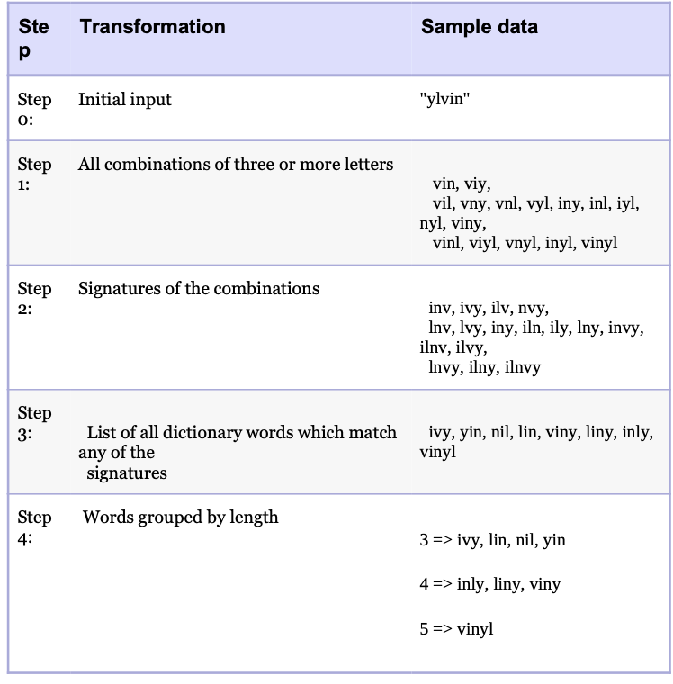
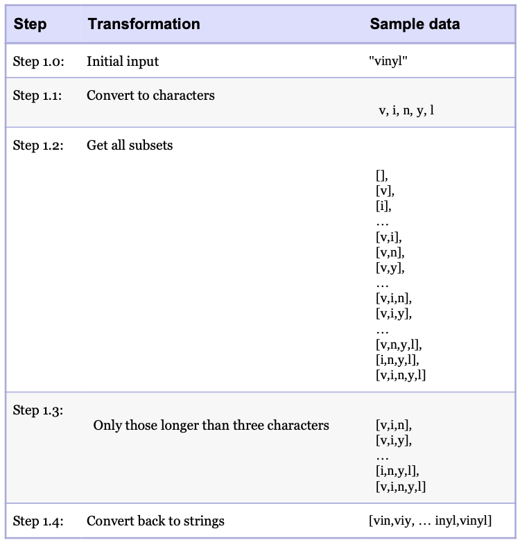
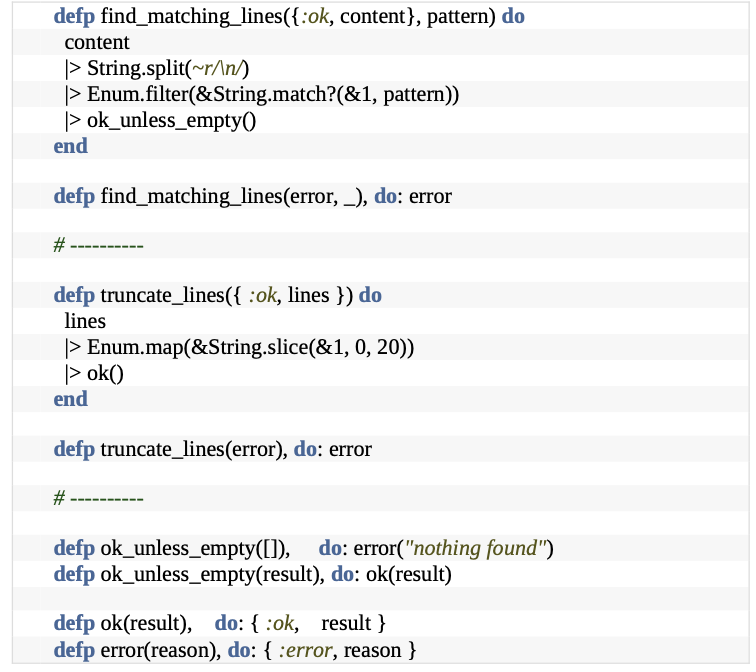
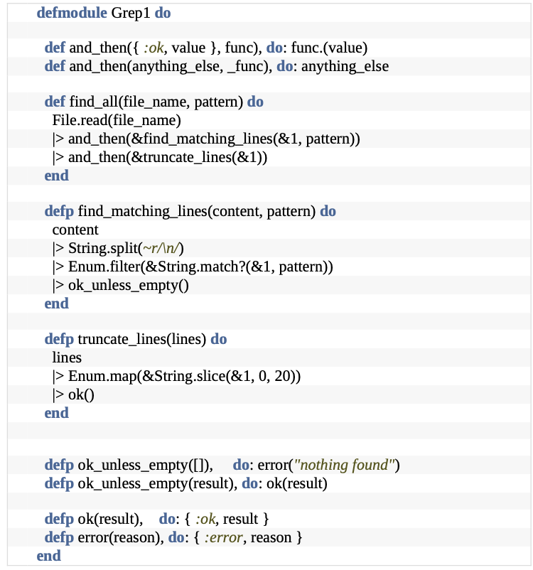

# Transforming Programming

## Programming is About Code, but Programs are about Data
* Think of programs as being something that transforms inputs into outputs.
    * The structure becomes clearer, the error handling more consistent, and the coupling drops way down.
* Unix programmer POV: Think about what we have (i.e. a directory tree) and what we want (i.e. a lisst of files).
```
$ find . -type f | xargs wc -l | sort -n | tail -6 | head -5 470 ./debug.pml
470 ./test_to_build.pml
487 ./dbc.pml
719 ./domain_languages.pml
727 ./dry.pml
```

* In terms of data that flows between the individual steps (raw data -> finished information), this becomes a series of transformations:
```
directory name 
-> list of files
-> list with line numbers
-> sorted list
-> highest five + total
-> highest five
```

## Finding Transformations

* _Top-Down_ approach:
    * Start with the requirement and determine its inputs and outputs.
    * Then find steps that lead you from input to output

    

    * Each step can also be represented as a list of transformations

    

## What's with the |> operator?

* Pipeline operator (aka _forward pipe_ or _pipe_) in Exilir
```
defp all_subsets_longer_than_three_characters(word) do 
    word
    |> String.codepoints()
    |> Comb.subsets()
    |> Stream.filter(fn subset -> length(subset) >= 3 end)
    |> Stream.map(&List.to_string(&1))
end
```
* Takes the value on its left and insert it as the first parameter of the function on its right

```
Comb.subsets(String.codepoints("vinyl"))
```

* Elm, F#, Swift : |>
* Clojure : -> and ->>
* R : %>%>

## Language X Doesn't Have Pipelines
* Transformation doesn't require a particular language syntax: it's more a philosophy of design.
* Write them as a series of assignments.
```
const content = File.read(file_name);
const lines = find_matching_lines(content, pattern)
const result = truncate_lines(lines)
```

## Putting it All Together
```
def anagrams_in(word) do
    word
    |> all_subsets_longer_than_three_characters()
    |> as_unique_signatures()
    |> find_in_dictionary()
    |> group_by_length()
end
```

## Why is this So Great?
* OOP demands that you hide data, encapsulating it inside objects. This introduces a lot of coupling.
* With transformational model, data is no longer tied to a particular group of functions. It is free to represent the unfolding progress of our application as it transforms its inputs into its outputs.
* Greatly reduces coupling.

## What about Error Handling?
* We never pass raw values between transformations. Instead, we wrap them in a data structure (or type) which also tells us if the contained value is valid.
* This concept is language specific. In general: handle checking for errors inside your transformations or outside them.

### Steps
* Choose a representation
```
iex(1)> File.open("/etc/passwd") 
{:ok, #PID<0.109.0>}

iex(2)> File.open("/etc/wombat") 
{:error, :enoent}
```
* Handle it inside each transformation



* Or handle it in the pipeline
    * We don't want to run code further down the pipeline when an error occurs, and we don't want the code to know that this is happening.
    * We need to defer running pipeline functions until we know that previous steps in the pipeline was successful.
    * Change them from function _calls_ into function _values_ that can be called later


