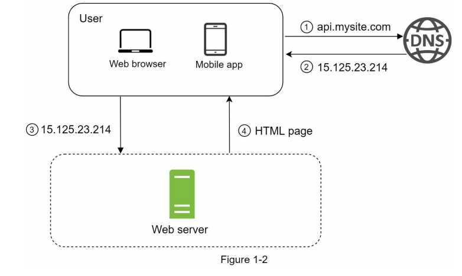
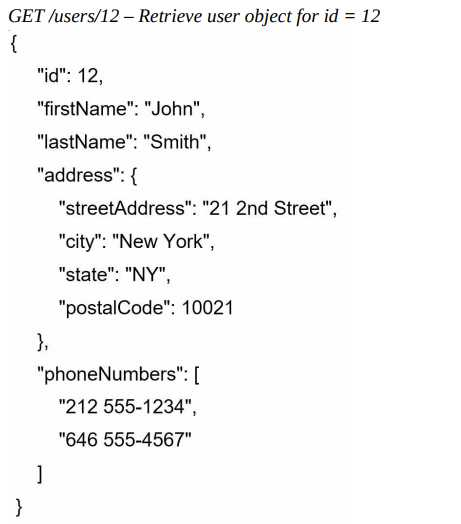

# 1. Scale From zero to Milions of Users
## (1) Single Server Setup


### - A single server setup (fg1-1)

Everything is running on one server( web app, database, cache, etc )


### - Request Flow & Traffic source

#### *Request Flow (fg1-2)*
```
1. 유저 도메인명 접속 (DNS(Domain name service)는 3rd party를 통한 유료서비스)
2. IP(internet protocol) 주소이 browser나 mobile app에 반환
3. IP가 주어지면, HTTP(Hypertext Transfer Protocol)의 Request가 directly your web server로 전달된다.
4. The web server가 렌더링을 위한 HTML page or Json response을 Return한다. 
```


#### *Traffic Source*
The traffic to your webserver는 두개의 sources(web application and mobile application)으로 온다.
```
1. web application: 두개의 combination 구성
 - server-side languages(Java, Python, etc) to handle business logic, storage, etc
 - front-side languages(HTML and JavaScript) for presentation

2. mobile application(API): HTTP protocol은 통신규약(communication protocol)로써 mobile app과 web server에 대함이다.
 - JSON(JavaScript Object Notation)이 가장 널리쓰이는 API response format to transfer data인데 이는 simplicity 때문이다.


  
```
###### JSON format 예시
 

## (2) Database (multiple server case)

Say multiple servers are needed with the growth of the user base now.

Separating web/mobile traffic (web tier) and database (data tier)을 이용한 독립적 확장


Which databases to use(Relational database vs Non-relational database)?

#### *Relational database*
```
- called RDBMS(Relational database management system) or SQL database
- i.e.) MySQL, Oracle database, PostgreSQL, etc.
- data in tables and rows
- SQL join operations(O)

When to use?
 All cases except for the NoSQL database cases below
```

#### *Non-relational database*
```
- called NoSQL databases
- i.e.) CouchDB, Neo4j, Cassandra, HBase, Amazon DynamoDB, etc.
- four categories: key-value stores, graph stores, column stores, and document stores
- join operations(SQL) across different database tables
- SQL join operations(X)

When to use?
• Your application requires super-low latency(minimal delay).
• Your data are unstructured, or you do not have any relational data.
• You only need to serialize and deserialize data (JSON, XML, YAML, etc.).
• You need to store a massive amount of data.
```

## (3) Vertical scaling vs horizontal scaling
#### *Vertical Scaling*👎
```
- called “scale up”
- more power (CPU, RAM, etc.) to your servers
- When traffic is low

But, Serious limitations
 • No unlimited CPU and memory to a single server.
 • No failover(장애조치) and redundancy(서버다중화). i.e. Server down😴 -> Website/App down😱
```

#### *horizontal Scaling*👍
```
- called  “scale-out”
- more servers into your pool of resources
- ✔ More Desirable for Large-Scale Applications( Due to the Vertical Scaling limit)
- SQL join operations(O)
```

In the single server design(users -> the web server directly),

 case 1. Web server offline -> No user access
 
 case 2. Many users access simultaneously ->  Web server’s Load Limit -> Lower Response or Fail Response

 
## (4) Load balancer

## (4) Database replication
## (5) Cache
## (6) Content delivery network (CDN)
## (7) Stateless web tier
## (8) Data centers
## (9) Message queue
## (10) Logging, metrics, automation
## (11) Database scaling


Reference from 'System Design Interview' written by Alex Xu
