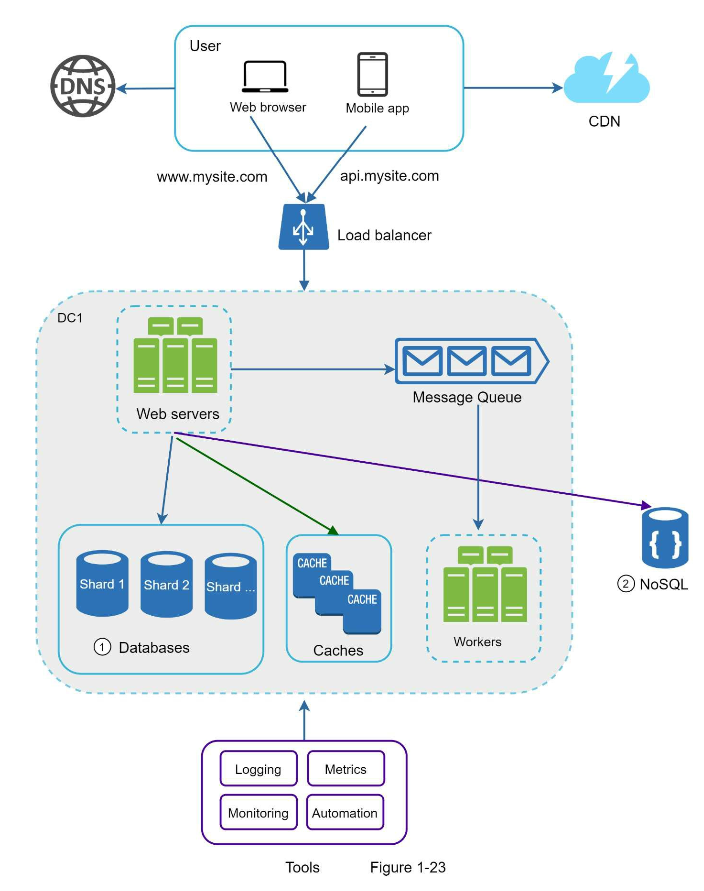
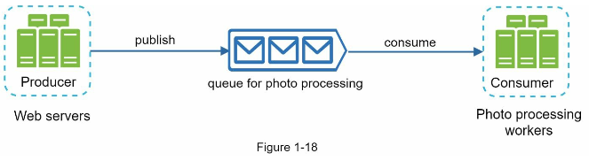

# Chapter 1. Scale from zero to millions of users

In this chapter, key components are introduced to host an application for many requests. The key components are:
- Load balancer
- Cache
- Content delivery network(CDN)
- Database
- Web server
- Queue
- Logging and monitoring
- Automation(Contious integration and continuous deployment(CI/CD))

# Goals for system design
- High availibitly
- Reliability
- Performance
- Cost
- Maintenance
- (Scalability)
: The ultimate goal for system design is to satisfy the above five factors. However, there is a trade-off among them.

## Verticla scaling vs horizontal scaling
- scale up vs scale out
- There are pros and cons between verticla scaling and horizontal scaling depending on business logic, cost, and team maturity.
- 

## Components
1. Load balancer
    - It distribute incoming requests based on a load balancer setting. 
2. Cache
    - What is cache?
        - A cache is a temporary storage area that stores the result of expensive response of frequently accessed data in memory so that subsequent requests are served more quickly.
    - What to consider?
        - Caching is not a permenent store. Cached data is stored in volatile memory.
        - Expiration policy.
        - Consistency
        - Single point of failure (SPOF): Requires multiple cache servers.
        - Eviction policy (LRU, LFU, or FIFO)
3. Content delivery network(CDN)
    - A CDN is a network of geographically dispersed servers used to deliver static content. CDN servers cache static like images, videos, CSS, JavaScript files.
4. Database
    - Relational database management system(RDBMS) vs Non-Relational database(NoSQL)
    - Database replication
        - master vs slave (writer vs reader)
        - Advanteges:
            - Better performance
            - Reliablity
            - High availability            
    - Database scailing 
        - verticla vs horizontal
        - Sharding challenges
            - Resharding data (Due to uneven data distribution)
            - Celebrity problem (Hotspot key problem)
            - join and de-normalization
5. Web server
    - stateless architecture vs stateful architecture
        - stateful architecture: HTTP requests from users can be sent to any web servers, which fetch state data from a shared data store.
    - To desing stateless architecture, we need to have a persistent data store that store sessions data.
    - Web server should do **auto scale** depending on incoming requests (k8s)
5. Queue
    - It serves as a buffer and distributes **asynchronous requests**.
    - pulling vs pushing.
    - Using queue decouples a messaging logic. And this can make an architecture for building a scalable and reliable application.
    - 
6. Logging (monitoring) and metrics
    - Logging plays a crucial part when it comes to **debugging and maintenain system**. 
    - Without metrics, there is no way to understand **key business value** and evaluate impace.
7. Automation(Contious integration and continuous deployment(CI/CD))
    - As system goes bigger and complicated, maintenace cost is also getting bigger.
    - The automation tools for CI, CD, and testing is also necessary.
