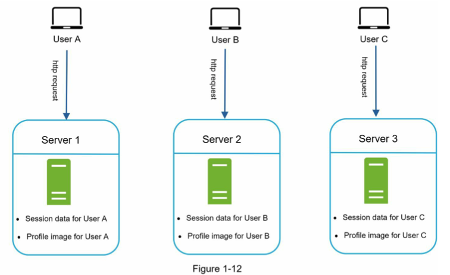
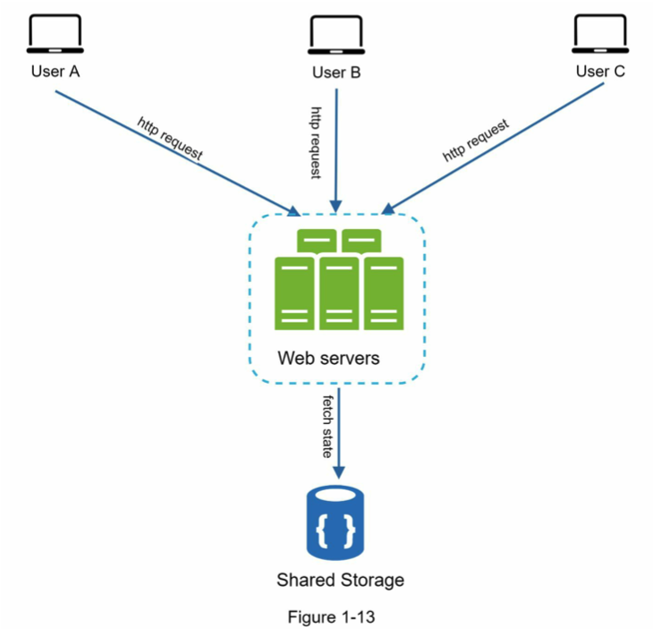
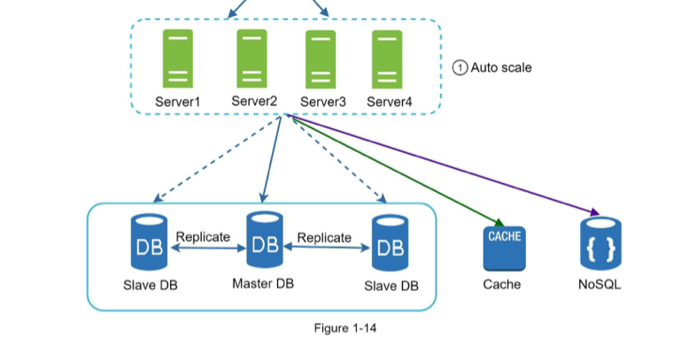
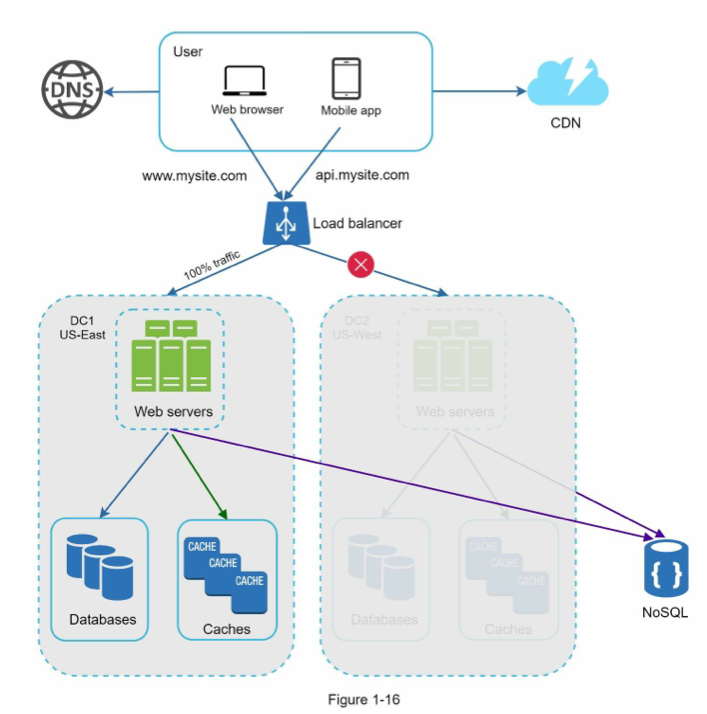
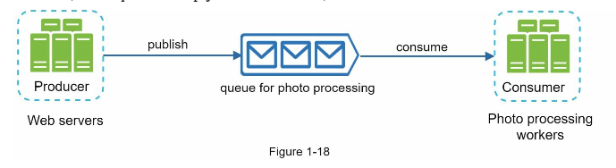
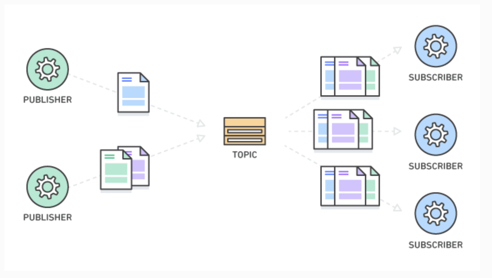
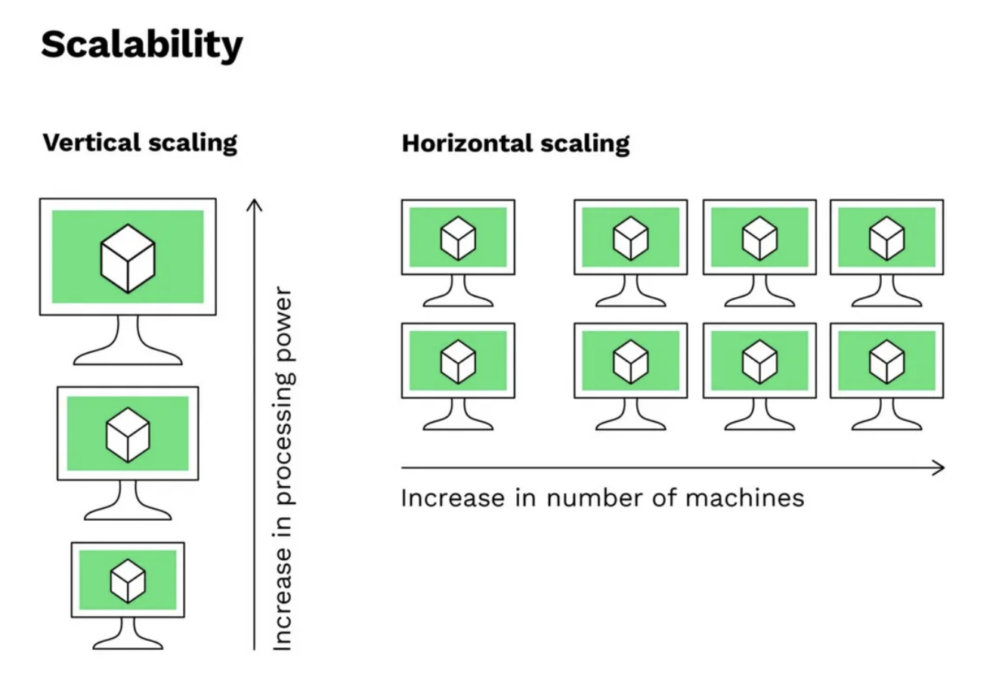
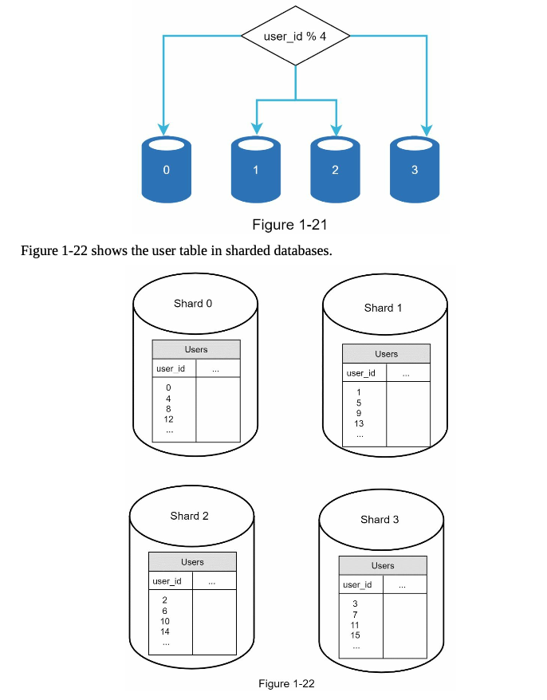

# SCALE FROM ZERO TO MILLIONS OF USERS

## Single server set up

- Web app + database + cache all on on server
- https://m.blog.naver.com/PostView.naver?blogId=cmw1728&logNo=222158613750&categoryNo=46&proxyReferer=

### DNS (Domain name system)

- the phonebook of the Internet
- converts a hostname into a computer-friendly IP address to find the internet device
- 4 servers involved in loading a page

  1. DNS recursor(recursive resolver): middleman between a client (user) and a DNS nameserver. Receives queries through web browser and makes a request to DNS nameservers. If there is cache it will simply return it back.
  2. DNS root nameserver: responds to a recursor's request by directing to a TLD nameserver based on the extension of the domain(.com,.net). There are 13 types of DNS rootnameservers.
  3. TLD nameserver: maintains information for all domains with a common extension. Root nameserver receives a request with .com domain. It queries info from .com TLD nameserver. TLD nameserver then responsds directing to authoritative nameserver for that domain.
     - generic top-level domains: .com, .net, .org
     - Country code top-level domains: .uk, .ca, .jp
  4. Authoritative nameserver: the last step. contains specific info to the domain name. responds with an ip address in DNS A record or CNAME record

- Web browsers fetches IP address of the website from DNS (3rd party)
- HTTP requests sent to the web server
- returns HTML or JSON

## Database

- As user grows, we need a separate server for the database
- Scale independently by separating web traffic and database traffic
- Relational database
  - MySql, PostgreSQL
  - Tables and rows
  - Join operations
- Non-relational database
  - NoSql
  - Key-value store, graph store, column store, document store
  - no join operation
  - Reasons to choose
    1. Need super low latency
    2. Data are unstructured and not relational
    3. Only need serailize/deserialize
    4. Not massive amount of data

## Vertical scaling vs horizontal scaling

- Vertical scaling: Adding more power of servers (CPU, RAM)
  - When traffic is low
  - Simple upgrade
  - LImitations: CPU and memory cap, no failover & redundancy (one dies, that's it)
- Horizontal scaling: Adding more servers
  - Large scale applications

## Load balancer (for web tier)

- Event distributes traffics among servers
- Load balancer gets the public ip while servers get private ip (only reachable by load balancer directly now)

## Database replication (for database tier)

- A master database (only writes) + slave databases(only reads)
- Better performance due to separated responsibilties in parallel
- Reliability (replicated data is preserved when a database is destroyed)
- High availability (replicated data is available when a database is down)

## Cache

- A cache is a temporary storage for the results of expensive/frequent operations for quicker response

### Cache tier

- a temporary data store layer
- can be scaled independently
- if data is available on cache layer, sends back the data without making querying from database
- if not query and store in cache and return (read-through cache)
- when frequent reads but infrequent updates happen
- not for persisting, all data is lost when cache server restarts
- expiration on cache data
- inconsistency between data in cache and in database can happen
  - when data-modifying operations on the data store and cache are not in a single transaction
- multiple cache servers across different data centers are recommended to avoid SPOF (single point of failure)
- cache eviction, when cache is full storing new data will delete other data. Least-recently-used is the mos popular policy but Least-frequently-used or First-In-First-out are also used.

### Content delivery network (CDN)

- Network of interconnected servers that speeds up webpage loading for data-heavy applications
- Cache static content like images, vidoes, css, js
- User <-> CDN <-> Origin
- Benefits
  - Reduce page load time
  - Reduce bandwidth cost
  - Increast content availaibility
  - Improve website security
- Considerations
  - Charged for transactions, caching infrequently used asserts provide no benefit
  - Expiry with TTL(TIME-TO-LIVE): too long - outdated, too short - defeats the purpose of caching
  - CDN fallback - Clients should be able to detect cdn issue and get data from origin server
  - Invalidate files by using api or versioning
- Examples: live screaming, high-speed content, supporting concurrent users, Amazon cloud front

===============================================================================================================================================================================

## Stateless web tier

### Sateful server

- server stores state data (session) in each server
- if a server is stateful, the state is not shared between servers but state data in database is
- defeats the purpose of database replication
- can direct requests from same client to the same server using balance loader but costly
- restoration after a crash may not be as smoooth since the state is lost

### Stateless server

- stores state data in database
- requests from the same client does not need to be directed to the same server
- load balancer can easily evenly distribute requests
- easier to scale horizontally (having more servers)
- Simple, robust, scalable
- auto-scaling can be achieved

## Data centers

- Data center is a physical location that stores the computing machines
- On-premises data center: highest secuirty + customization vs costly + low scalability
- Collocation: share a location to manage hardware, closer to end users but hard for global users
- Cloud data centers: rent both space and equipment, available for global users
- Modern data centers: cloud data centers like AWS
- geoDNS allows domain names to be resolved to an IP addresses of the web servers based on the user's location
- Challenges on multiple data center
  - Traffic redirection: geoDNS is needed to correctly redirect
  - Data Sync: difference in cache (data replication is needed)
  - Test and deploy to keep the sync

## Message queue

- support async service-to-service communication
- producers (web servers) publishes tasks in a message queue when regardless of availaibility of consumers at the time
- consumer (workers) consumes tasks regardless of produceres at that time
- efficiently distirbuted workload
- smooth out spiky workload, buffer heavyweight processing
- decoupling and independently scaling
- when the size of the queue becomes too large (too much work is left unpicked up), increase number of workers
- duplicated task issue?
- if messaging queue is introduced, it is importatnt to have all services to subscribe to the queue instead of some of them communicating with each other

- different from pub/sub messaging (in pub/sub all subscribers gets a copy of a message and respond in parrallel while in queue, only one subscriber react to one message, one-to-one, or point-to-point, communications)

reference: https://aws.amazon.com/message-queue/

## Logging, metrics, automation

- Logging: monitoring per server or central logging
- Metrics: gain business insight (daily active user count, rentention, revenue) and health of the system (CPU, Memory use)
- Automation: improve productivity, automating tets, build, deployment

## Database scaling

### Vertical scaling

- adding more power (CPU, RAM, DISK) to an existing machine, ex) RDS can go up to 24TB
- no logic change needed
- Physical limitation cap of upgrades
- Lack of redundancy => single point of failures
- Lower availability in different regions

### Horizontal scaling (sharding)

- adding more server
- logic is broken into smaller pieces and executed in parallel across multiple devices so code change is needed
- Sharding: storing a large database across multiple machines by splitting data into more managable sizes called "shards" but share the same schema
- Faster response time: faster than searching through many rows in a single database set up
- Avoid single point of failure along with data replication
- Efficient scaling: can add shards at runtime
- Sharding key
  - determines how data is distributed
  - used to route queries to the correct database
- Resharding data is needed when
  - new shards are added
  - certain shrads are more loaded
- Celebrity problem: certain data can be more frequently queried causing imbalance (celebrity data)
- Join & denormalization: hard to do joins on shards so denormalized it
- Could also use NoSQL for storing non-relational data

reference: https://www.clickittech.com/devops/vertical-vs-horizontal-scaling/amp

## Millions of users and beyond

- Keep web tier stateless
- Build redundancy at every tier
- Cache data as much as you can
- Support multiple data centers
- Host static assets in CDN
- Scale your data tier by sharding
- Split tiers into individual services
- Monitor your system and use automation tools
