# CHAPTER 1: SCALE FROM ZERO TO MILIONS OF USERS

- Designing a system that supports millions of users is challenging
- Require continuous refinement and endless improvement
- Build a system that supports a single user and gradually scale it up to serve millions of users.

## Single server setup

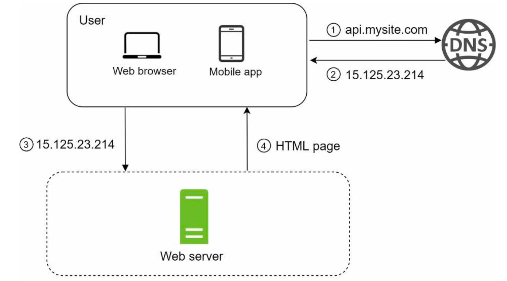

- Building a complex system begins with simple, a single server
- A single server, everyting is running on
    - web app / database / cache, etc. 
- Request flow 
    - User access websites through domain names, domain name is queried through DNS (Domain Name System)
    - Internet Protocol(IP) address is returned to the browser or mobile app.
    - Once the IP is obtained, Hypertext Transfer Protocol(HTTP) requests are sent directly to web server
    - The web server returns HTML pages or JSON response for rendering. 
        - Web application
            - uses a combination of server-side languages (Java, Python, etc) to handle business logics, storage, and client-side languages(HTLM or Javascript) for presentation
        - Mobile application
            - HTTP protocol is the communication protocol between the mobild app and the web server
            - JSON(JavaScript Object Notation) is commonly used
- 
## Database
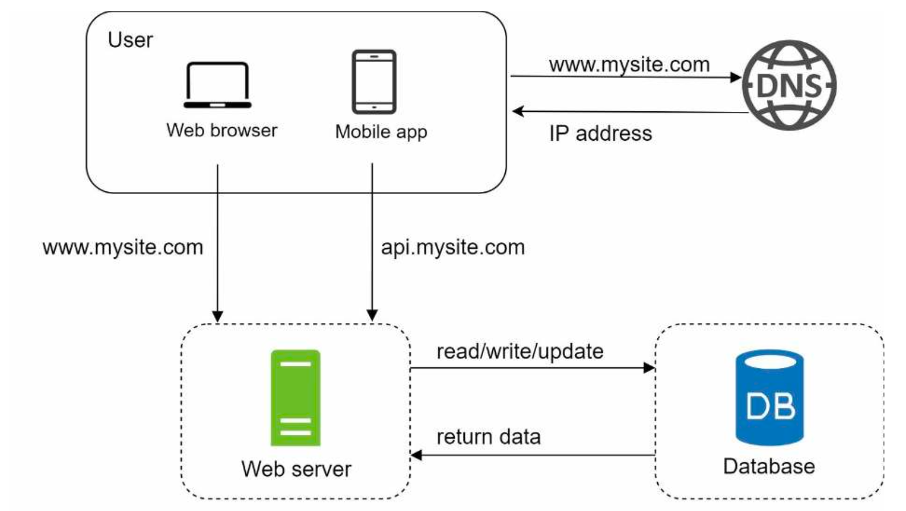
- With the growth of the user base, one server is not enough.
    - web tier: one for web/mobile traffic,
    - data tier: the other for the database
- Allows them to be scaled independently.

###  Which databases to use?
- Traditional relational database vs a non-relational database
- Relation database
    - Relational database management system(RDBMS) / SQL database
    - MySQL, Oracle, PostgreSQL, ...
    - Represent and store data in tables and rows
    - Join operatoin using SQL across different database tables. 
- Non-Relational database
    - NoSQL database
    - CouchDB, Neo4j, Cassandra, HBase, Amazon DynamoDB, ...
    - 4 categories
        - key-value stores
        - graph stores
        - column stores
        - document stores
    - Not support JOIN operations
- How can choose between these?
    - Relation DB have been used around for over 40 years, worked well, but not suitable for specific use cases. 
    - Non-relation DB might be the right choice if
        - Your application requires super-low latency
        - Your data are unstructured, do not have any relational data
        - Only need to serialize and deserialize data(JSON, XML, YAML, ...)
        - Need to store a massive amount of data

### Vertical scaling vs horizontal scaling
- Vertical scaling
    - Scale-up
    - the process of adding more power to your servers with CPU, RAM, ...
    - Simple and great option for low traffic
    - Has hard limit / Impossible to add unlimited CPU and memory to a single server
    - Does not have failover and redundancy, if one server goes down, the service does down
- Horizontal scaling
    - Scale-out
    - Scale by adding more servers into your pool of resources.
    - More desirable for large scale applications due to the limitations of vertical scaling. 

## Load balancer
- Limitation Single server
    - Users are connected to the web server directly
        - Users will unable to access the website if the web server is offline. 
    - If many users access the web server simultaneously and it reaches the web servers' load limit, 
        - User generally experience slower response of ail to connect to the server
    - A load balancer is the best technique to address these problems. 

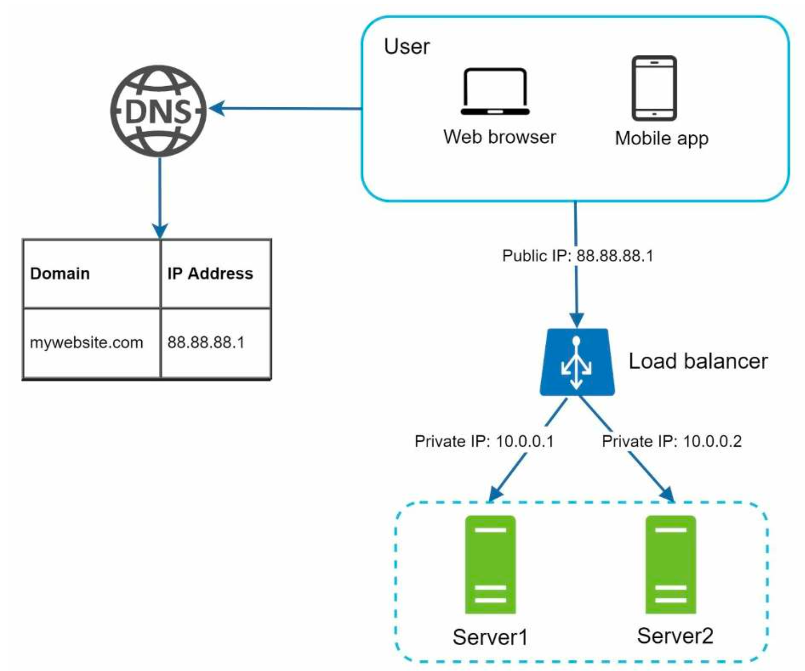

- A load balancer evenly distributes incoming traffic among web servers that are defined in a load-balanced set
- Connect
    - Users connect to the public IP of the load balancer directly.
    - Web servers are unreachable directly by clients anymore. 
- Private IP
    - For better security, private IPs are used for communication between servers.
    - Private Ip is unreachable over the internet. 
    - The load balancer communicates with web servers through private IPs
- Failover
    - With the load balance and a second web server are added, failover issues can be solved and improved the availability of the web tier. 
    - Two servers are behind the load balancer
    - If server 1 goes offline, all the traffic will be reouted to server2
        - This prevents the website from going offline
        - New healthy web server need to be added to the server pool
- Availability
    - If the website traffic grows rapidly, and two servers are not enough to handle the traffic
    - Only need to add more servers to the web server pool, and the load balancer automatically start to send request to them. 

## Database replication
- Definition from Wikipedia: Database replication can be used in many database management systems, usually with a master/slave relationship between the original(master) and the copies (slaves)

- Master database
    - Generally only supports write operations.
    - Data-modifying commands like insert, delete, or update must be sent to the master database.
- Slave database
    - Copies from the master database and only supports read operations.
    - Most applications require a much higher ratio of reads to writes
    - The number of slave databases in a system is usually larger than the number of master databases. 

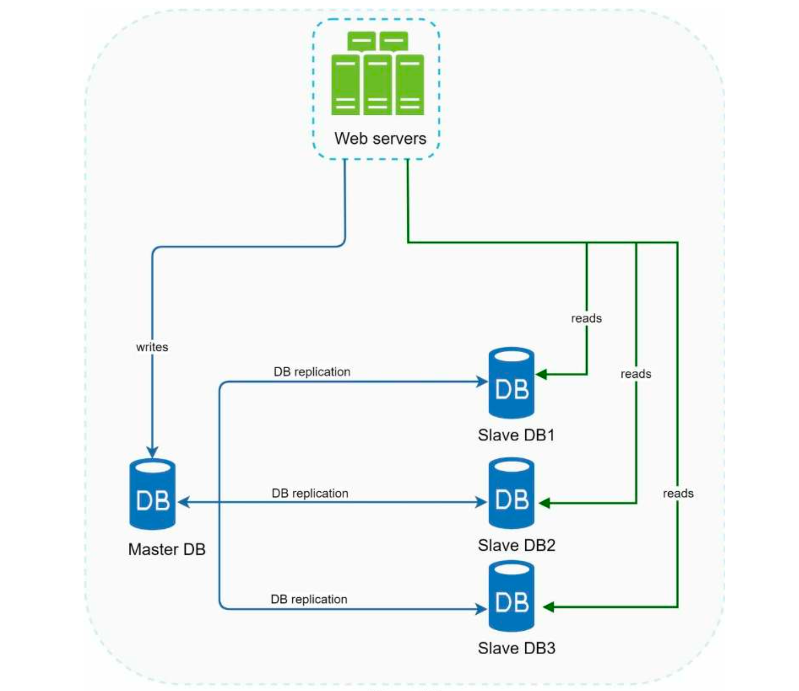

- Advantages of database replicatoin
    - Batter performance
        - All writes and updates happen in master nodes
        - Read operations are distributed across slave nodes
        - Allows more queries to be processed in parallel
    - Reliability
        - If one of the servers is destroyed, data is still preserved
        - Do not worry about data loss because data is replicated across multiple locations.
    - High availability
        - By replicating data across different locations, if one of the databases is offline, can use another database server

### What if one of the databases goes offline?

- If only one slave database is available and it goes offline
    - Read operations will be directed to the master database temporarily.
    - A new slave database will replace the old one.
    - In case multiple slave databases are available, read operations are redirected to other healthy slave databases.

- if the master database goes offline
    - A slave database will be promoted to be the new master.
    - All the database operations will be temporarily executed on the new master database. 
    - A new slave database will replace the old one for data replication immediately.
    - In production systems, promoting a new master is more complicated as the data in a slave database might not be up to date
        - The missing data needs to be updated by running data recovery scripts.
        - Some other replication method like multi-masters and circular replication could help, those setups are more complicated. 

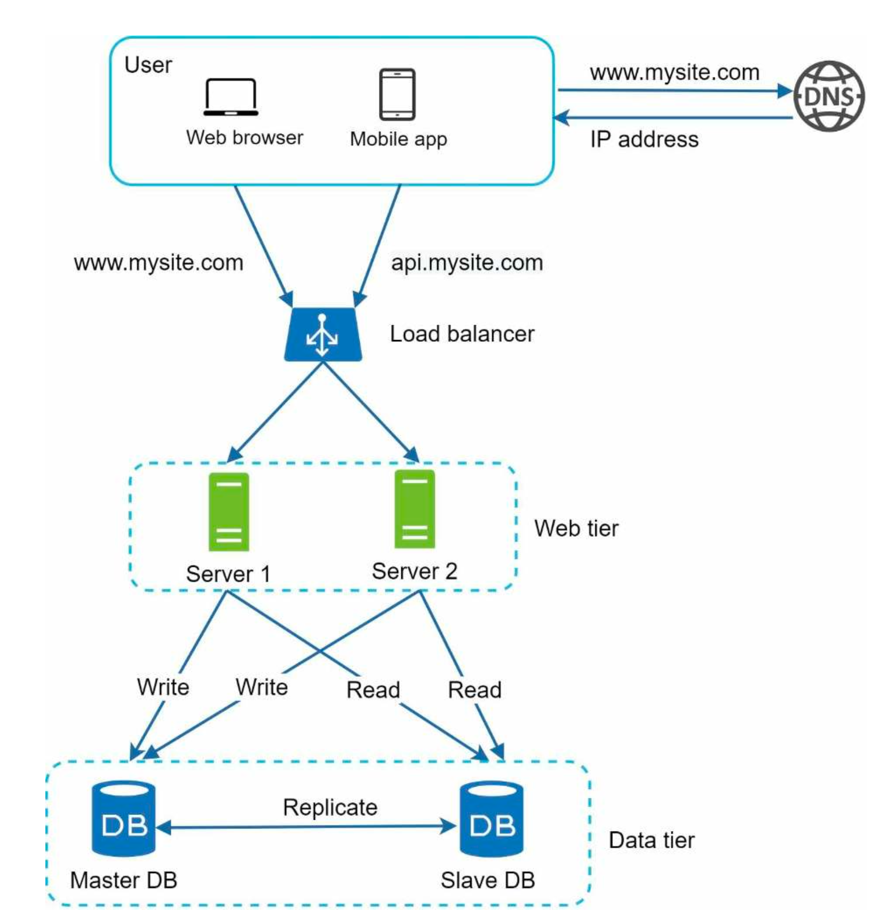
- A user get the IP address of the load balancer from DNS, and user connect to load balancer.
- Load balancer
    - HTTP request is routed to either Server 1 or Server 2
- Database Replication
    - A web server read user data from a slave database (Read operation)
    - A web server routes any data-modifying operations to the master database. (write/update/delete)
- Sugguestion
    - Load balancer will be needed ahead of slave DBs
- How to imporve the load/response time for web service system?
    - By adding cache layer and shifting static content(JavaScript/CSS/image/video files) to the contet delivery network(CDN)

## Cache
### What is cache?
- A temporary storage area that stores the result of expensive responses of frequently accessed data in memory
    - Subsequent requests are served more quickly
    - Cache is used any layer in Computer Architecture. (CPU/Memory/DB/, ...)

### Cache tier
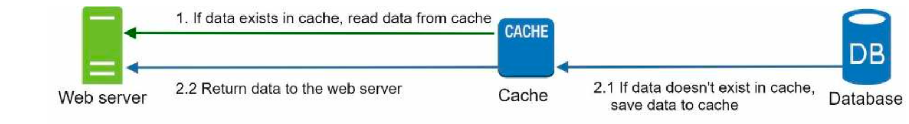
- A temporary data store layer, much faster than the database.
- The benefit of cache tier
    - Bettery system performance
    - Ability to reduce database workloads
    - Ability to scale the cache tier independently
- How it works when receving a request?
    - Find in the Cache
        - After receiving a request, a web server first checks if the cache has the available response. 
        - If it has, it send data back to the client
    - Find in the Database
        - If not, queries the database, stores the response in cache.
        - Send it back to the client
        - A read-through cache
    - Other caching strategies are available depending on the data type, size, and access patterns. 
- Interacting with cache servers is simple
    - using APIs
    - Memcached APIs
    ```
    SECONDS=1
    cache.set('myKey', 'hi there', 3600*SECONDS)
    cache.get('myKey')
    ```

### Considerations for using cache
- Decide when to use cache
    - Read frequently, modified infrequently
    - Volatile memory vs persistent data stores
- Expiration policy
    - Once cached data is expired, it is removed from the cache
    - If there is no expiration policy, cache data is remain in the memory permanently
    - Short expiration cause reload data prequently
- Consistency
    - Keeping the data store and the cache in sync
    - Inconsistency can happen when data is moified in on the data store and cache are not in a single transaction
    - Scaling across multiple regions, maintaining consistency between the data store and cache is challenging.
- Mitigating failures
    - A single cache server represents a potential single point of failure(SPOF)
    - SPOF will stop the entire system from working
    - Multiple cache servers across different data centers are recommended to avoid SPOF

- Eviction Policy
    - Once the cache is full, any requests to add items to the cache might cause existing items to be removed. 
    - Cache Eviction
    - LRU(least-recently-used) is most popular cache eviction policy
    - LFU(least frequently used), FIFO(first in first out)


## Content delivery network (CDN)
- CDN
    - A network of geographically dispersed servers used to deliver static content.
    - Cache static content like images, videos, CSS, JavaScript files, ...
- Dynamic content caching 
    - Enabling the caching of HTML pages that are based on request path, query string, cookies, request headers.

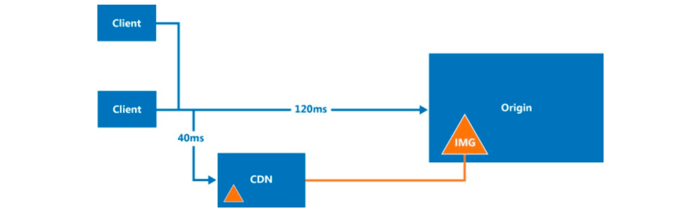
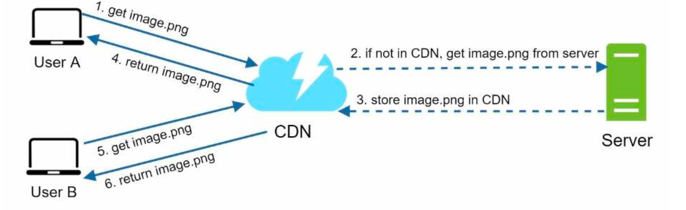

- How CDN works
    - User A tries to get image.png by using image URL
        - The URL's domain is provided by the CDN provider
    - If the CDN server does not have image.png in the cache, the CDN server requests the file from the origin. 
    - The origin returns image.png to the CDN server (Optionally have HTTP header, Time-to-Live, TTL)
    - The CDN caches the image and returns it to USER A
        - The image remains cached in the CDN until the TTL expires.
    - User B send a request to get the same image
    - The image is returned from the cache as long as the TTL has not expired  
### Considerations of using a CND
- Cost
    - CDNs are run by third-party providers
    - Caching infrequently used asserts provides no significant benefits
- Setting an appropriate cache expiry
- CDN fallback
    - Should consider how your service copes with CDN failure. 
    - If there is a temporary CDN outage, clients should be able to detec the problem and request resources from the origin
- Invalidating files
    - Using version of object through the query string, image.png?v=2

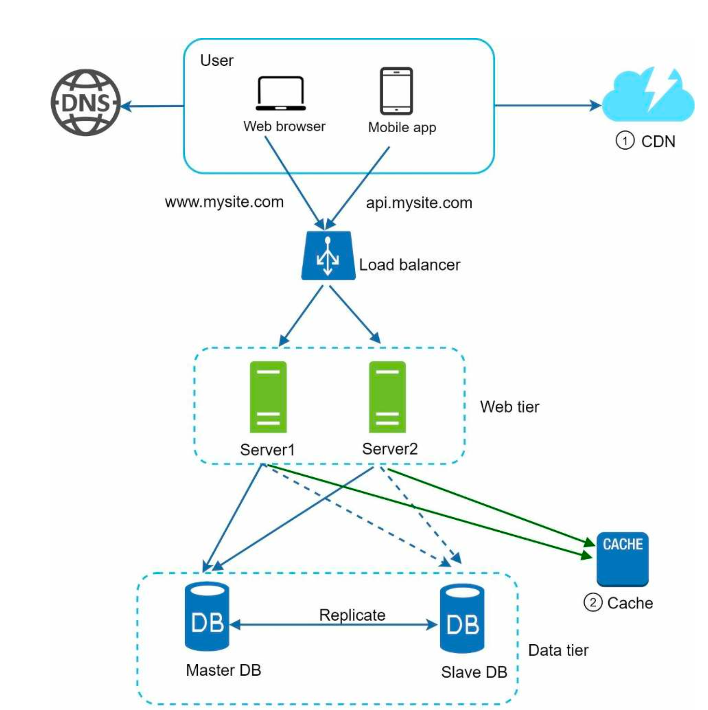

- Static assets(JS, CSS, images, etc.,) are no longer served by web servers
- They are fetched from the CDN for better performance. 
- The database load is lightened by caching data.

## Stateless web tier

- Scaling the web horizontally
- Need to move state (for instance user session data) out of the web tier.
- Session data store is to store in DBMS or NoSQL, each web server can access state data
- Stateless web tier 

### Stateful architecture
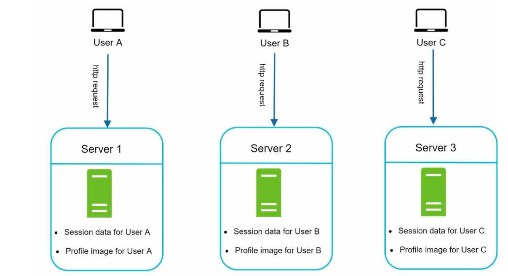
- Stateful server remembers client data(state) from one quest to the next 
- Authentication is done specific server
- User A authentication will be failed in Server 2
- Every request from the same client must be routed to the same server
    - This can be done with sticky sessions in most load balancers
    - Overhead
    - Adding or removing servers is much more difficult with this approach

### Stateless architecture

- Stateless server keeps no state information
- HTTP request from users can be sent to any web server
- State data is sotred in a shared data store and kept out of web servers
- A stateless system is simpler, more robust, and scalable


- Move the session data out of the web tier and store them in the persistent data store
- Shard data store
    - Memcached / Redis / NoSQL, RDBMS, ...
- Autoscaling
    - Adding or removing web servers automatically based on the traffic load
    - Autoscaling will be easily achieved with stateless architecture

## Data Centers
- Two data centers
- geoNDS-routed
    - to the closest data center
    - DNS service that allows domain names to be solved to IP address based on the location of a user
- Split traffic of x% in US-East and (100-x)% in US-West


- In the event of any significant data center outage
    - Direct all traffic to a healthy data center
    - US-West is offline, 100% of the traffic is routed to data center(US-East)

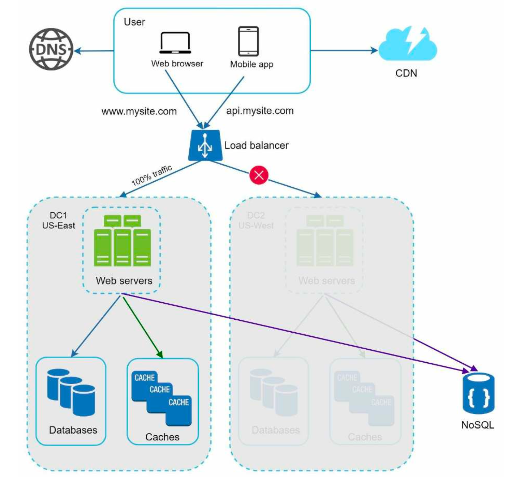
- Technical challenges must be resolved to archive multi-data center setup
    - Traffic redirection
        - GeoDNS
    - Data synchronization
        - failover cases
    - Test and deployment

## Message queue
- System for decoupling different components to be scaled independently
- Message queue
    - Durable component, store in memory, that supports asynchronous communication
    - Buffer and distributes asynchronous request
- Basic architecture
    - Input Service
        - producers/publishers
        - create message & publish them to a message queue
    - Consumers/subscribers
        - connect to the quee
        - perform actions defined by the messages.

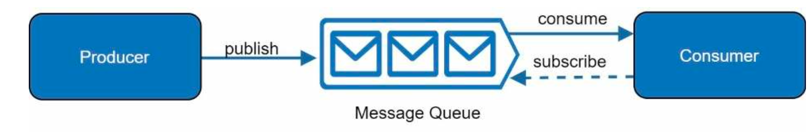

- Decoupling
    - Makes the message queue a preferred architecture for building a scalable and reliable application
    - Producer
        - Can post a message to the queue when the consumer is unavailable to proess it
    - Consumer
        - Can read message from the queue even the producer is unavailable
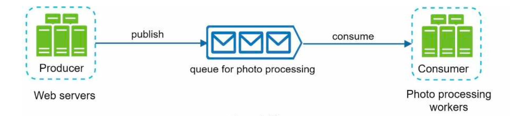

## Logging, metrics, automation
- Logging
    - Monitoring error logs - helps to identify errors and problems in the system
    - aggregate for easy search and viewing
- Metrics
    - Collecting different types of metrics 
    - Gain business insights and understand the health status of the system
    - A kind of Metrics
        - Host level metric: CPU / Memory / DISK I/O, ...
        - Aggregated level metrics
        - Key business metric :daily active users, retention ...
- Automation
    - Build or leverage automation tools to improve productivity
    - CI
    - Build , test, deploy process, ...
### Adding message queues and different tools
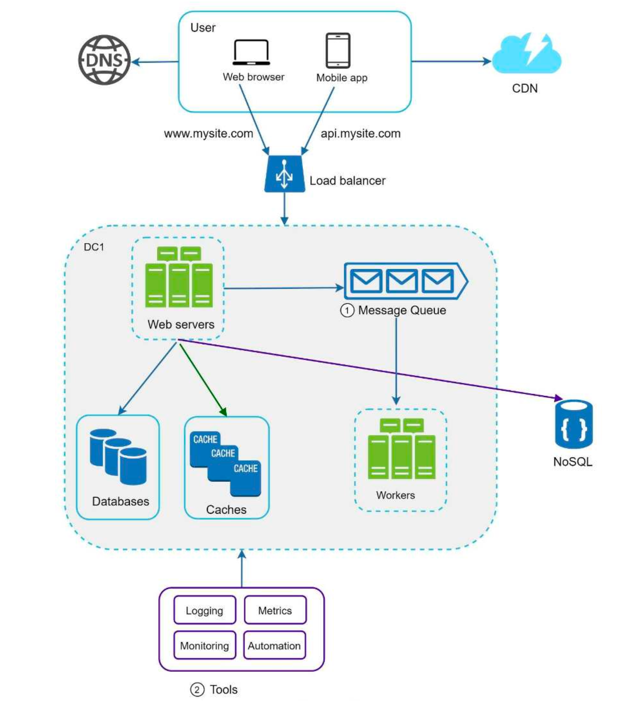
- Includes a message queue 
    - Make system more loosely coupled and failure resilient
- Logging / Monitoring / metrics and automation tools are included

## Database scaling
- Two broad approaches for database scaling : Vertical & Horizontal
### Vertical scaling
- Scaling Up
- Adding More power (CPU, RAM, DISK, ...)
- hardware Limit
- Greater risk of single point of failure
- Overall cost of vertical scaling is high

### Horizontal scaling
- Known as SHARDING
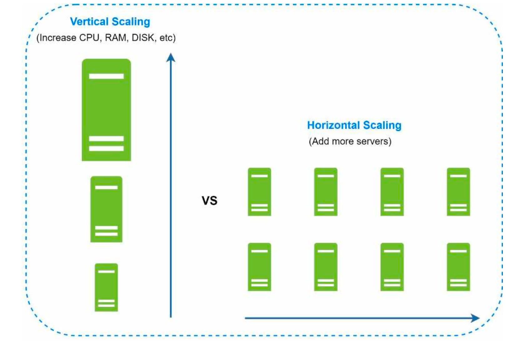
- Seperates large databases into smaller, more easily managed parts called shards. 
- Each shard shares the same schema
- Acutal data on each shard is unique
- How to shard?
    - User data is allocated to a dtabase server based on user ID
    - hash function like user_id % 4
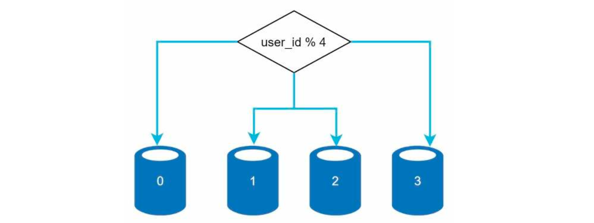
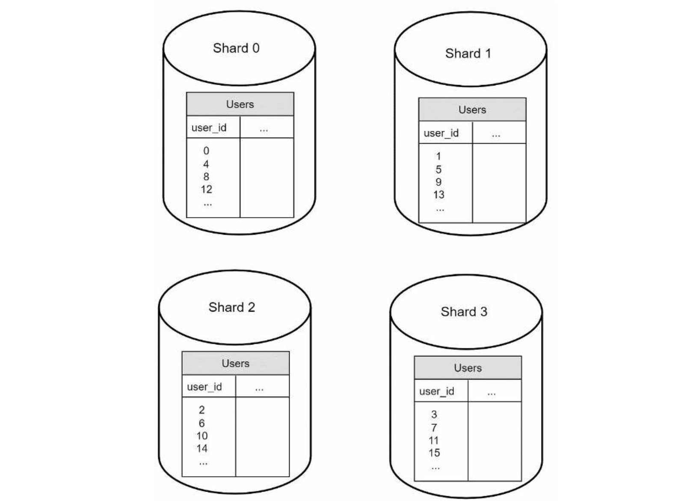

- Most important factor to consider when implementing a sharding strategy 
    - Choice of the sharding key (partition eky)
        - Consists of one or more columns that determine how data is distributed
        - Routing database for query
        - Can evenly distributed ?
- Sharding is goo but far from a perfect solution, and it's challenges
    - Resharding data
    - Celebrity problem
    - Join and de-normalization

## Millions of users and beyond
- Scaling a system is an iterative process
- More fine-tuning and new strategies are needed to scale beyond millions of users

