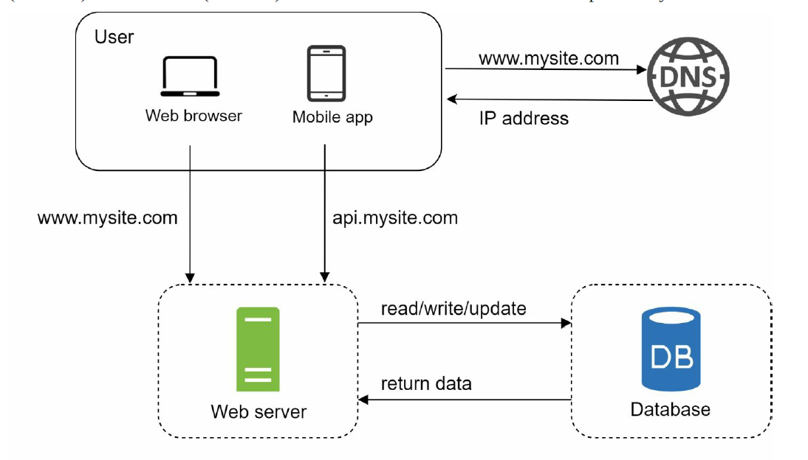
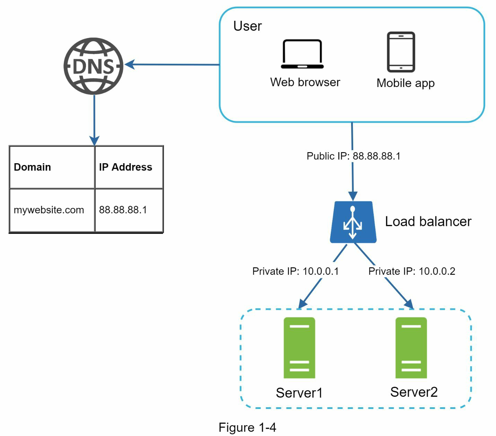
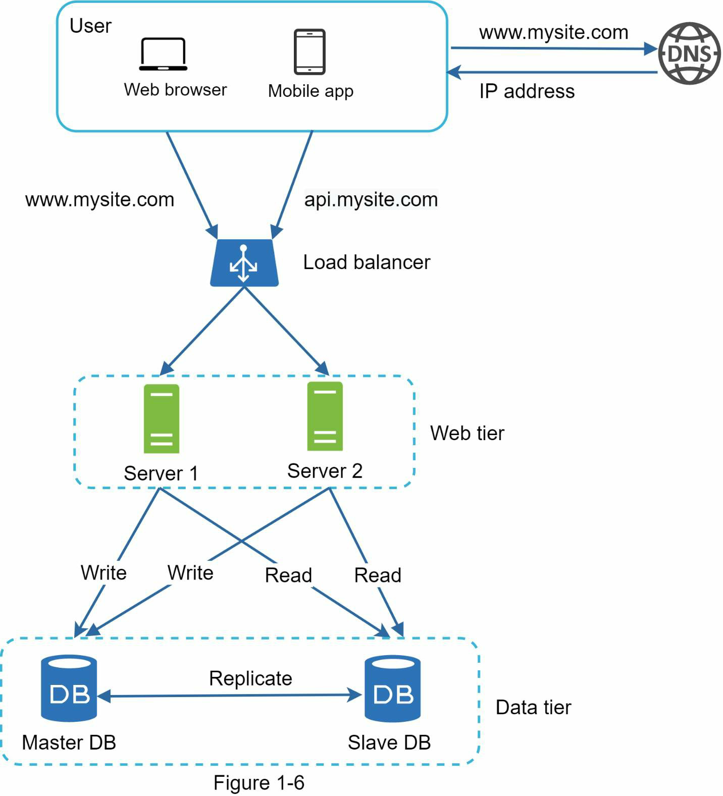
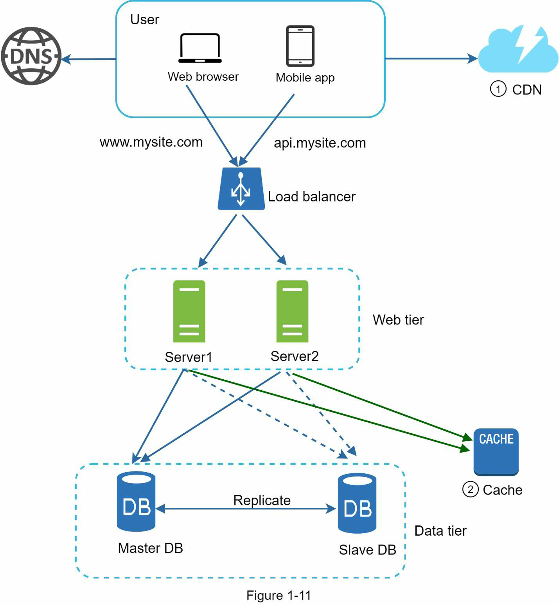
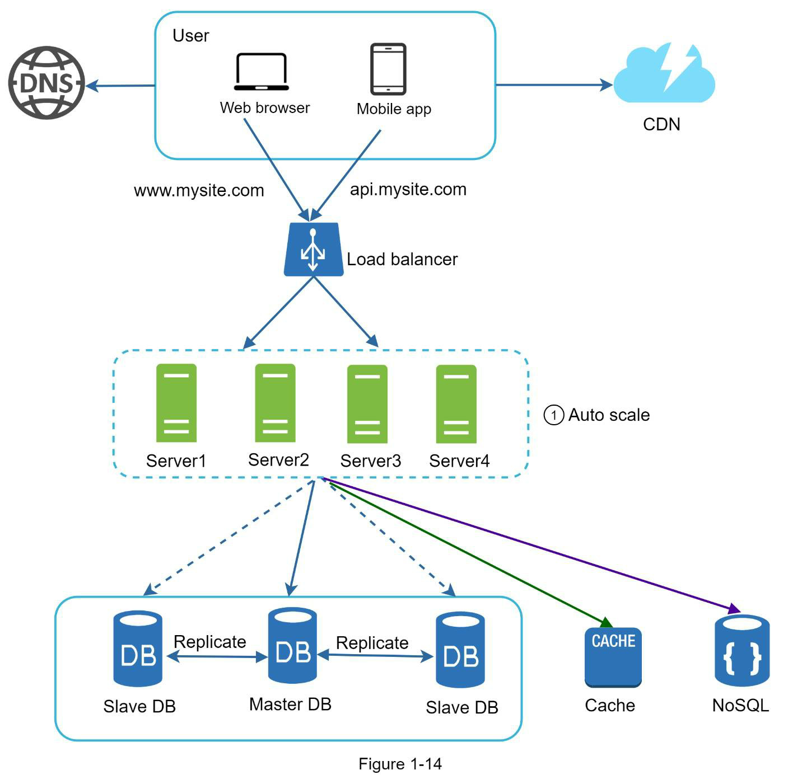
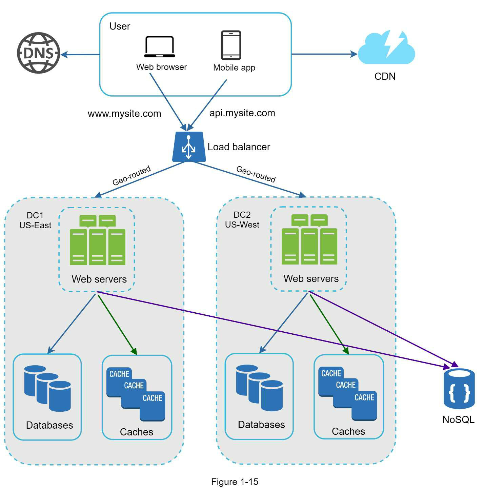
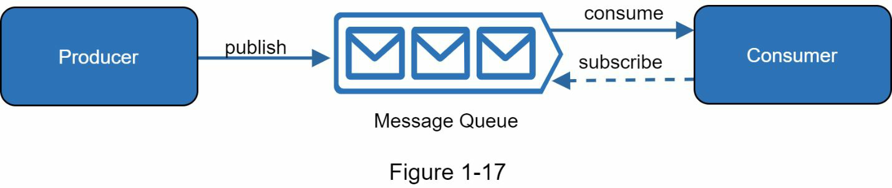
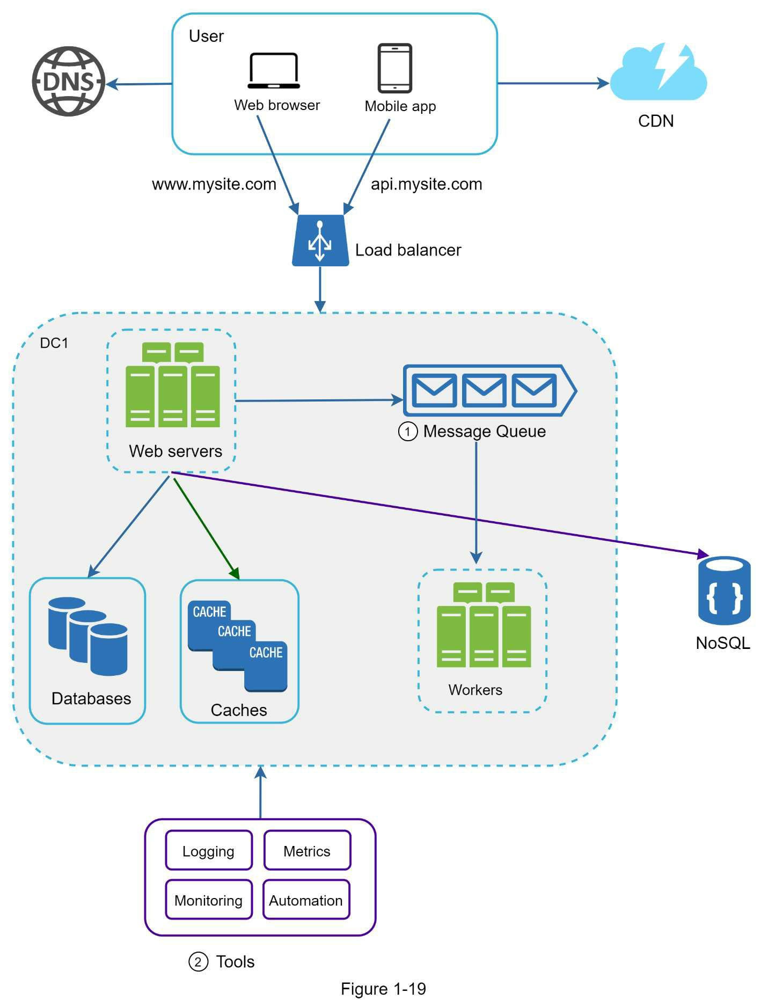
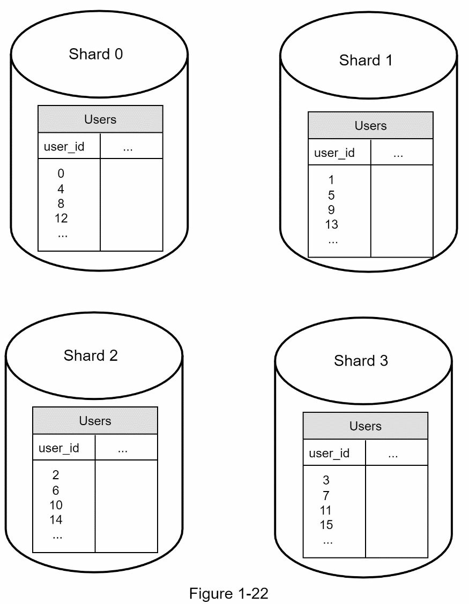

#### Basic Single Server Setup
Seperation of web/mobile traffic tier (web tier) and database (data tier) servers allows them to be scaled independently

##### which database to use?
Non-relational databases might be the right choice if:
• Your application requires super-low latency.
• Your data are unstructured, or you do not have any relational data.
• You only need to serialize and deserialize data (JSON, XML, YAML, etc.).
• You need to store a massive amount of data.

##### Vertical scaling vs horizontal scaling?
• Vertical scaling has a hard limit. It is impossible to add unlimited CPU and memory to a
single server.
• Vertical scaling does not have failover and redundancy. If one server goes down, the
website/app goes down with it completely.
Horizontal scaling is more desirable for large scale

##### Load balancer

##### Database replication

Advantages of database replication:
• Better performance: In the master-slave model, all writes and updates happen in master nodes whereas, read operations are distributed across slave nodes. This model improves performance because it allows more queries to be processed in parallel.
• Reliability: If one of your database servers is destroyed by a natural disaster, such as a typhoon or an earthquake, data is still preserved. You do not need to worry about data loss because data is replicated across multiple locations.
• High availability: By replicating data across different locations, your website remains in operation even if a database is offline as you can access data stored in another database server.

##### Cache
• Decide when to use cache
• Expiration policy
• Consistency
• Mitigating failures
• Eviction Policy

##### CDN
Considerations of using a CDN
• Cost
• Setting an appropriate cache expiry
• CDN
• Invalidating files

##### Stateless web tier vs Stateful architecture

##### Data Centers

##### Message Queue

##### Logging, metrics, automation

##### Database scaling
Vertical vs Horizontal scaling

Sharding

##### Millions of users and beyond
• Keep web tier stateless
• Build redundancy at every tier
• Cache data as much as you can
• Support multiple data centers
• Host static assets in CDN
• Scale your data tier by sharding
• Split tiers into individual services
• Monitor your system and use automation tools