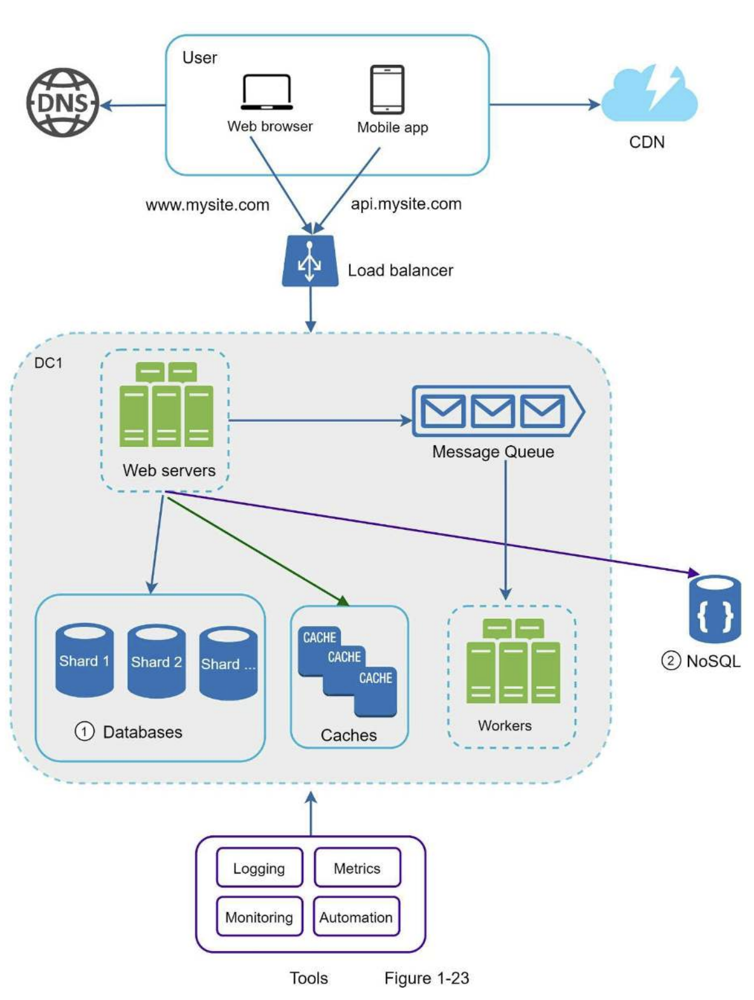

# 1. SCALE FROM ZERO TO MILLIONS OF USERS
### Single server setup
##### Request Flow
1. Users access websites through domain names, such as api.mysite.com.
2. Internet Protocol (IP) address is returned to the browser or mobile app.
3. Once the IP address is obtained, Hypertext Transfer Protocol (HTTP) requests are
sent directly to your web server.
4. The web server returns HTML pages or JSON response for rendering.
##### Web application
- it uses a combination of server-side languages to handle business logic, storage, etc., and client-side languages for presentation.
##### Mobile application
- HTTP protocol is the communication protocol between the mobile app and the web server. JavaScript Object Notation (JSON) is commonly used API response format to transfer data due to its simplicity.

### Database
- Separating web/mobile traffic (web tier) and database (data tier) servers allows them to be **scaled independently**.

### Which databases to use?
##### Relational databases
- called a relational database management system (RDBMS) or SQL database.
- MySQL, Oracle database, PostgreSQL, etc.
- represent and store data in tables and rows.
- perform join operations using SQL across different database tables.
##### Non-Relational databases
- called NoSQL databases.
- CouchDB, Neo4j, Cassandra, HBase, Amazon DynamoDB, etc.
- grouped into four categories: key-value stores, graph stores, column stores, and document stores.
- Join operations are generally not supported.
##### Non-relational databases might be the right choice if:
- Your application requires super-low latency.
- Your data are unstructured, or you do not have any relational data.
- You only need to serialize and deserialize data (JSON, XML, YAML, etc.).
- You need to store a massive amount of data.

### Vertical scaling vs horizontal scaling
- Horizontal scaling is more desirable for large scale applications due to the limitations of vertical scaling.
##### Limitations of vertical scaling
- It is impossible to add unlimited CPU and memory to a single server.
- does not have failover and redundancy. If one server goes down, the website/app goes down with it completely.

### Load balancer
- Users connect to the public IP of the load balancer directly. 
- With this setup, web servers are unreachable directly by clients anymore.
- After a load balancer and a second web server are added, we successfully
solved no failover issue and improved the availability of the web tier.

### Database replication
- Advantages of database replication
    - **Better performance**: In the master-slave model, all writes and updates happen in master nodes; whereas, read operations are distributed across slave nodes. This model improves performance because it allows more queries to be processed in parallel.
    - **Reliability**: If one of your database servers is destroyed by a natural disaster, such as a typhoon or an earthquake, data is still preserved. You do not need to worry about data loss because data is replicated across multiple locations.
    -  **High availability**: By replicating data across different locations, your website remains in operation even if a database is offline as you can access data stored in another database server.
- **If only one slave database is available and it goes offline**, read operations will be directed to the master database temporarily. As soon as the issue is found, a new slave database will replace the old one. In case multiple slave databases are available, read operations are redirected to other healthy slave databases. A new database server will replace the old one.
- **If the master database goes offline**, a slave database will be promoted to be the new master. All the database operations will be temporarily executed on the new master database. A new slave database will replace the old one for data replication immediately. In production systems, promoting a new master is more complicated as the data in a slave database might not be up to date. The missing data needs to be updated by running data recovery scripts.

### Cache
- The application performance is greatly affected by calling the database repeatedly. The cache can mitigate this problem.

### Cache tier
- The benefits of having a separate cache tier include better system performance, ability to reduce database workloads, and the ability to scale the cache tier independently.

### Considerations for using cache
- Consider using cache when data is read frequently but modified infrequently. 
- Expiration policy.
- Consistency: This involves keeping the data store and the cache in sync.
- Mitigating failures: A single cache server represents a potential single point of failure(SPOF). As a result, multiple cache servers across different data centers are recommended to avoid SPOF.
- Eviction Policy: Once the cache is full, any requests to add items to the cache might cause existing items to be removed. For example, Least Frequently Used (LFU) and First in First Out (FIFO).

### Content delivery network (CDN)
- A CDN is a network of geographically dispersed servers used to deliver static content(images, videos, CSS, JavaScript files, etc). 

### Considerations of using a CDN
- Cost: CDNs are run by third-party providers, and you are charged for data transfers in and out of the CDN. 
- Setting an appropriate cache expiry: For time-sensitive content, setting a cache expiry time is important.
- CDN fallback: You should consider how your website/application copes with CDN failure.
- Invalidating files

### Stateless web tier
- A good practice is to store session data in the persistent storage such as relational database or NoSQL. Each web server in the cluster can access state data from databases. This is called stateless web tier.

### Stateful architecture
- The issue is that every request from the same client must be routed to the same server. This can be done with sticky sessions in most load balancers. However, this adds the overhead. Adding or removing servers is much more difficult with this approach. It is also challenging to handle server failures.

### Stateless architecture
- HTTP requests from users can be sent to any web servers, which
fetch state data from a shared data store. State data is **stored in a shared data store** and kept out of web servers. A stateless system is simpler, more robust, and scalable.

### Data centers
##### Considerations of multi-data center setup
- Traffic redirection: Effective tools are needed to direct traffic to the correct data center. GeoDNS can be used to direct traffic to the nearest data center depending on where a user is located.
- Data synchronization: Users from different regions could use different local databases or caches.
- Test and deployment: With multi-data center setup, it is important to test your website/application at different locations. Automated deployment tools are vital to keep services consistent through all the data centers.

### Message queue
-  Input services, called **producers/publishers**, create messages, and publish them to a message queue. Other services or servers, called **consumers/subscribers**, connect to the queue, and perform actions defined by the messages.
- Decoupling makes the message queue a preferred architecture for building a scalable and reliable application.

### Logging, metrics, automation
- Logging: Monitoring error logs is important because it helps to identify errors and problems in the system.
- Metrics: Collecting different types of metrics help us to gain business insights and understand the health status of the system.
- Automation: When a system gets big and complex, we need to build or leverage automation tools to improve productivity.

### Database scaling
##### Vertical scaling
- **Scaling up** is scaling by adding more power (CPU, RAM, DISK, etc.) to an existing machine.
- Drawbacks:
    - There are hardware limits. If you have a large user base, a single server is not enough.
    - Greater risk of single point of failures.
    - The overall cost of vertical scaling is high.
##### Horizontal scaling
- **Sharding** is the practice of adding more servers.
- Each shard shares the same schema, though the actual data on each shard is unique to the shard.
- Complexities and new challenges:
    - **Resharding data**: Resharding data is needed when 1) a single shard could no longer hold more data due to rapid growth. 2) Certain shards might experience shard exhaustion faster than others due to uneven data distribution. *Consistent hashing* is a commonly used technique to solve this problem.
    - **Celebrity problem**: Excessive access to a specific shard could cause server overload. To solve this problem, we may need to allocate a shard for each celebrity. Each shard might even require further partition.
    - **Join and de-normalization**: It is hard to perform join operations across database shards. A common workaround is to denormalize the database so that queries can be performed in a single table.

### Millions of users and beyond
##### Summary of how we scale our system to support millions of users:
- Keep web tier stateless
- Build redundancy at every tier
- Cache data as much as you can
- Support multiple data centers
- Host static assets in CDN
- Scale your data tier by sharding
- Split tiers into individual services
- Monitor your system and use automation tools

##### Result:
