# Chapter 1: Scale from Zero to Millions of Users 
Designing a system that supports millions of users is challenging, and it is a journey that requires continuous refinement and endless improvement. 

## 1-1: Single Server Setup

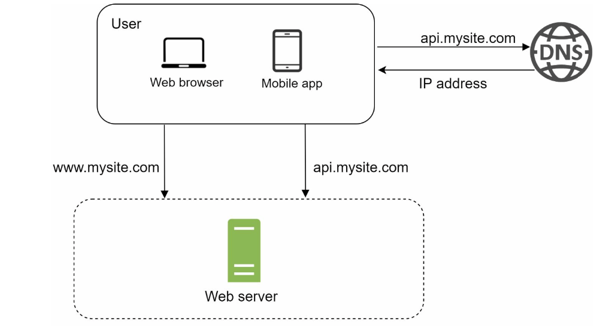

- Above figure illustrates a single server setup where everything is running on one server (including web app, dbs, cache, etc).

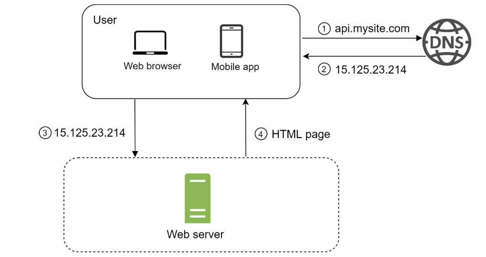

- Request Flow:
    - User access websites through domain name `api.mysite.com`. The DNS (Domain Name System) is a paid service provided by 3rd parties and not hosted on-premise.
    - IP (Internet Protocol) address `15.125.23.214` is returned to the browser or mobile app. 
    - Once the IP address is obtained, HTTP (Hypertext Transfer Protocol) requests are sent directly to your web server
    - The web server returns HTML pages or JSON response for rendering

- Traffic source (comes from two sources):
    - Web application: uses a combination of
        - server-side languages (Java, Python, etc) to handle business logic
        - client-side languages (HTML, JavaScipt, etc) for presentation
    - Mobile application: 
        - HTTP protocol is the communication protocol between the mobile app and the web server
        - JSON (JavaScript Object Notation) is commonly used API response format to transfer data due to its simplicity.

## 1-2: Database
- With the growth of the user base, one server is not enough. We need:
    - One for web/mobile traffic
    - One for the database.
- Separating web tier and data tier servers allows them to be scaled independently.

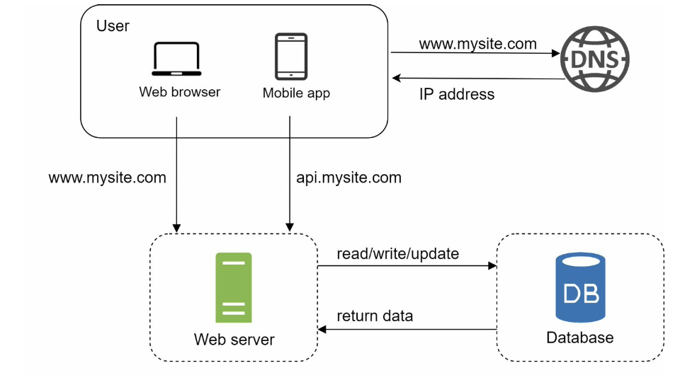

- There are two types of dbs:
    - Relational DB
        - aka RDBMS (Relational Database Management Ststem) or SQL db
        - MySQL, PostgreSQL, etc
        - Represent and store data in tables and rows
        - Can perform join operations using SQL across different db tables
        - Traditional. More references and use cases
    - Non-Relational DB
        - aka NoSQL db
        - Amazon DynamoDB, MongoDB, etc
        - Grouped into four categories: key-value stores, graph stores, column stores, document stores
        - Join operations are generally not supported
        - Super-low latency
        - Supports unstructured, non-relational data
        - Better if you only need to serialize and deserialize data (JSON, XML, YAML, etc)
        - Stores massive amout of data

## 1-3: Vertical Scaling vs Horizontal Scaling
- Vertical Scaling:
    - "scale up"
    - Adding more power (CPU, RAM, etc) to your servers.
    - Great option when traffic is low.
    - Has a hard limit. Impossible to add unlimited CPU and memory to a single server.
    - No failover and redundancy. If one server goes down, the website/app goes down completely.
- Horizontal Scaling:
    - "scale-out"
    - adding more servers into your pool of resources.
    - More desirable for large scale applications (makes up for vertical scaling limitations).

## 1-4: Load Balancer
- If users are connected to the web server directly, they are unable to access the website if the web server is offline. Moreover if many users access the web server simultaneously and it reaches the web server's load limit, users experience latency. A load balancer is the best technique to address these problems!
- LBs evenly distributes incoming traffic among web servers that are defined in a load-balanced set.

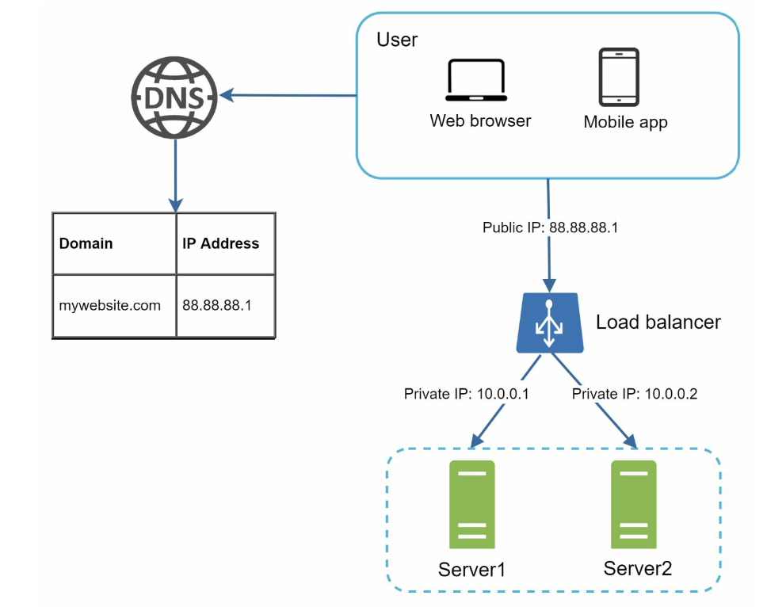

- Users connect to the public IP of the lbs directly (web servers are unreachable directly by clients anymore)
- Private IPs are used for communication between servers (secure).
    - Private IP: IP address reachable only between servers in the same network. Unreachable over the internet
    - The load balancer communicates with web servers through private IPs.

- In above figure, after we add a second server and a load balancer, we've solved the no failover issue and improved availability of the web tier:
    - If server 1 goes offline, all traffic routed to server 2.
    - We immediately add a new healthy web server to the server pool to balance the load.
    - If website traffic grows, lbs handle this gracefully by adding more servers to the web server pool. LBs automatically starts to send requests to them.

## 1-5 Database Replication
- Howe do we support filover and redundancy for the data tier?
- "Database replication can be used in many db management systems, usually with a master/slave relationship between the original (master) and the copies (slaves)"
- Master database:
    - Generally supports write operations.
    - All data-modifying commands (insert, delete, update, etc) must be sent to the master db.
- Slave databases:
    - Gets copies of the data from the master db, and only supports read operations.
    - Number of slave dbs in a system is usually larger than master dbs, because most apps require a much higher ratio of reads to writes.

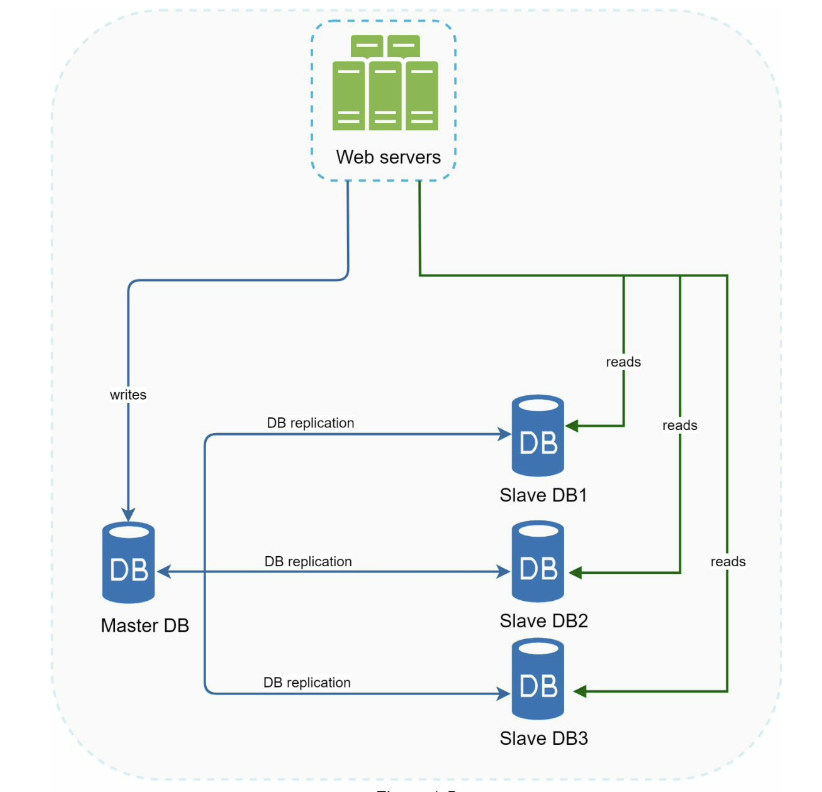

- Better performance: because it allows more queries to be processed in parallel.
- Reliability: data is still preserved even if one of your db servers is destroyed by a natural disaster. No need to worry about data loss (data is replicated across multiple locations).
- High availability: by replicating data across different locations, your website remains in operation even if a db is offline as you can access data stored in another db server.

### What if one of the dbs goes offline?
- If only one slave db is available and goes offline, read operations will be directed to the master db temporarily. A new healthy slave db will replace the old one.
- If multiple slave dbs are available, read operations are redirected to the other healthy slave dbs. 
- If master db goes offline, a slave db gets promoted to be the new master. All db executions will temporarily execute on the new master db. A new slave db will replace the old one for data replication immediately.

- In prod systems, promoting a new master can be very complicated as the data in a slave db might not be up to date.
- The missing data must be updated by running data recovery scripts.
- Some replication methods: multi-masters, circular replication.

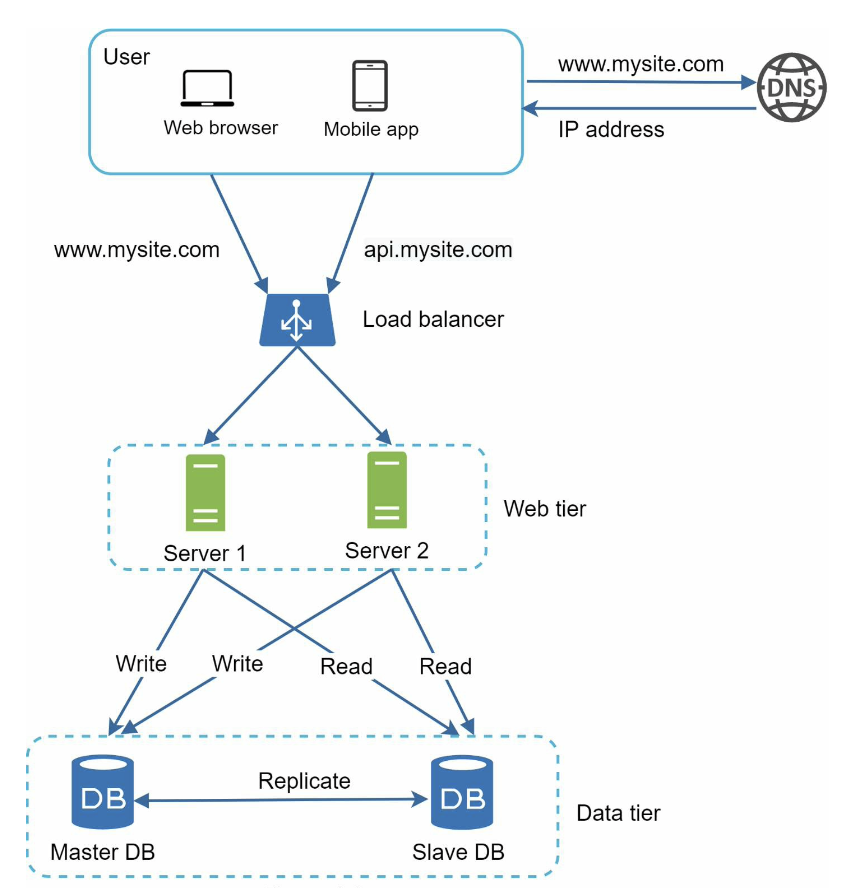

- A user gets the IP address of the lb from DNS.
- A user connects the lb with this IP address.
- The HTTP request is routed to either Server 1 or Server 2.
- A web server reads user data from a slave db.
- A web server routes any data-modifying operations to the master db (write, update, delte, etc).

## 1-6 Cache
- Adding a cahce layer and shifting static content (JavaScript/CSS/image/video files) to the CDN improves load/response time. 
- A cache is a temporary storage area that stores the result of expensive responses or frequently accessed data in memory so that subsequent requests are served more quickly. 
- The app performance is greatly affected by calling the db repeatedly. Cache can mitigate this problem. 

### Cache Tier
- Temporary data store layer, much fater than db.
- Better system performance, reduce db workloads, can scale the cache tier independently. 

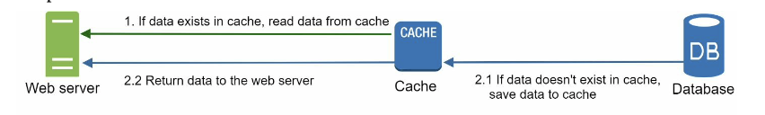

- Interacting with cache servers is simple because most cache servers provide APIs for common programming languages.
- Typical Memcached APIs:

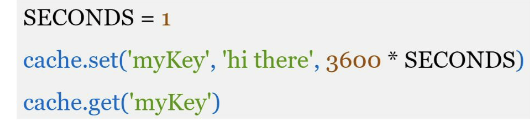

### Considerations for using Cache
- When data is read frequently but modified infrequently.
- Since cahced data is stored in volatile memory, a cache server is not ideal for persisting data.
    - If a cache server restarts, all the data in memory is lost.
    - Important data should be saved in persistent data stores.
- Implement an expiration policy. Not too short (system reloads data too frequently), not too long (data can become stale).
- Important to keep data store and cache in sync. Data-modifying operations on the data store and cache are not in a single transaction.
- Multiple cache servers across different data centers are recommended to avaoid SPOF (Single Point Of Failure).
- Overprovision the required memory by certain percentages. This provides a buffer as the memory usage increases.
- Eviction Policy: Once the cache is full, any requests to add items to the cache might cause existing items to be removed. 
    - LRU (Lease-recently-used)
    - FIFO (Fist In First Out)

## 1-7 Content Delivery Network (CDN)
- A network of geographically dispersed servers used to deliver static content.
- Cache **static** content (images, videos, CSS, JavaScript files, etc)
- When a user visits a website, a CDN server closest to the user will deliver static content (distance matters).

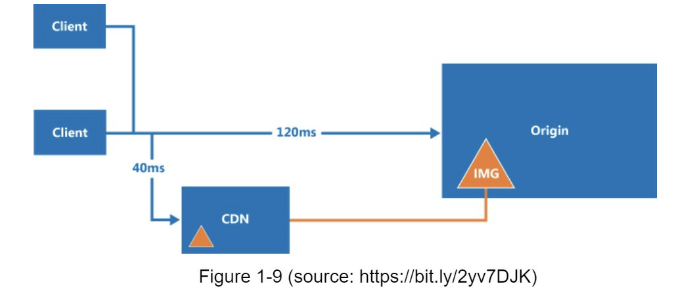
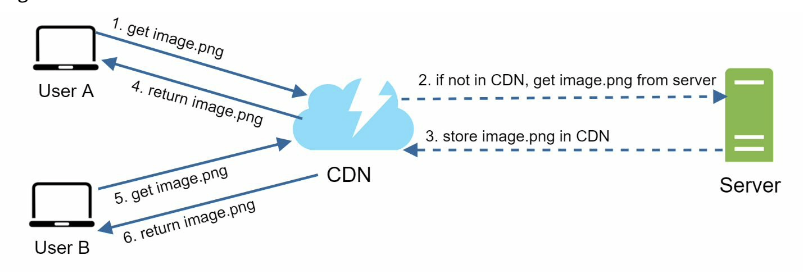

- User tries to get `image.png` by using an image URL. The URL's  domain is provided by the CDN provider. 
    - i.e. `https://mysite.cloudfront.net/imange.png`
- If the CND server does not have the image in the cache, the CDN server requests the file from the origin (web server, online storage like aws S3)
- The origin returns image to the CDN server, which includes optional TTL HTTP header (how long the image is cached). 
- CDN caches the image, and returns to user.
- User B sends a request to get the same image. As long as TTL has not expired, CDN returns the cached image.

### Considerations of using CDN
- Cost: CDNs are run by third party providers. Caching infrequently used assets provides no significatnt benefit.
- Set appropriate cache expiry.
- CDN fallback: how your website/app copes with CDN failure. If there is a temporary CDN outage, clients should be able to detect the problem and request resources from the origin.
- Invalidating files: can remove files from CDN before it expires
    - Using APIs provided by CDN vendors
    - Using object versioning to serve a different version of the object.
        - i.e. Add parameter to the URL `image.png?v=2`

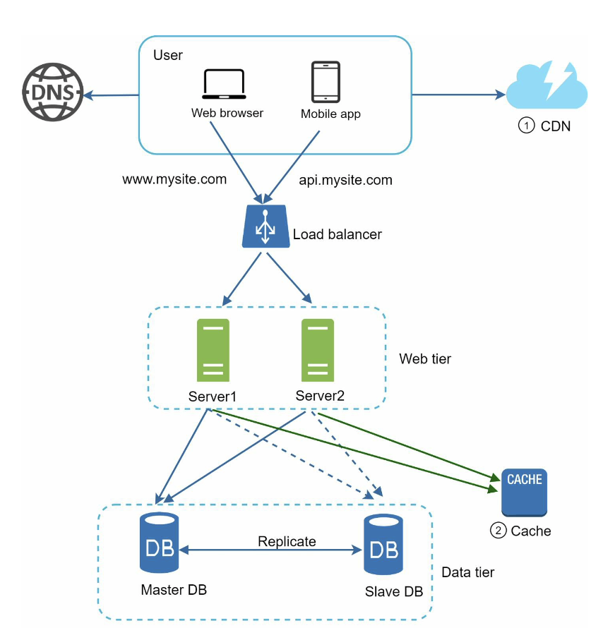
 - Static assets are no longer served by web servers. They are fetched from the CDN for better performance.
 - The db load is lightened by caching data.

 ### CDN and machine learning
CDNs often use edge servers strategically placed in various locations worldwide to reduce latency and improve content delivery speed. What makes it fascinating is that some CDNs leverage machine learning algorithms to predict and pre-load content onto these edge servers based on user behavior, effectively anticipating user requests and further optimizing the delivery process. This dynamic and predictive approach helps enhance the overall performance of the CDN by providing a faster and more responsive user experience.

Some examples are: 
- Amazon CloudFront: As part of the Amazon Web Services (AWS) ecosystem, CloudFront likely leverages machine learning capabilities to enhance content delivery on a global scale.
- Google Cloud CDN: Given Google's expertise in machine learning, it's reasonable to assume that their CDN service incorporates such algorithms to optimize content delivery.

 ## 1-8 Stateless Web Tier
 - To scale the web tier horizontally, we need to move state (i.e. user session data) out of the web tier. 
    - Good practice is to store session data in the persistent storage such as SQL or NoSQL dbs. Each web server in the cluster can access state data from dbs.
### Stateful architecture

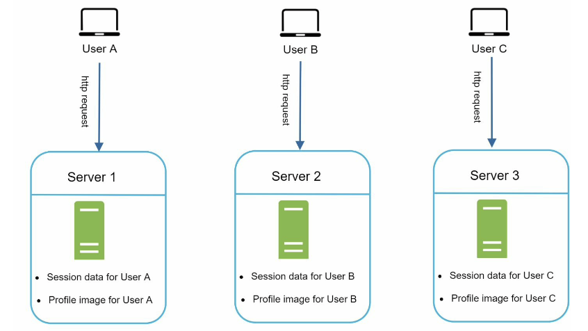

- A stateful server remembers client data (state) from one request to the next
    - i.e. user A's session data and profile image are stored in Server 1. To authenticate user A, HTTP requests must be routed to Server 1. If the request is sent to server 2, authentication fails.
- Thus every request must be routed to the same server. This can be done with sticky sessions in most lbs. However, overhead - adding/removing servers is much difficult with this approach & challenging to handle server failures.

### Stateless architecture

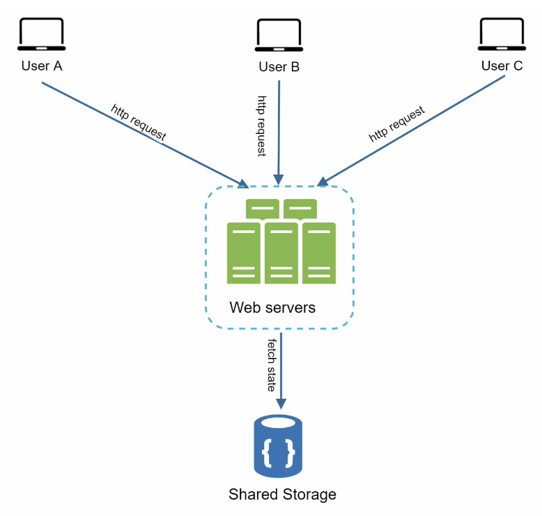

- HTTP requests from users can ge sent to any web servers.
- Fetches state data from a shared data store.
- State data is stored in a shared data store and kept out of web servers.
- Simpler, more robust, and scalable.

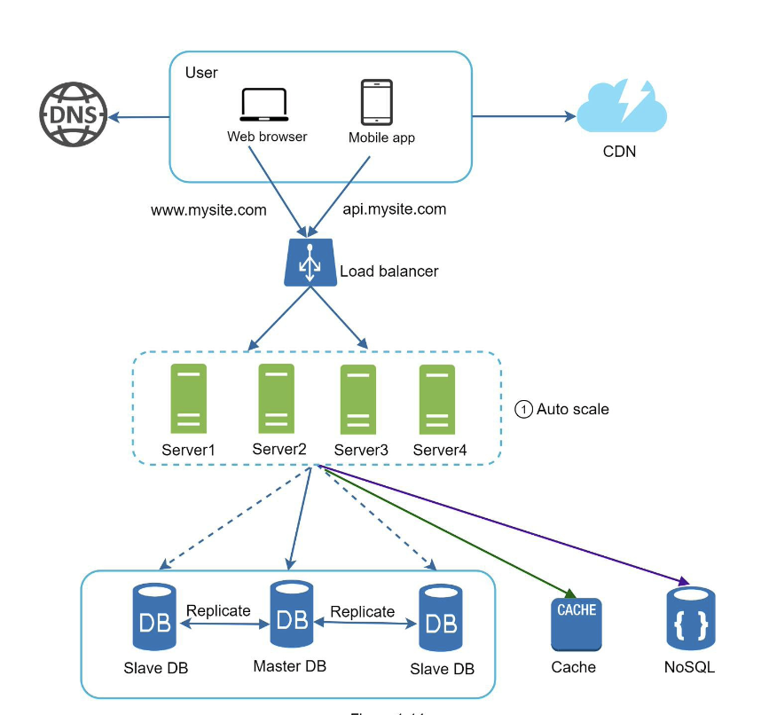

- Moved session data out of the web tier and store in persistent data store
- Shared data store could be: SQL db, NoSQL db (easy to scale), etc
- After the state data is removed out of web servers, auto-scaling of the web tier is easily achieved by adding or removing servers based on traffic load

### HTTP Protocol
HTTP (Hypertext Transfer Protocol) is considered a stateless protocol at the web tier. The term "stateless" in this context means that each request from a client to a server is treated as an independent transaction, and the server does not retain information about the state of the client's previous requests.

In the context of web applications, statelessness means that each HTTP request contains all the information necessary for the server to understand and fulfill that particular request. The server does not retain information about previous requests from the same client. Any required state information, such as user sessions or authentication tokens, needs to be managed explicitly, often through the use of cookies, URL parameters, or other mechanisms.

While HTTP itself is stateless, web applications often implement stateful behavior by using additional techniques and technologies, such as cookies, sessions, or tokens, to maintain user-specific information across multiple requests. This helps create a more interactive and personalized experience for users despite the statelessness of the underlying HTTP protocol.

## 1-9 Data Centers
- To improve availability and provide a better user experience across wider geographical areas, supporting multiple data centers is crucial. 

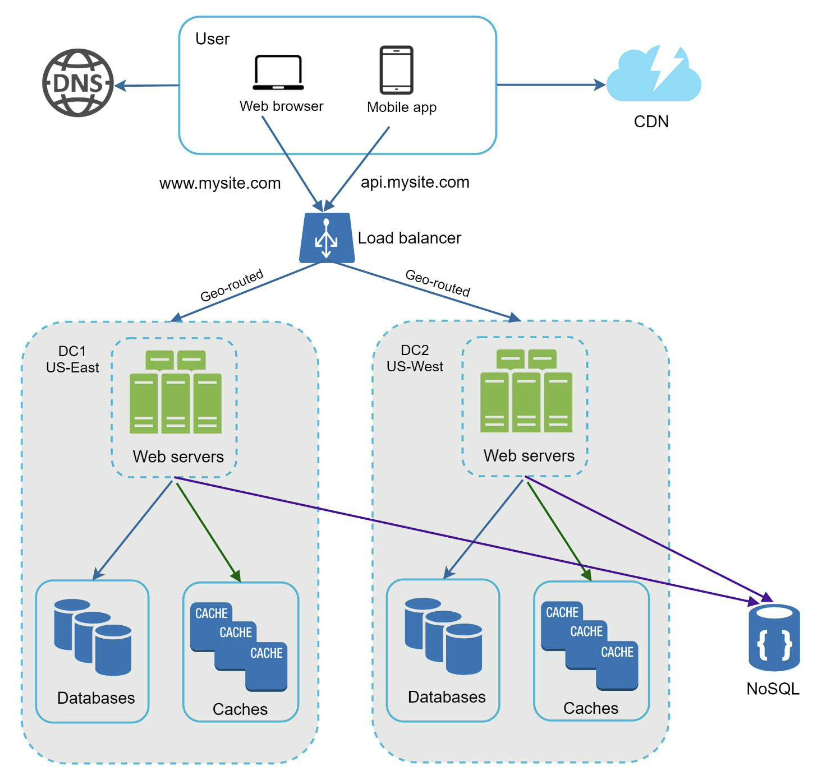

- Users are geoDNS-routed (geo-routed) to the closest data center.
- geoDNS is a DNS service that allows domain names to be resolved to IP addresses based on the location of a user.
- When there is a data center outage, we direct all traffic to a healthy data center. 

### Some technical challenges:
- Traffic redirection: effective tools are needed to direct traffic to the correct data center. 
    - GeoDNS (nearest data center by user's location)
- Data synchronization: Users form different regions could use different local dbs or cahces. In failover cases, traffic might be routed to a data center where data is unavailable.
    - Thus replicate data across multiple data centers.
    - i.e. Netflix implements asynchronous multi-data center replication.
- Test and deployment: test your website/app at different locations.
    - Automated deployment tools are vital to keep services consistent through all the data centers.
        - gha

### Data Center Temperatures

Data centers are known for their rigorous temperature control to ensure optimal performance and prevent equipment overheating. However, you might be surprised to learn that some tech giants, like Facebook, experiment with allowing higher temperatures in their data centers. In an effort to be more environmentally friendly and reduce energy consumption for cooling, they have found that slightly increasing the operating temperature within the acceptable range doesn't compromise the equipment's reliability. This approach reflects a growing trend in designing more energy-efficient and sustainable data center practices.

## 1-10 Message Queue
- Messaging queue is a key strategy employed by many real-world distributed systems to decouple different components of the system so they can be scaled independently.
- Durable component, stored in memory, that supports asynchronous communication. 
- It serves as a buffer and distributes asynchronous requests.

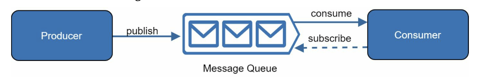

- Input services (producers/publishers) create messages, and publish them to a message queue. 
- Other services or servers (consumers/subscribers) connect to the queue, and perform actions defined by the messages.

- Decoupled: producer can post a message to the queue independently from the consumer, and vise versa.
- The producer and the consumer can be scaled independently.

- i.e: your app supports photo customization (cropping, sharpening, blurring, etc) which take time to complete. Web servers publish photo processing jobs to the queue. Photo processing workers pick up jobs from the queue and asynchronously perform photo customization tasks. 

### Message Queue and AWS Step Functions
In many distributed systems, AWS Step Functions and message queues can complement each other. For example:

- Workflow Orchestration: AWS Step Functions can be used to orchestrate and coordinate tasks that involve processing messages from an SQS queue. Each step in the workflow can represent a task, and Step Functions can handle the transitions and error handling between these tasks.

- Asynchronous Processing: Message queues like SQS are often used for decoupling components that produce and consume messages. AWS Step Functions can be used to define workflows that respond to events, including messages arriving in an SQS queue.

- Error Handling: Step Functions can include error-handling steps, allowing you to gracefully handle failures during the processing of messages from a queue.

In summary, while AWS Step Functions focus on workflow orchestration and coordination of tasks, message queues like SQS facilitate asynchronous communication between different components. The combination of both can lead to scalable, loosely coupled, and reliable architectures.

## 1- 11 Logging, Metrics, Automation
- Logging: Error logs help to identify errors and problems in the system. Can monitor error logs at per server level or use tools to aggregate them to a centralized service for easy search and viewing.

- Metrics: Different types of metrics help us gain business insights and understand the health status of the system. 
    - Host level metrics: CPU, Memory, disk I/O, etc.
    - Aggregated level metrics: for example, the performance of the entire database tier, cache tier, etc.
    - Key business metrics: daily active users, retention, revenue, etc.

- Automation: Continuous integration is a good practice, in which each code check-in is verified through automation, allowing teams to detect problems early. Besides, automating your build, test, deploy process, etc. could improve developer productivity significantly.

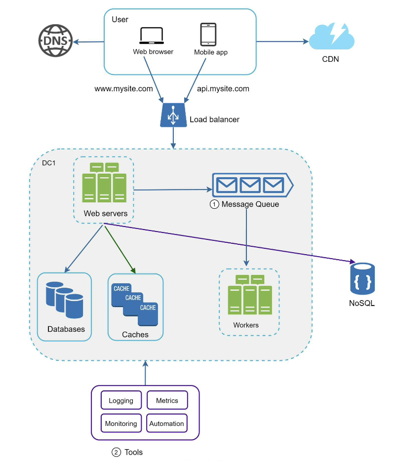

### Fun Facts about Logging, Metrics, and Automation
- The term "logging" in the context of computing has an origin in the nautical world. The practice of keeping a ship's log dates back centuries, where sailors recorded important information about the ship's journey, weather conditions, and notable events. This historical practice inspired the concept of logging in computing, where software systems record events, errors, and other relevant information for analysis and troubleshooting.

- As for metrics, the idea of collecting and analyzing metrics has similarities with the field of sports statistics. The systematic tracking of player performance and game metrics in sports has parallels in the tech world, where metrics are crucial for assessing the performance, health, and efficiency of systems and applications.

- Now, when it comes to automation, the term "robot" comes from the Czech word "robota," meaning forced labor or drudgery. The word was popularized by Czech writer Karel Čapek in his 1920 play "R.U.R. (Rossum's Universal Robots)," which depicted artificial beings created to perform labor for humans. Fast forward to today, and automation in computing helps alleviate human labor by handling repetitive tasks, allowing humans to focus on more creative and complex aspects of their work.

## 1-12 Database Scaling

### Vertical Scaling
- "scaling up". Scaling by adding more power (CPU, RAM, DISK, etc) to an existing machine
    - Amazon RDS
    - stackoverflow.com
- Some drawbacks:
    - hardware limits. With a larger user base, a single server is not enough
    - greater risk of single point of failures
    - vertical scaling is expensive. 
### Horizontal Scaling
- aka "sharding". Adding more servers
- separates large dbs into smaller, more easily managed parts called shards
    - Each shard shares the same schema, though the actual data on each shard is unique to the shard.

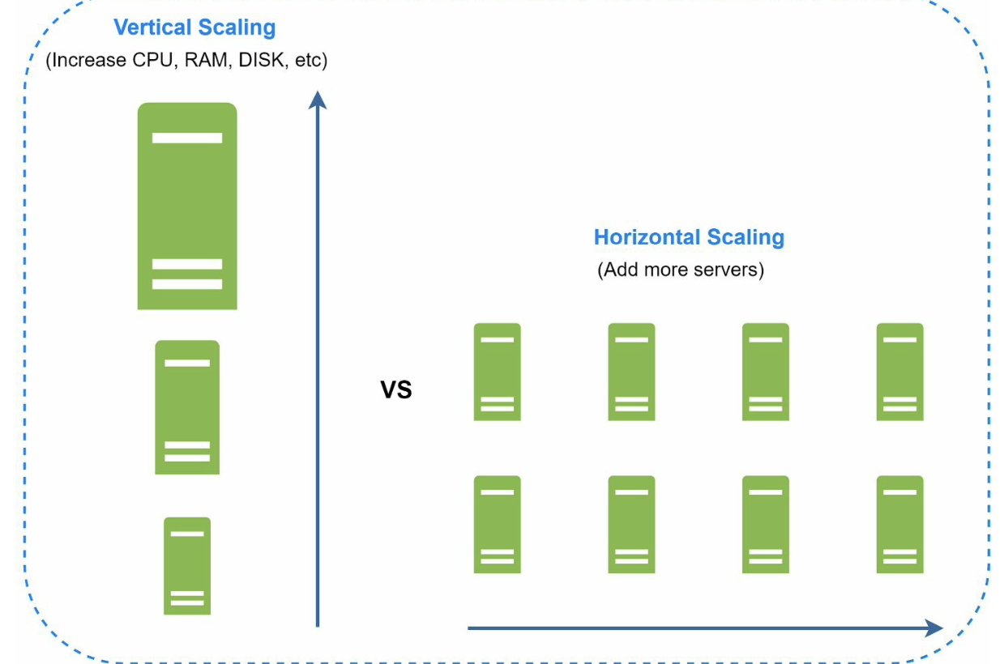

- User data is allocated to a db server based on userId
- When you access data, a hash function is used to find the corresponding shard.

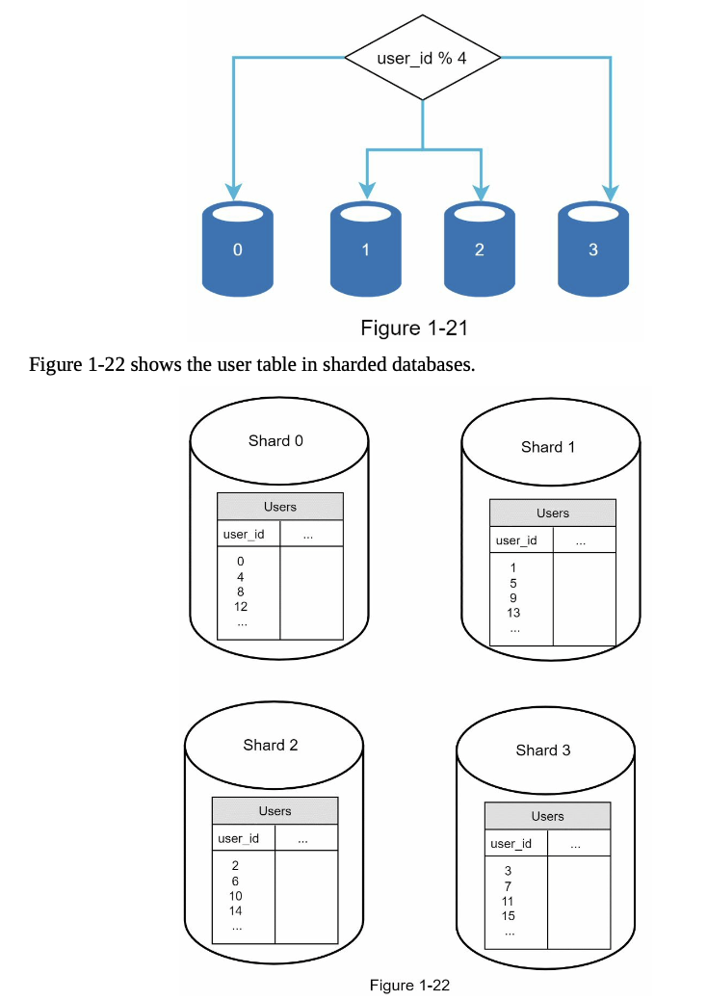

- Sharding key consists of one or more columns that determine how data is distributed.
- "user_id" is the sharding key above
- A sharding key allows you to retrieve and modify data efficiently by routing db queries to the correct database.
- It is important to choose a key that can evenly distribute data
- Some challenges:
    - Resharding data
    - Celebrity problem
    - Join and de-normalization

### DB scaling in MongoDB

- MongoDB can be vertically scaled by upgrading the hardware on a single server to handle increased load or performance requirements. This is a straightforward approach, but it has its limits, and there's a point where further vertical scaling becomes impractical or expensive.
Horizontal Scaling (Scaling Out):

- MongoDB achieves horizontal scaling through sharding, a technique that involves partitioning data across multiple servers (shards). Each shard is an independent database that can be hosted on a separate machine.
MongoDB's built-in sharding capabilities allow it to distribute large datasets horizontally, providing a scalable solution for handling increased data volumes and read/write operations.

## 1-12 Millions of Users and Beyond
- How we scale our system:
    - Keep web tier stateless
    - Build redundancy at every tier
    - Cache data as much as you can
    - Support multiple data centers
    - Host static assets in CDN
    - Scale your data tier by sharding
    - Split tiers into individual services
    - Monitor your system and automation tools
- Scaling a system is an iterative process. However, more fine-tuning and new strategies are needed to scale beyond millions of users.