# 01. Scale from zero to millions of users

### 1) Single server setup
1. User access websites through domain names
2. Domain Name System(DNS) provides IP address to the browser or mobile app
3. Hypertext Transfer Protocol(HTTP) requests are sent to web server
4. Web server returns HTML pages or JSON response

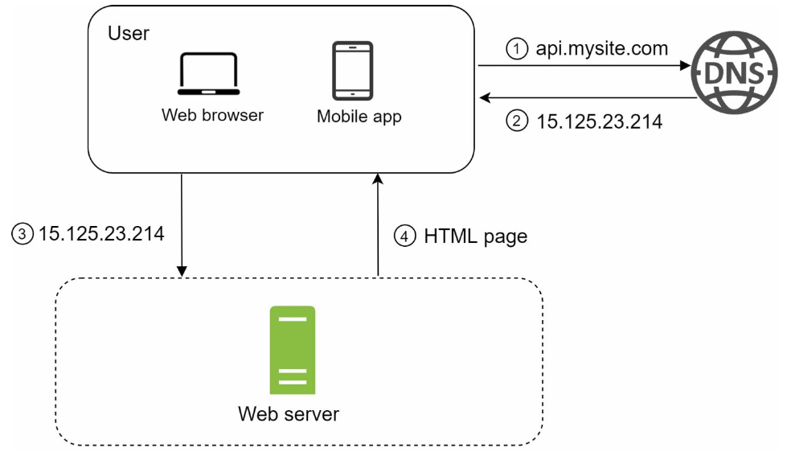

> Two main traffic sources
1. Web application 
2. mobile application

### 2) Database
Separating web server and database server allows us to scale them independently

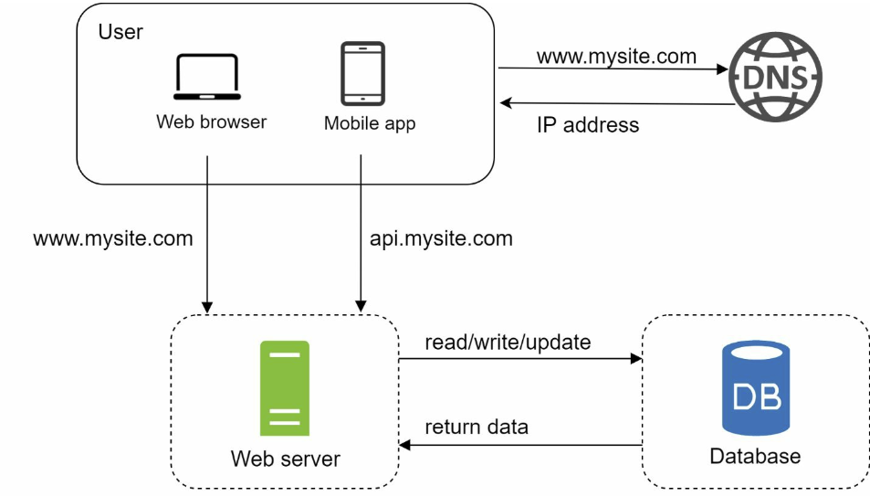

> Which databases to use?
1. Relational database(RDBMS or SQL database)
- Represent and store data in tables and rows
- We can perform join operations using SQL across different database tables
2. Non-Relational database(NoSQL database)
- Grouped into four categories: key-value stores/ graph stores/ column stores/ document stores
- Join operations are generally not supported

> Reason to choose Non-relational database over relational database

- application requires super-slow latency
- data are unstructured, or do not have any relational data
- only need to serialize and deserialized data
- need to store massive amount of data

### 3) Vertical scaling vs horizontal scaling
1. Vertical Scaling - by adding more power(CPU, RAM, etc)

**pros**
- Good option when traffic is low
- Simplicity

**cons**
- Hard limit (there's no unlimited CPU and memory)
- No failover and redundancy (if one server goes down, the application goes completely down)

2. Horizontal scaling - by adding more servers
- More desirable for large scale applications because of the limitations of vertical scaling

### 4) Load balancer
Evenly distributes incoming traffic among web servers. With this below setup, web servers are not reachable from public. Instead, private IPs are used for communication between servers.

**Private IP** is an IP address reachable only between servers in the same network. It's unreachable over the internet. The load balancer communicates with web servers through private IPs.

Load balancer helps us to solve failover issue and improve the availability. If Server 1 goes down, all the traffic will be routed to server 2. If the traffic grows, and two servers are not enough to handle the traffic, we only have to add more servers and load balancer automatically starts to send requests to the new servers.
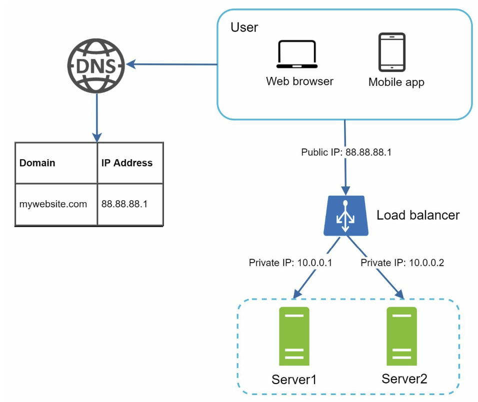

### 5) Database replication
Master/slave relationship between the original(master) and the copies(slaves). A **master** database only supports write operations. A **slave** database gets copies of the dat from the master database and only supports read operations. Most applications require a much higher ratio of reads to writes, so the number of slave databases is usually larger than the number of master databases.

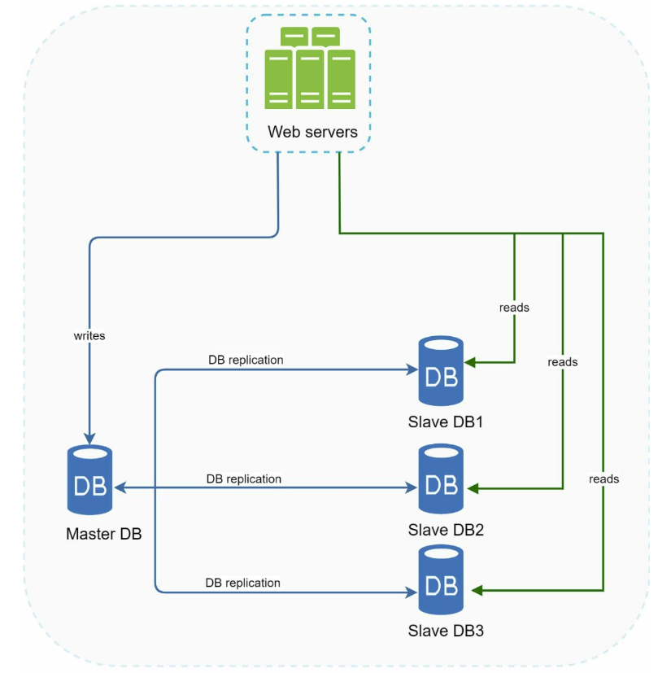

> Advantages
1. Better performance - it allows more queries to be processed in parallel
2. Reliability - we don't have to worry about data loss because dat is replicated across multiple locations
3. High availability - we can access data stored in another database server even if a database goes down

> What if one of the database goes offline?

- If only **one slave** database is available and it goes offline, read operations will be directed to the master database temporarily. If **multiple slave** databases are available, read operations are redirected to other healthy slave databases.
- If the **master** database goes offline, a slave database will be promoted to be the new master. Promoting a new master to production environment is more complicated because the data in a slave database might not be up to date.

After applying database replication
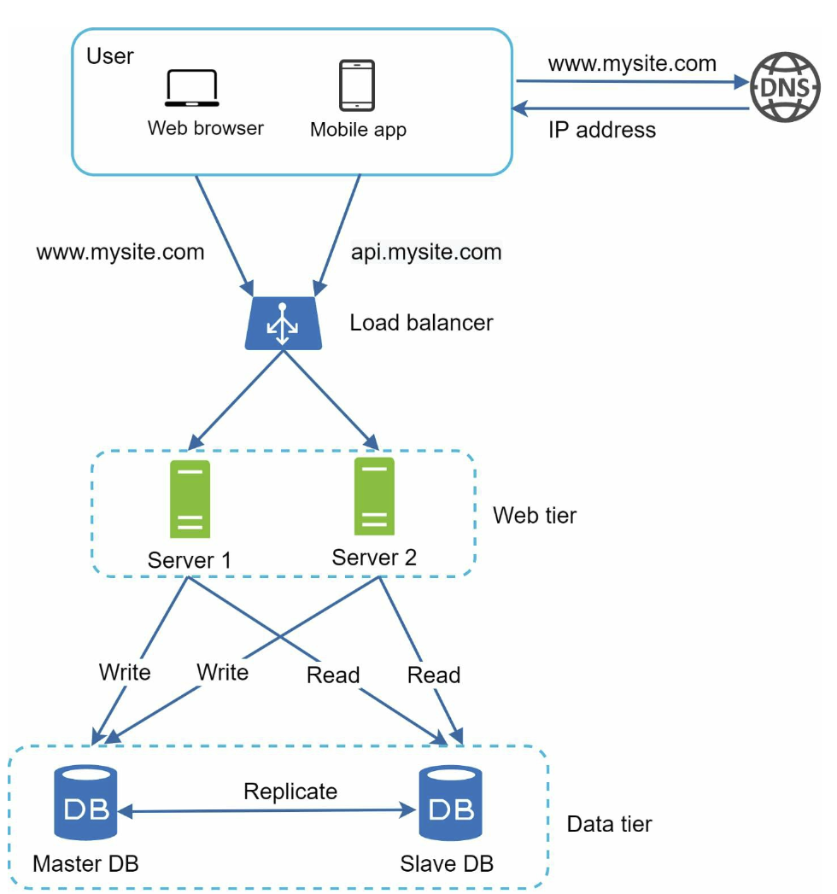

### 6) Cache
temporary storage area that stores the result of expensive responses or frequently accessed data, so that subsequent requests are served more quickly.

> Cache tier

**Benefit**: 
- better system performance
- ability to reduce database workloads
- ability to scale the cache tier independently

> read-through cache

After receiving a request, a web server first checks if the cache has the available response. If it has, it sends data back to the client. If not, it queries the database, stores the response in cache, and sends it back to the client.
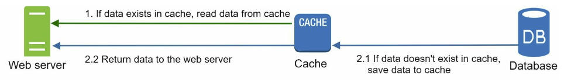

> Considerations for using cache

- **Decide when to use cache** - when data is read frequently but modified infrequently. A cache server is not ideal for persisting data because if cache server restarts, all teh data in memory is lost
- **Expiration policy** - when there is no expiration policy, cached data will be stored in the memory permanently
- **Consistency** - keeping the data store and the cache in sync
- **Mitigating failures** - single cache server represents a potential single point of failure
- **Eviction Policy** - once the cache is full, any requests to add items to the cache might cause existing items to be removed. Least-recently-used(LRU), Least Frequently Used(LFU), or First in First out (FIFO) can be used as an eviction policy

### 7) CDN
Network of geographically dispersed servers used to deliver static content. When a user visits a website, a CDN server closest to the user will deliver static content. The further users are from CDN servers, the slower the website loads.
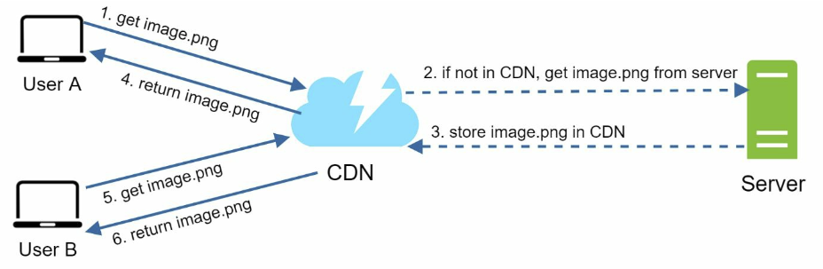
> Considerations of using a CDN

- **Cost** - CDNs are run by third-party providers and it's being charged for data transfers in and out of the CDN
- **Seeing an appropriate cache expiry** - if the expiry time is too long, the content might not no longer be fresh. If it is too short, it can cause repeat reloading of content from origin servers
- **CDN fallback** - if there's a temporary CDN outage, clients should be able to detect the problem and request resources from the origin 
- **Invalidating files** - invalidate the CDN object using APIs provided by CDN vendors

### 8) Stateless web tier
It is a good practice to store session data in the persistent storage such as relational database or No-SQL. Each web server in the cluster can access state data from databases.

> Stateful architecture

A **stateful server** remembers client data(state) from one request to the next. In the other hand, a **stateless server** keeps no state information. Stateful server's issue is that every request from the same client must be routed to the same server.

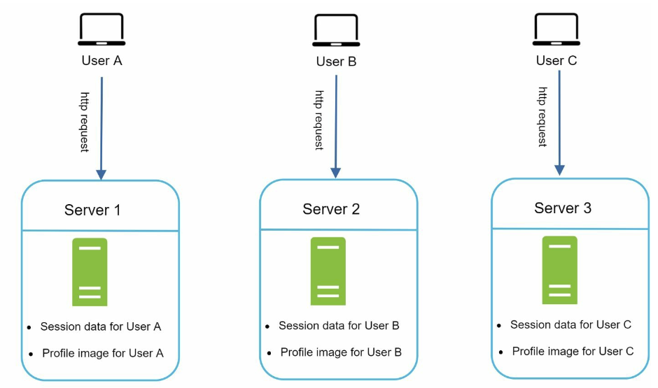

> Stateless architecture

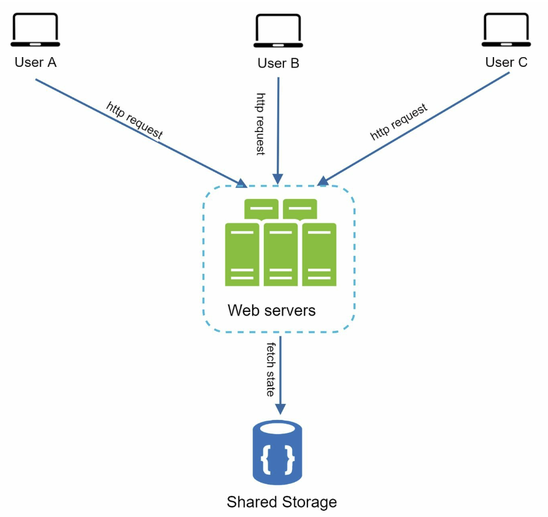

HTTP requests from users can be sent to any web servers, which fetch state data from a shared data store. It is simpler, more robust, and scalable compared to stateful architecture.

### 9) Data centers
If we have multiple data centers, users are geo-routed, to the closest data center. **geoDNS** is a DNS service that allows domain names to be resolved to IP addresses based on the location of a user.

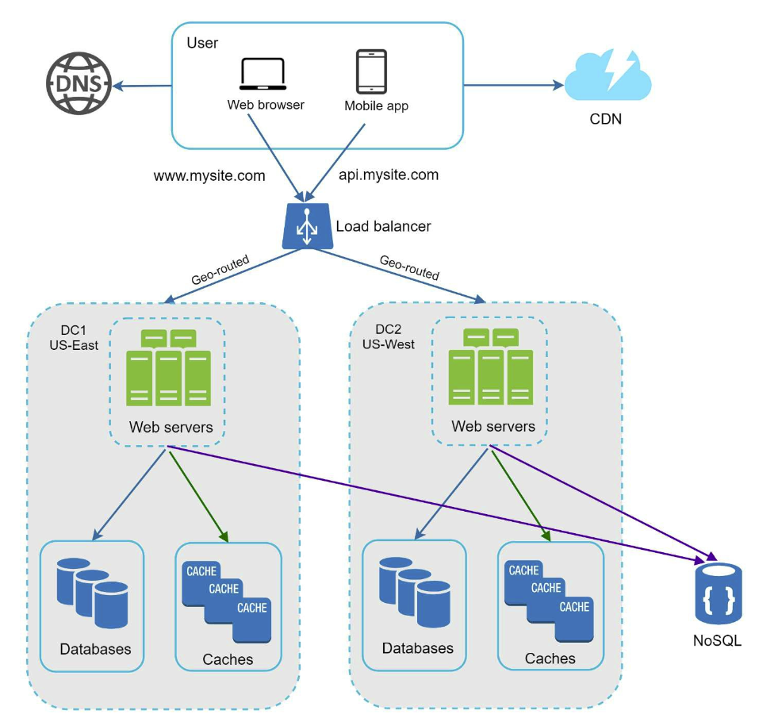

> Technical challenges to achieve multi-data center setup
- **Traffic redirection** - effective tools are needed to direct traffic to the correct data center
- **Data synchronization** - in failover cases, traffic might be routed to a data center where data is unavailable. It can be solved by replicating data across multiple data centers
- **Test and deployment** - it is important to test application at different locations. Automated deployments tools are vital

### 10) Message Queue
Durable component, stored in memory, that supports asynchronous communication. It serves as a buffer and distributes asynchronous requests.
**Producers/publishers** create messages and publish them to a message queue and **consumers/subscribers** connect to the queue, and perform actions defined by the messages.
By using message queue, we can decouple the application. The producer can post a message to the queue when the consumer is unavailable to process it and the consumer can read messages from the queue even the producer is unavailable.

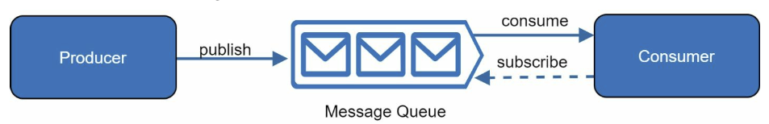

### 11) Logging, metrics, automation
As our application grows to serve a large business, investing in logging, metrics and automation is essential
- **Logging** - monitoring error logs is important because it helps to identify errors and problems in the system
- **Metrics** - it helps us to gain business insights and understand the health status of the system
- **Automation** - automating build, test, deploy process, etc could improve developer productivity significantly

### 12) Database scaling

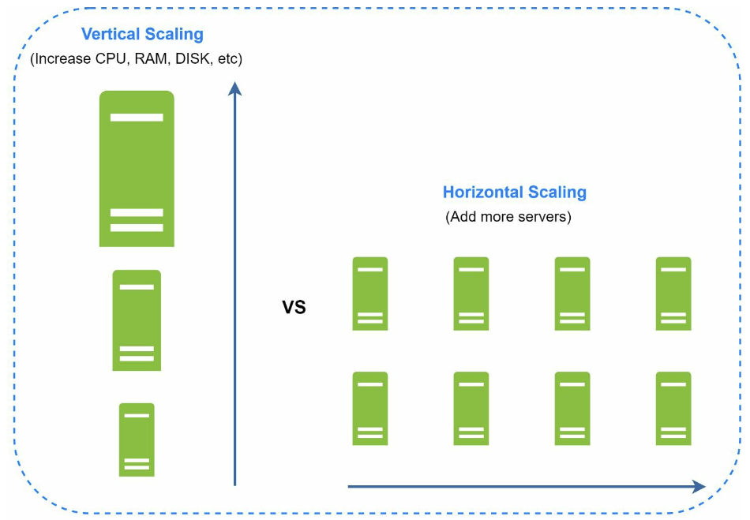

> Vertical scaling

- hardware limits
- greater risk of single point of failure
- overall cost of vertical scaling is high

> Horizontal scaling

**Sharding** is the practice of adding more servers. It separates large databases into smaller, more easily managed parts called shards. Each shard shares the same schema, but the actual data on each shard is unique to the shard. The most important factor to consider implementing a sharding strategy is the **choice of sharding key**. It should be evenly distributed data.

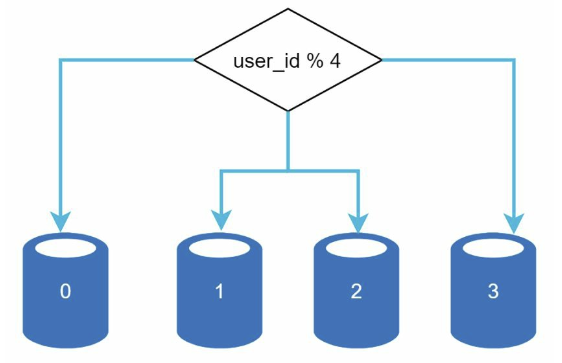
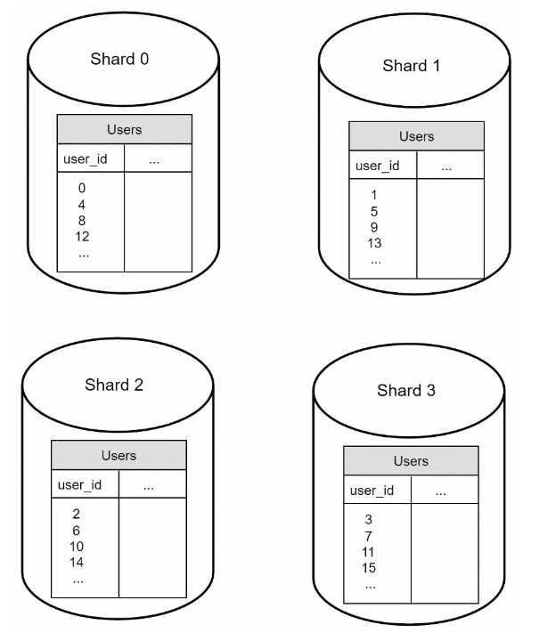

> Challenges of sharding
- **Resharding data** 
    - a single shard could no longer hold more data due to rapid growth. 
    - certain shard might experience shard exhaustion faster than others due to uneven data distribution
- **Celebrity problem** - Excessive access to a specific shard could cause server overload
- **Join and de-normalization** - it is hard to perform join on sharded databases, de-normalizing database can resolve the issue

