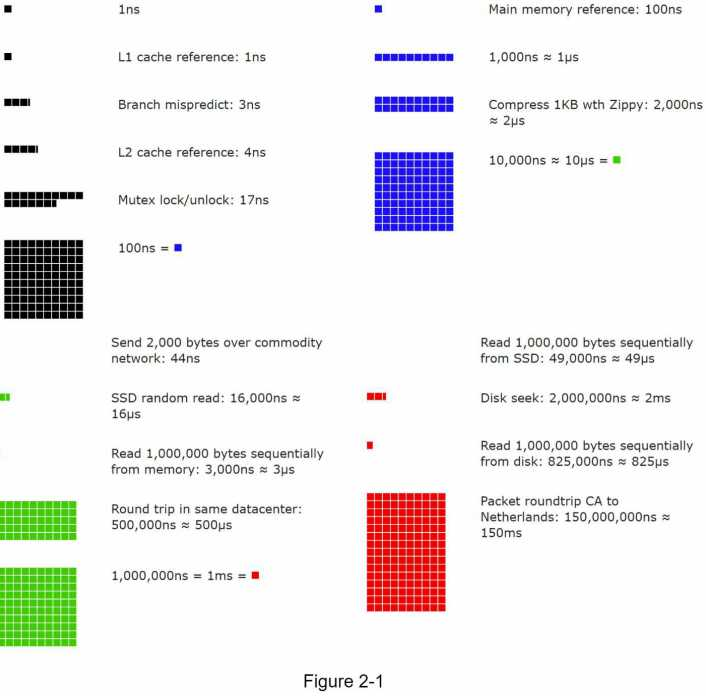

# CHAPTER 2: BACK-OF-THE-ENVELOPE ESTIMATION

You need to have a good sense of scalability basics to effectively carry out back-of-the-envelope estimation. 
```
- Power of two [2]
- Latency numbers every programmer should know
- Availability numbers.
```


## (1) Power of two

## (2) Latency numbers every programmer should know

## (3) Availability numbers

## Example: Estimate Twitter QPS and storage requirements


