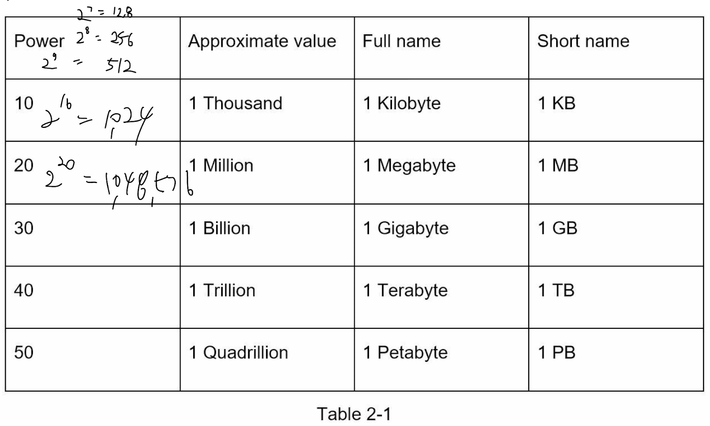
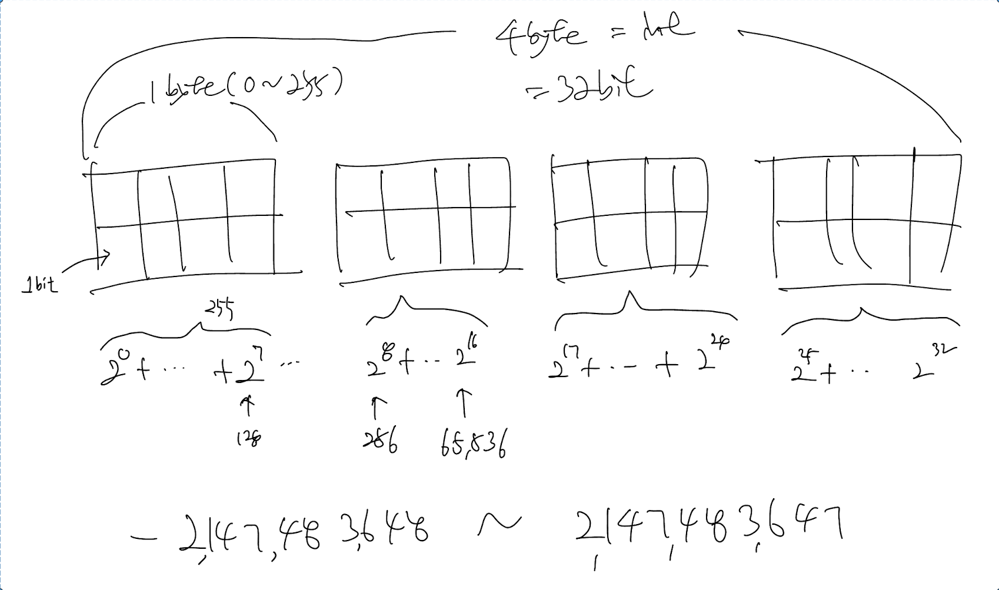

# Chapter 2: Back-of-the-envelope estimation

## Power of two
- The power of 2 = 2의 거듭 제곱
- 2 to power of 10 = 2의 10승
- A byte is a sequence of 8 bits.
- 1 byte = 8 bits = 2 to power of 3.
- The size of a char is a byte. (= 8 bits) 

## Integer

## Latency numbers

## Availability numbers
- SLA(Service Level Agreement): SLAs formalise the commitments made between service providers and customers within the Performance Management Framework. These agreements outline the expected levels of service, including specific metrics, response times, and potential consequences for not meeting the agreed-upon standards.
- SLO(Service Level Objectives): Specific quantifiable goals set within the Performance Management Framework to define acceptable levels of service performance. These objectives ensure a more granular and focused approach to maintaining service reliability and quality.
- KPI(Key Performance Indicator): Serves as the foundational metric within the Performance Manager Framework, offering a holistic view of organisational or operational success. They provide a broader perspective on overall performance and guide strategic decision-making.

## Ex: Estimate Twitter

## Tips
- Solving the problem is more important than obtaining results
  - Rounding and Approximation. It is difficult to perform complicated math operations
    during the interview. For example, what is the result of **“99987 / 9.1”?** There is no need to
    spend valuable time to solve complicated math problems. Precision is not expected. Use
    round numbers and approximation to your advantage. The division question can be
    simplified as follows: **“100,000 / 10”**.
  - Write down your assumptions. It is a good idea to write down your assumptions to be
    referenced later.
  -  Label your units. When you write down “5”, **does it mean 5 KB or 5 MB?** You might
     confuse yourself with this. Write down the units because “5 MB” helps to remove
     ambiguity.
  - Commonly asked back-of-the-envelope estimations: **QPS, peak QPS, storage, cache,
    number of servers, etc**. You can practice these calculations when preparing for an
    interview. Practice makes perfect. 