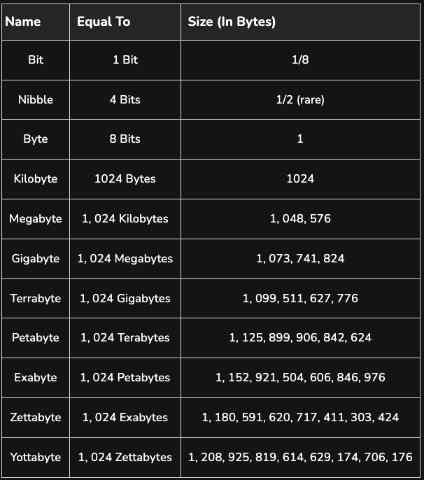
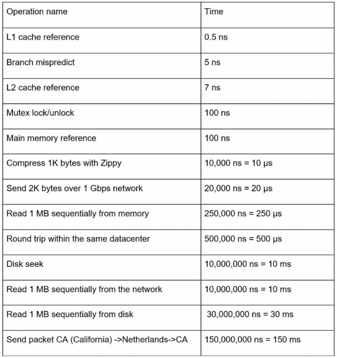
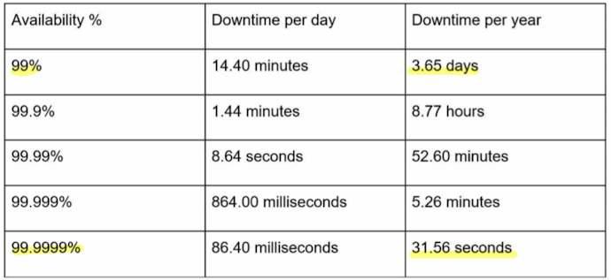

# Chapter 2. Back-of-the-envelope estimation

## Data volume (Power of two)
\
(source: https://www.geeksforgeeks.org/understanding-file-sizes-bytes-kb-mb-gb-tb-pb-eb-zb-yb/)

## Latency numbers

(source: system design interview book)

* notes
    - ps=picosecond, ns=nanosecond, µs=microseconds, ms=millisecond
    - 1 ns = 10^9 seconds
    - 1 µs = 10^6 seconds = 1,000 ns
    - 1 ms = 10^3 seconds = 1,000,000 ns
    - 1 ps = 10^12 seconds

* conclusions:
    - Memory is fast but the disk is low.
    - Avoid disk seeks if possible.
    - Simple compression algorithsm are fast.
    - Compress data before sending it over the internet if possible.
    - Data centers are usually in different regions, and it takes time to send data between them.

## Availabiltiy numbers

(The S3 Standard storage class is designed for 99.99%)

### Example
- Estimate Twitter QPS and storage requirements
- Assumptions:
    - 300 million monthly active users.
    - 50% of users use Twitter daily
    - Users post two tweets per day on average.
    - 10% of tweets contain media.
    - Data is stored for five years.
- Estimations:
    - Query per second(QPS) estimate:
        - Daily active users (DAU) = 300 million * 50% = 150 million
        - Tweets QPS = 150 million * 2 tweets / 24 hour / 3,600 seconds = ~ 3,500
        - Peek QPS = 2 * QPS = ~7,000
            * Why do we need to multiply two?
    - Storage estimate:
        - Average tweet size:
            - tweet_id: 64 bytes
            - text: 140 bytes
            - media: 1MB
        - Media storage: 150 million * 2 * 10% * 1MB = 30 TB per day
        - 5-year media storage: 30 TB * 365 * 5 = ~ 55 PB