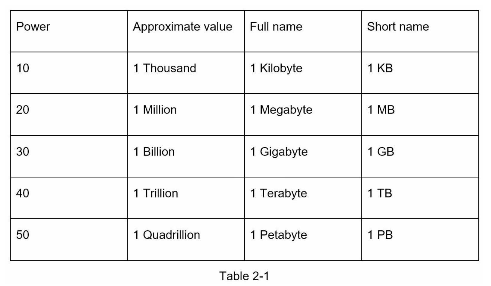
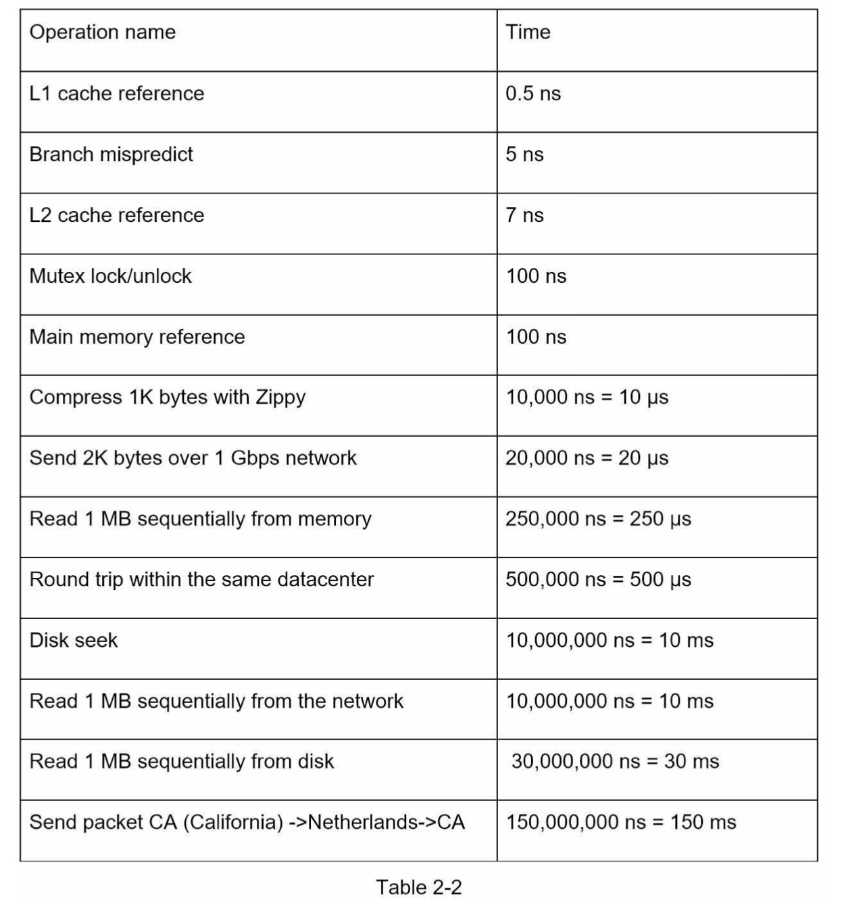

# CHAPTER 2: BACK-OF-THE-ENVELOPE ESTIMATION

## Power of two

Data volumes are calculated in power of 2

- 1 byte = 8 bits
- 1 kilobyte (K / KB) = 2^10 bytes = 1,024 bytes (1 thousand)
- 1 megabyte (M / MB) = 2^20 bytes = 1,048,576 bytes (1 million)
- 1 gigabyte (G / GB) = 2^30 bytes = 1,073,741,824 bytes (1 billion)
- 1 terabyte (T / TB) = 2^40 bytes = 1,099,511,627,776 bytes (1 trillion)
- 1 petabyte (P / PB) = 2^50 bytes = 1,125,899,906,842,624 bytes (1 quadrillion)
- 1 exabyte (E / EB) = 2^60 bytes = 1,152,921,504,606,846,976 bytes (1 quintillion)

## Latency numbers

- ns: nanosecond (10^-9)
- μs: microsecond (10^-6)
- ms: millisecond (10^-3)
  
  

- Memory is fast but the disk is slow.
- Avoid disk seeks if possible.
- Simple compression algorithms are fast.
- Compress data before sending it over the internet if possible.
- Data centers are usually in different regions, and it takes time to send data between them.

## Availability numbers

- the ability of a system to be continuously operational
- measured as a percentage (uptime vs downtime)
- most are btw 99% ~ 100%
- measured in nines
- service level agreement (SLA) between service provider and user
- defines the level of uptime
  

## Tips

- Back-of-the-envelope estimation is all about the process
- precision of the result of a complex calculation is not important
- write down assumptions
- define units
- common topics: QPS, peak QPS, storage, cache, number of server
