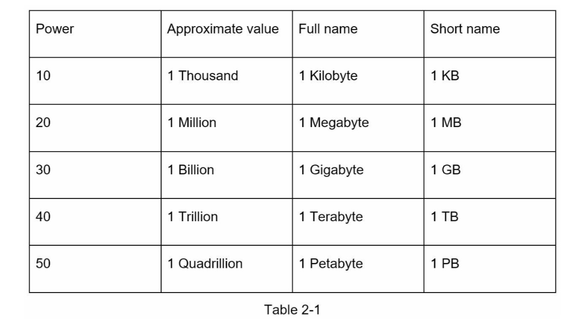
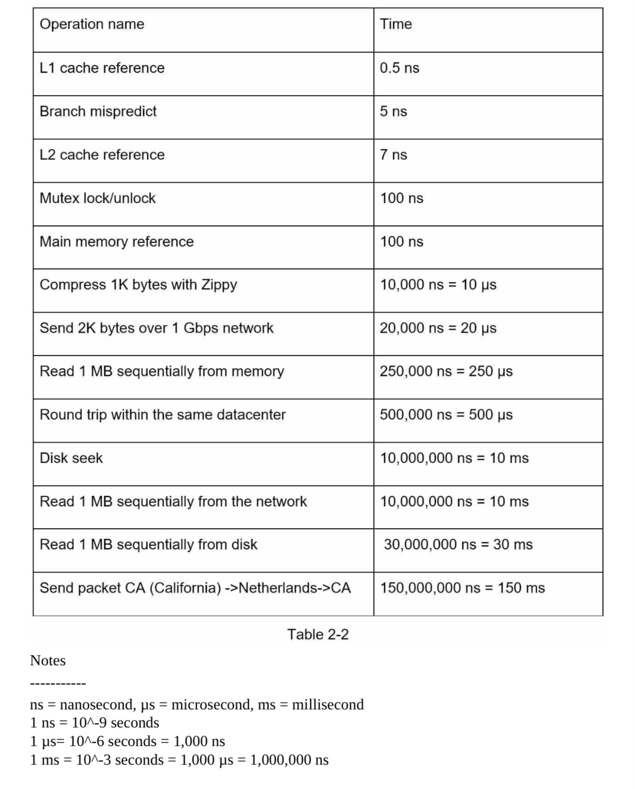
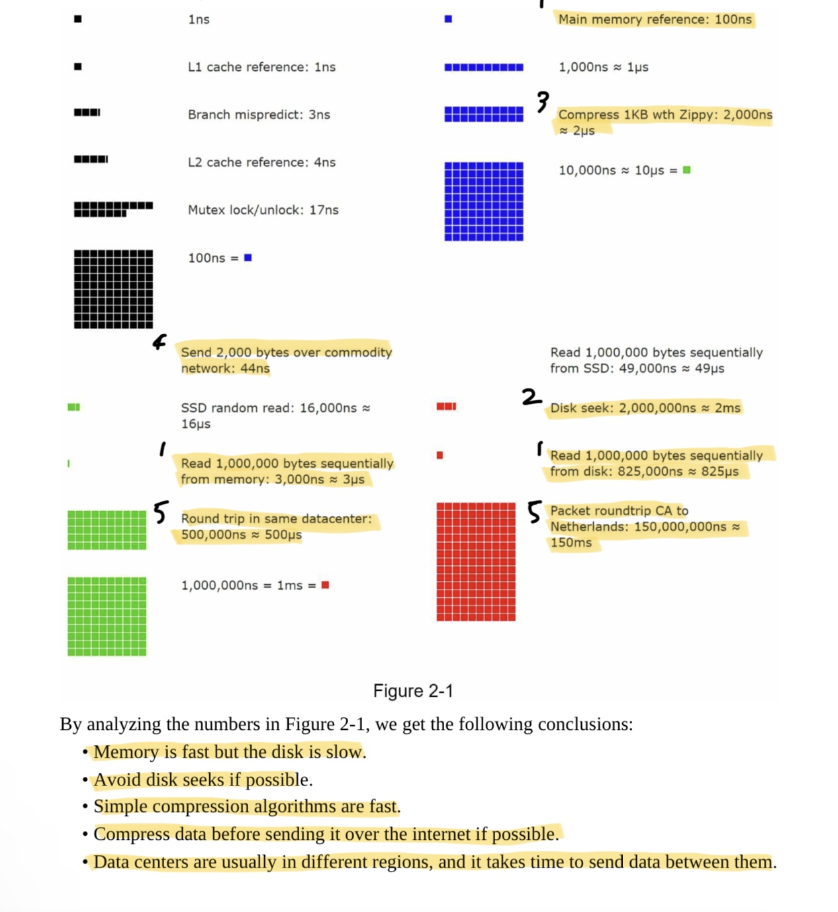
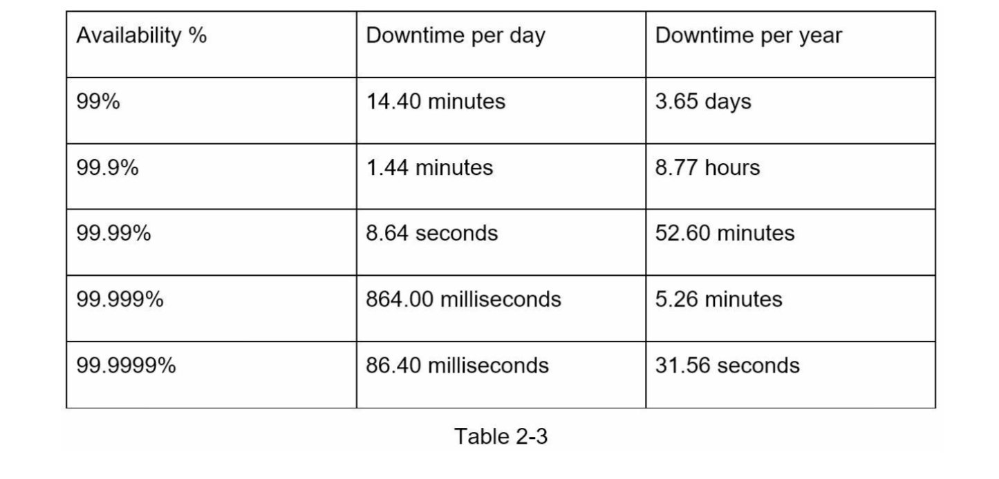

# CHAPTER 2: BACK-OF-THE-ENVELOPE ESTIMATION

estimate system capacity or performance requirements using a back-of-the-envelope estimation.

back-of-the-envelope calculations are estimates you create using a combination of thought experiments and common performance numbers to get a good feel for which designs will meet your requirement

## Power of two

- data volume unit using the power of 2 | 8bits = 1byte
- ASCII character = one byte of memory

 

## Latency numbers every programmer should know

1. Memory is fast but the disk is slow.
2. Avoid disk seeks if possible.
3. Simple compression algorithms are fast.
4. Compress data before sending it over the internet if possible.
5. Data centers are usually in different regions, and it takes time to send data between them.

## Availability numbers

High availability is the ability of a system to be continuously operational for a desirably long period of time. 
0% low - high 100%

service level agreement (SLA): agreement between service provider and the customer(user) 

## Example: Estimate Twitter QPS and storage requirements

Assumptions:
- 300 million monthly active users.
- 50% of users use Twitter daily.
- Users post 2 tweets per day on average. • 10% of tweets contain media.
- Data is stored for 5 years.

Estimations:
Query per second (QPS) estimate:
- Daily active users (DAU) = 300 million * 50% = 150 million
- Tweets QPS = 150 million * 2 tweets / 24 hour / 3600 seconds = ~3500 • PeekQPS=2*QPS=~7000
We will only estimate media storage here. • Average tweet size:
- tweet_id 64 bytes • text 140 bytes • media 1MB
- Mediastorage:150million*2*10%*1MB=30TBperday • 5-yearmediastorage:30TB*365*5=~55PB

## Tips
 - Rounding and Approximation: Use round numbers and approximation (ex: 99,987 / 9.1 -> 100,000 / 10)
 - Write down your assumptions
 - Label your units (you'll be confused later if you write down only 5 instead, write down 5MB)
 - Commonly asked back-of-the-envelope estimations: QPS, peak QPS, storage, cache, number of servers, etc.
