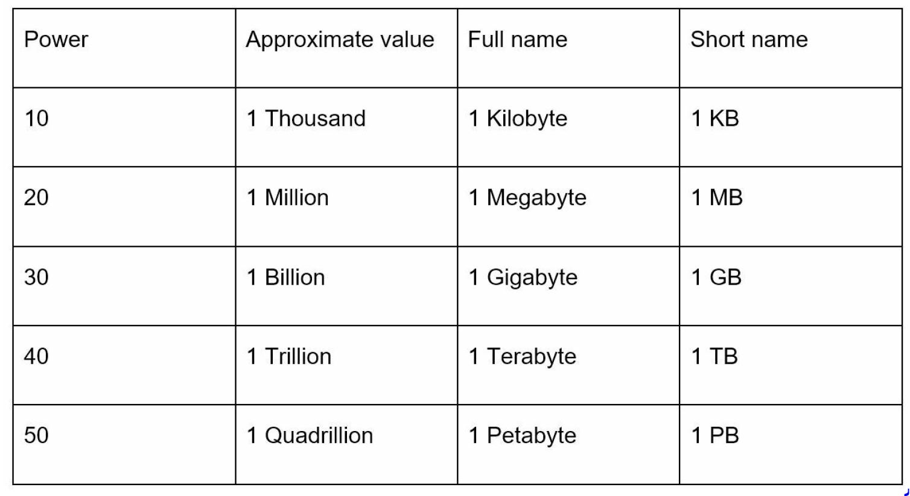
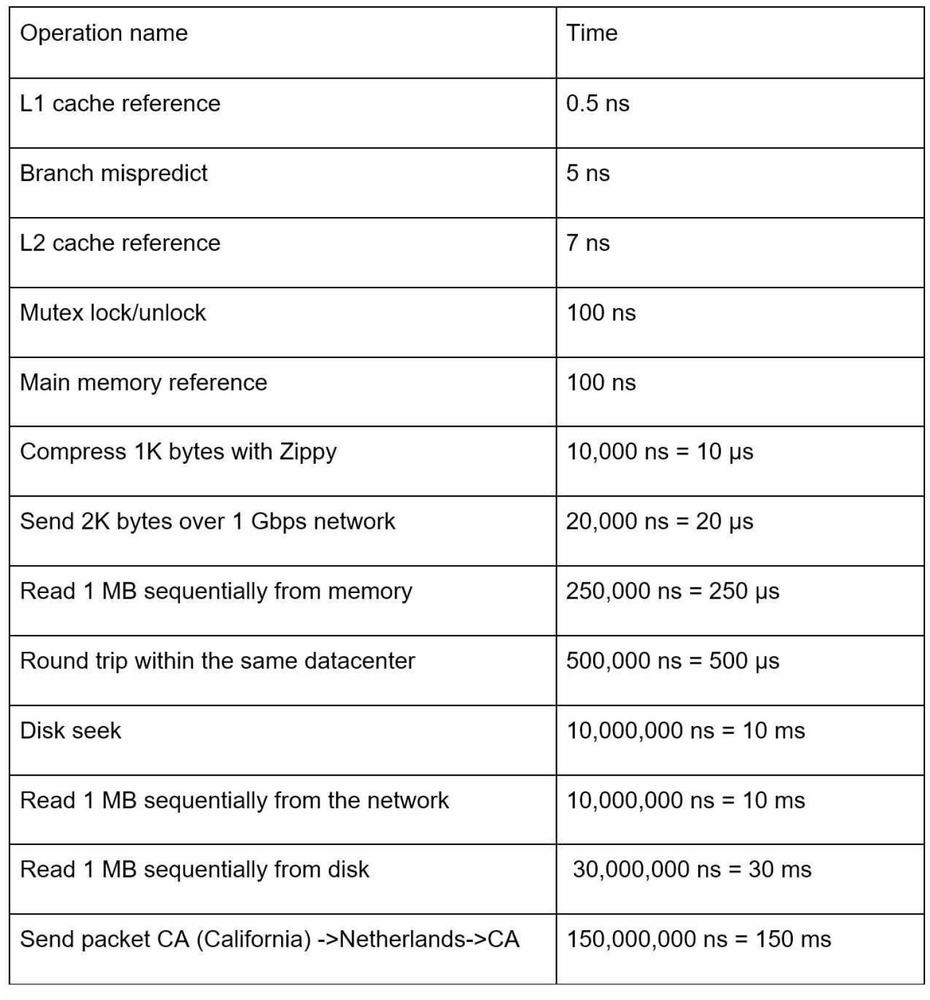
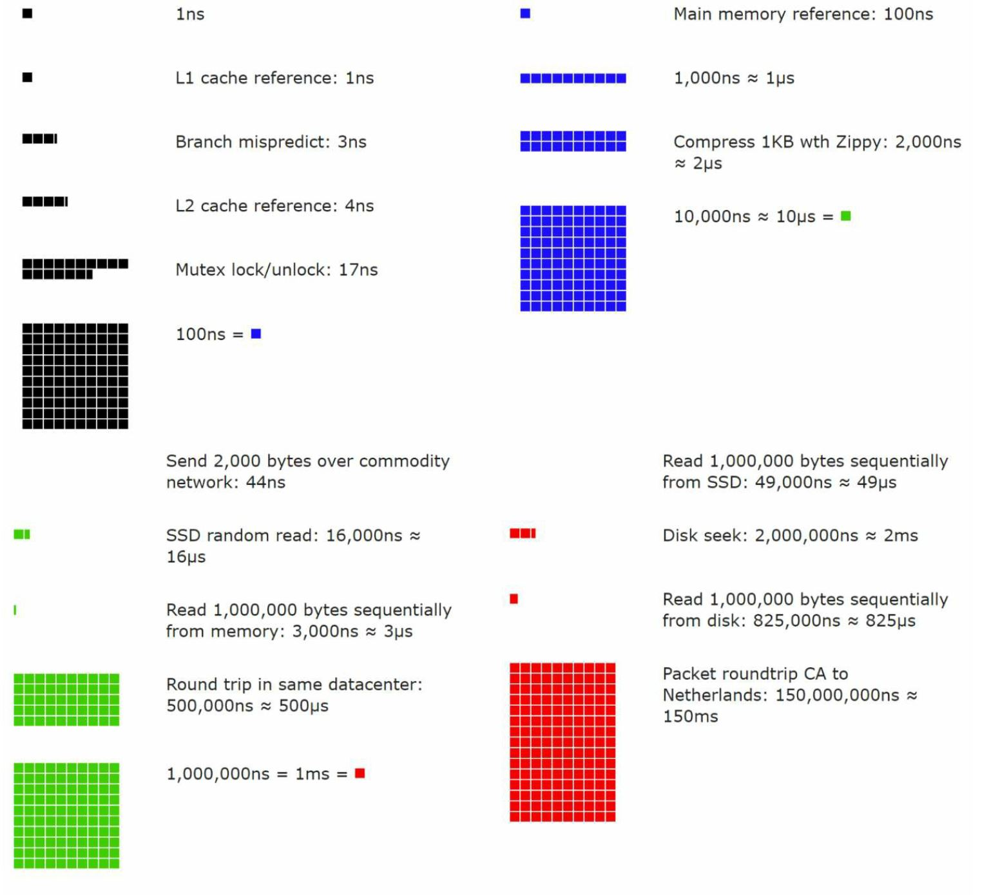
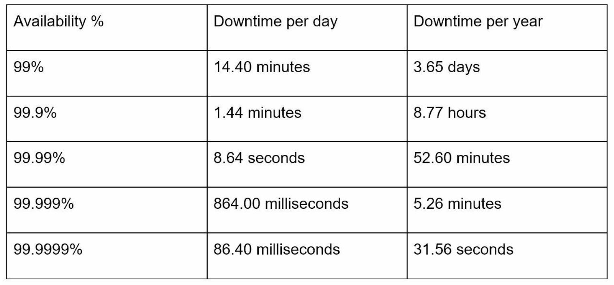

# Chapter 2: Back of the envelope estimation

### A back-of-the-envelope estimation 
- Estimate system capacity or performance requirements 
- A combination of thought experiments and common performance number
- Need to have a good sense of scalability basics to effectively carry out back-of-the-envelope estimation.

## Power of two
- Dealing with distributed system, calcuation all boils down to the basics
- To obtain correct calculations, it is critical to know the data volume unit using the power of 2
- A byte is a sequence of 8 bits.
- An ASCII character uses one byte of memory(8 bits)

## Latency numbers every programmer should know
- The length of typical computer operations in 2010 by Dr. Dean from Google
- Some numbers are outdated, as computers become faster and more powerful
- Even though, those numbers should still be able to give us an idea of the fastness and slowness of different computer operations

- nano second = 10^-9 seconds
- micro second = 10^-6 seconds = 1,000 nano seconds
- milli second = 10^-3 seconds = 1,000 micro seconds = 1,000,000 nano seconds

- Visualized latency numbers as of 2020
- Memory is fast but the disk is slow
- Avoid disk seeks if possible
- Simple compression algorithms are fast
- Compress data before sending it over the internet if possible
- Data centers are usually in different regions, and it takes time to send data between them

## Availability numbers
- High Availability
    - the ability of system to be continuously operational for a desirably long period of time. 
    - Measured as a percentage, with 100% means a service that has 0 downtime.
    - Most services fall between 99% and 100%
- SLA(Service Level Agreement)
    - Commonly used term for service providers
    - An agreement between you (the service provider) and your customer
    - Formally defines the level of uptime your service will deliver
    - Amzaon, Google, Microsoft set their SLA at 99.9% or above
- Uptime is traditionally measured in nines. 
  - More the nines, the betters

- The number of nines correlated to the expected system downtime

## Example: Estimate Twitter QPS and storage requirements

### Assumptions
- 300 million monthly active users
- 50% of users use Twitter daily
- Users post 2 tweets per day on average
- 10% of tweets contain media
- Data is stored for 5 years

### Estimation
- Query per seconds (QPS) estimate
    - Daily Active Users (DAU) = 300 million * 50 % = 150 million
    - Tweets QPS = 150 miliion * 2 tweets / 24 Hours / 3600 seconds = ~3500
    - Peek QPS = 2 * QPS = ~7000

- Estimate media storage 
    - Average tweet size
      - tweet_id    64 bytes
      - text        140 bytes
      - media       1 MB
    - Media storage : 150 million * 2 * 10% * 1MB = 30 TB per day
    - 5-year media storage: 30 TB * 365 * 5 = ~55TB
## TIPs
    - Back of the envelope estimation is all about the process
    - Solving the problem is more important than obtaining result
    - Interviewers may test your probelm-solving skills
    - Tips
      - Rounding and Approximation
      - Write down your assumptions
      - Label your unit
      - Commonly asked back of the envleop estimation