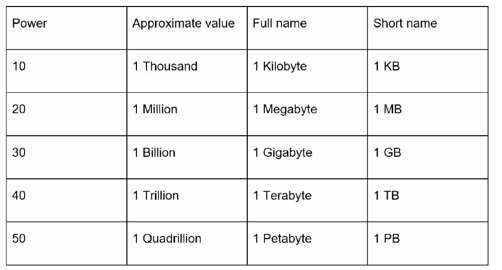
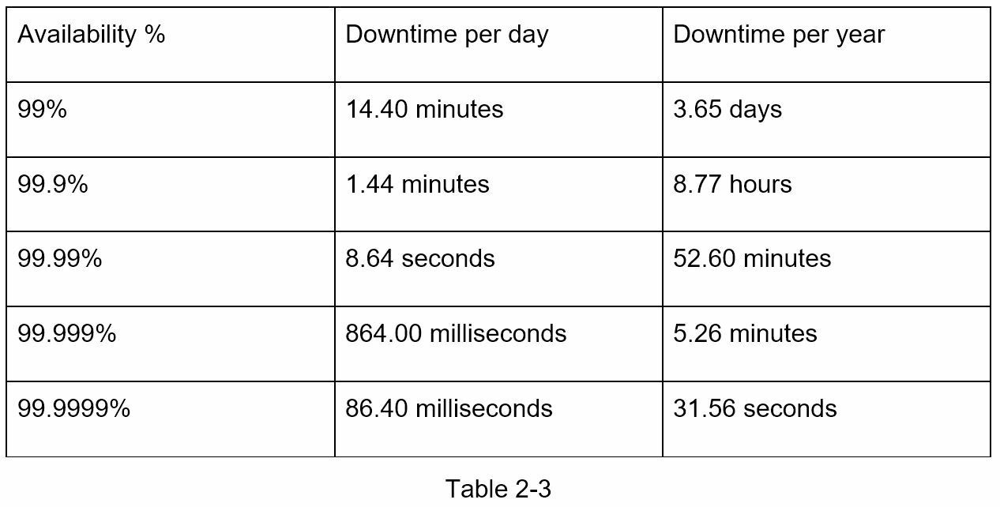

#### Power of Two

#### Latency numbers every programmer should know

By analyzing the numbers in Figure 2-1, we get the following conclusions:
- Memory is fast but the disk is slow.
- Avoid disk seeks if possible.
- Simple compression algorithms are fast.
- Compress data before sending it over the internet if possible.
- Data centers are usually in different regions, and it takes time to send data between them.

#### Availability numbers
