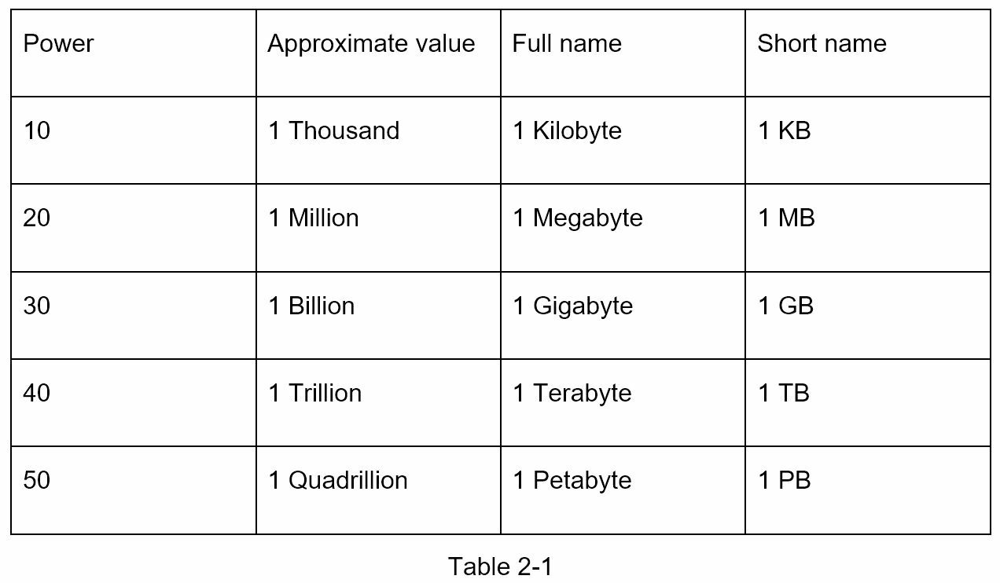
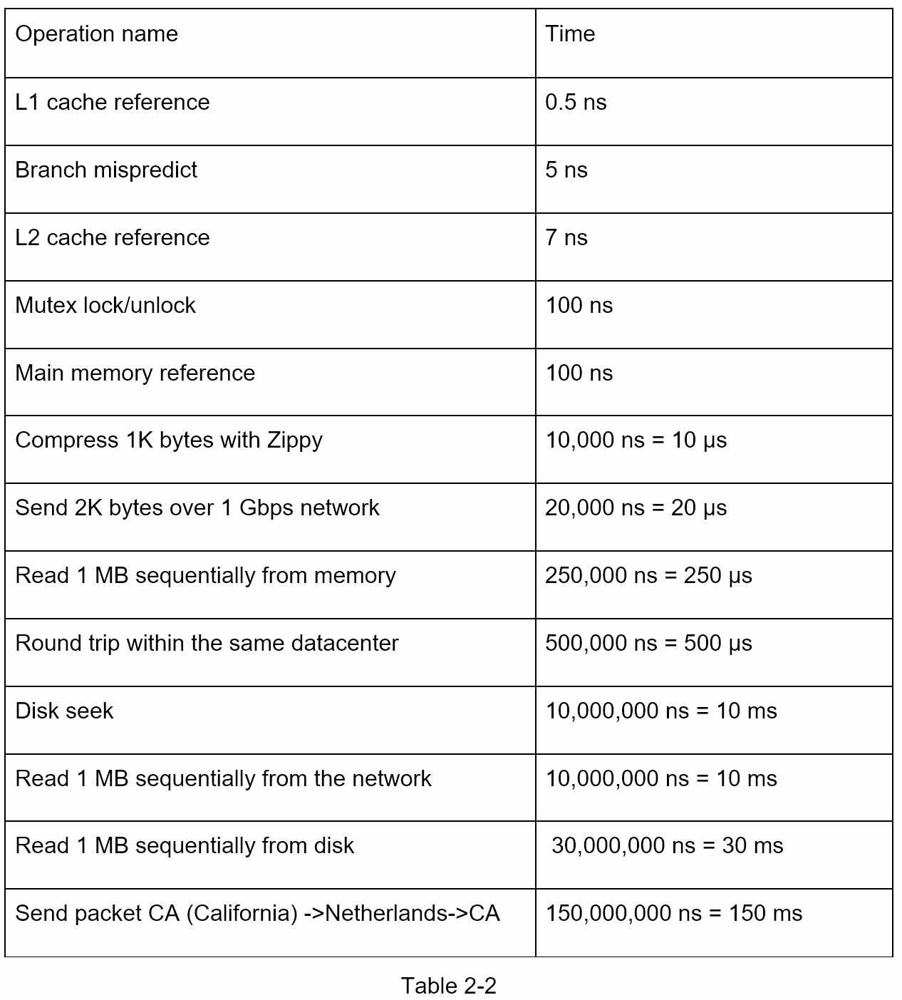

# Power of two

# Latency numbers

- Memory is fast but the disk is slow.
- Avoid disk seeks if possible.
- Simple compression algorithms are fast.
- Compress data before sending it over the internet if possible.
- Data centers are usually in different regions, and it takes time to send data between them.

# Availability numbers

- A service level agreement (SLA): a commonly used term for service providers.
- Cloud providers Amazon, Google and Microsoft set their SLAs at 99.9% or above.

# Estimate Twitter QPS and storage requirements

- Assumptions
  - Monthly active users: 300 million
  - 50% of users use Twitter daily.
  - Post 2 tweets per day on average.
  - 10% of tweets contain media.
  - Data is stored for 5 years.

- QPS estimate
  - DAU: 300mil * 0.5 
  - QPS: DAU * 2 / 24 / 60 / 60 
  - Peek QPS: QPS * 2

- Media storage estimate
  - Average tweet size
    - id: 64 bytes
    - text: 140 bytes
    - media: 1 MB
  - Daily Estimate: DAU * 2 * 0.1 * 1MB --- (1)
  - 5 years media storage: (1) * 5 * 365

- Commonly asked estimations: QPS, peak QPS, storage, cache, number of servers

