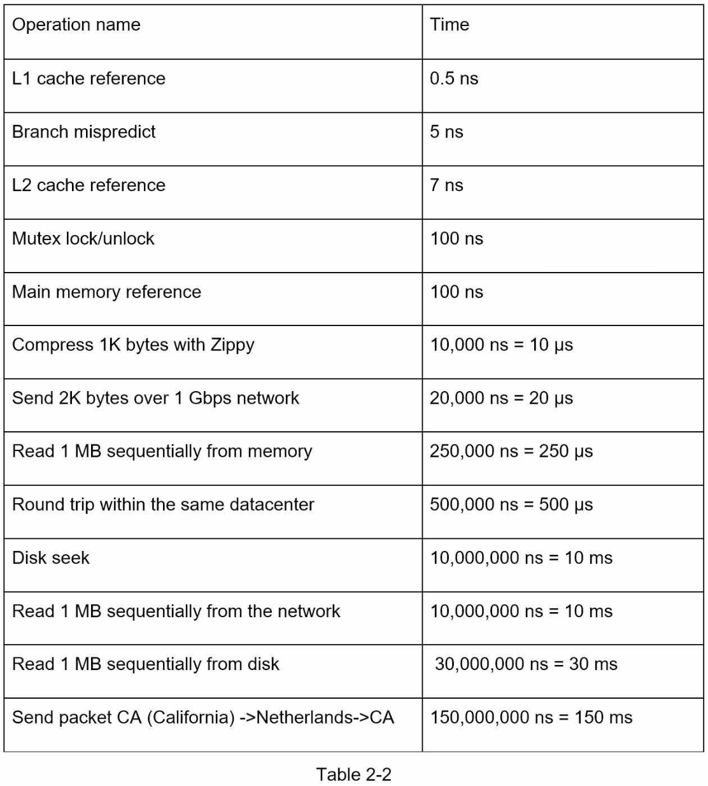
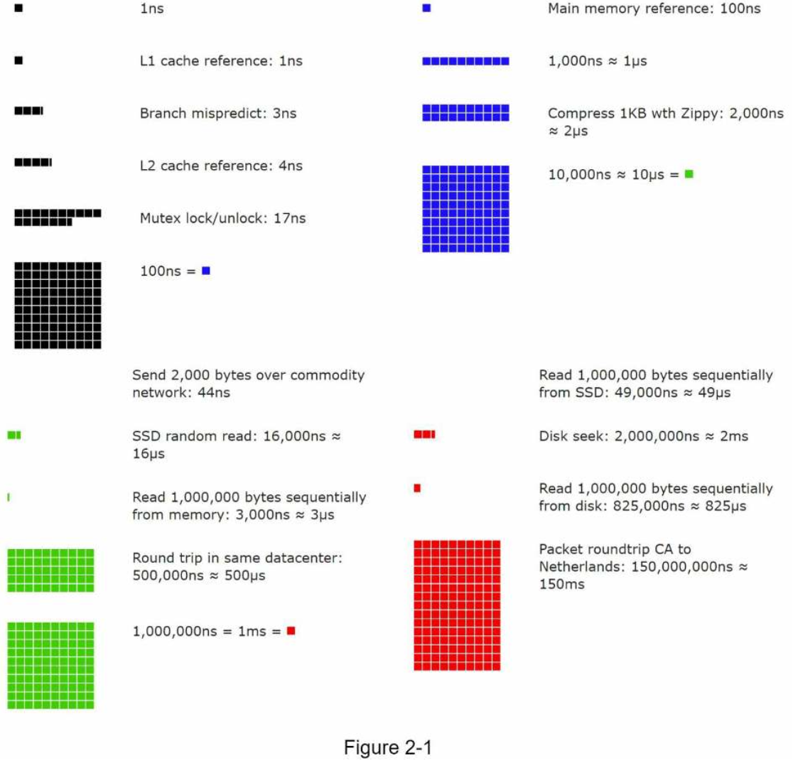
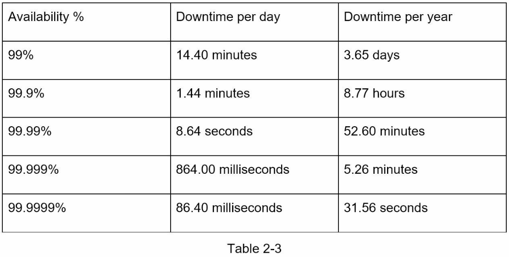

# 2. BACK-OF-THE-ENVELOPE ESTIMATION
Back-of-the-envelope calculations (대략적인 계산) are estimates you create using a **combination of thought experiments and common performance numbers** to get a good feel for which designs will meet your requirements.

### Power of two
- It is critical to know the **data volume unit** using the power of 2.
- A byte is a sequence of 8 bits.
- An ASCII character uses one byte of memory (8 bits).

### Latency numbers every programmer should know
- Those numbers should still be able to give us an idea of the fastness and slowness of different computer operations.
> 그냥 외우자!

##### conclusions
- Memory is fast but the disk is slow.
- Avoid disk seeks if possible.
- Simple compression algorithms are fast.
- Compress data before sending it over the internet if possible.
- Data centers are usually in different regions, and it takes time to send data between them.

### Availability numbers
- High availability is **the ability of a system** to be continuously operational for a desirably long period of time.
- A service level agreement (SLA) is a commonly used term for service providers and it formally defines **the level of uptime** your service will deliver.

### Example: Estimate Twitter QPS and storage requirements
##### Assumptions:
- 300 million monthly active users.
- 50% of users use Twitter daily.
- Users post 2 tweets per day on average.
- 10% of tweets contain media.
- Data is stored for 5 years.
##### Estimations:
- **Daily active users (DAU)** = 300 million * 50% = 150 million
- **Tweets Query per second (QPS)** = 150 million * 2 tweets / 24 hour / 3600 seconds = ~3500
- **Peek QPS** = 2 * QPS = ~7000
- Average tweet size:
    - tweet_id 64 bytes
    - text 140 bytes
    - media 1 MB
- **Media storage** = 150 million * 2 * 10% * 1 MB = 30 TB per day
- **5-year media storage** = 30 TB * 365 * 5 = ~55 PB

### Tips
- **Rounding and Approximation.** Precision is not expected. Use round numbers and approximation to your advantage. 
- **Write down your assumptions.** It is a good idea to write down your assumptions to be referenced later.
- **Label your units.** You might confuse yourself with this.
- **Commonly asked back-of-the-envelope estimations.** QPS, peak QPS, storage, cache, number of servers, etc.

> Practice makes perfect.