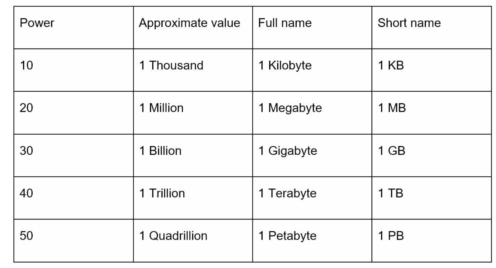
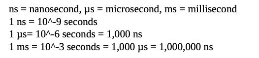
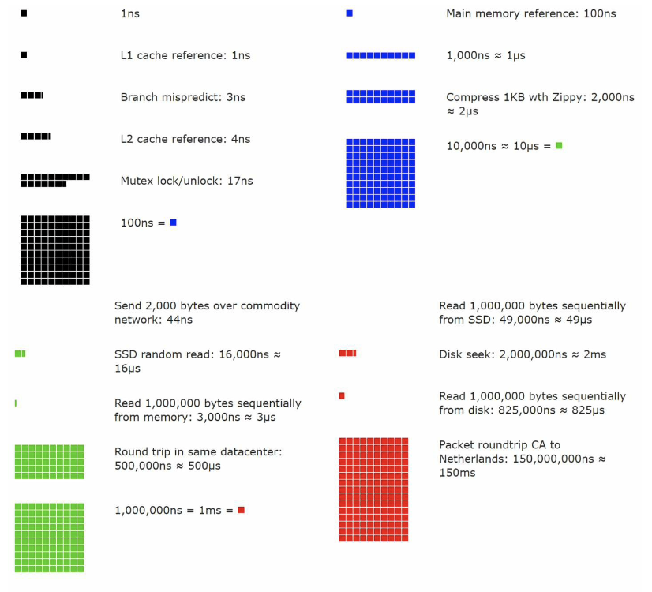
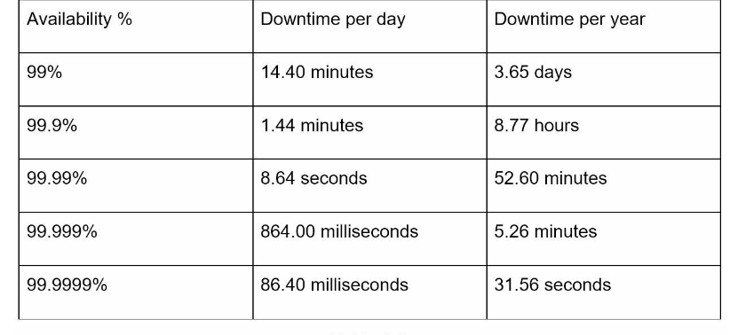

# Chapter 2: Back of the Envelope Estimation

- "Back-of-the-envelope calculations are estimates you create using a combination of thought experiments and common performance numbers to get a good feel for which designs will meet your requirements"

- Used to estimate system capacity or performance requirements
- Requires a good sense of scalability

## Power of Two
- To obtain correct calculations, it is critical to know the data volume unit using the power of 2 (note: data volume can be enormous when dealing with distributed systems)
- 1 byte = 8 bits
- An ASCII char uses one byte of memory (8bits)
- The data volume unit explained below:

## Latency Numbers Every Programmer Should Know

- Below table (some numbers might be outdated as computers become faster and more powerful) gives us an idea of the fastness and slowness of different computer operations:

- Visual representtion of ^ (visualized latency numbers as of 2020):

- Takes the time factor into consideration
- Memory is fast but the disk is slow
- Avoid disk seeks if possible
- Simple compression algorithms are fast
- Compress data before sending it over the internet if possible
- Data centers are usually in different regions, and it takes time to send data between them

## Availability Numbers
- High availability : the ability of a system to be continuously operational for a desirably long period of time
- 100% means 0 downtime (most services fall between 99% and 100%)
- SLA (Service Level Agreement) : agreement between the service provider and the customer, which formally defines the level of uptime your service will deliver. 
- Cloud provides (Amazon, Google, Microsoft) set their SLAs at 99.9% or above
- Uptime is traditionally measured in nines (the more nines, the better)

- The number of nines correlate to the expected system downtime

## Example: Estimate Twitter QPS and storage requirements
- refer to textbook

## Tips

- Back-of-the-envelope estimation is all about the process. Solving the problem is more important than obtaining results
- Some interview tips:
    - Rounding and approximation: it is difficult to perform complicated math operations at an interview (i.e. 99987 / 9.1?)
    There is no need to solve this. Precision is not expected. Use round numnbers and approximation to your advantage (i.e. 100000 / 10)
    - Write down assumptions. Good to be referenced later
    - Label units. Don't just write down "5". Do "5KB". Remove ambiguity
    - Commonly asked back-of-the-envelope estimations: 
        - QPS
        - peak QPS
        - storage
        - cache
        - number of servers
        - practice these calculations when preparing for an interview
    
