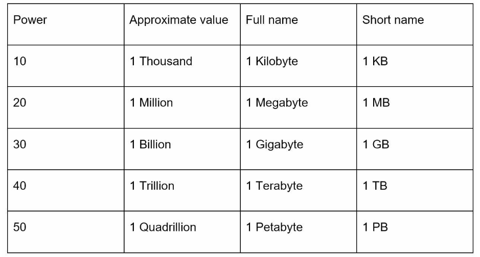
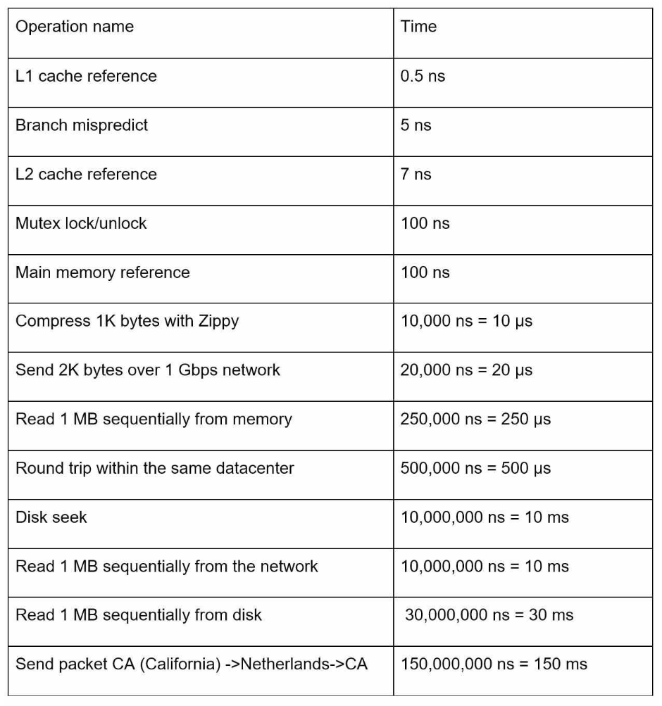
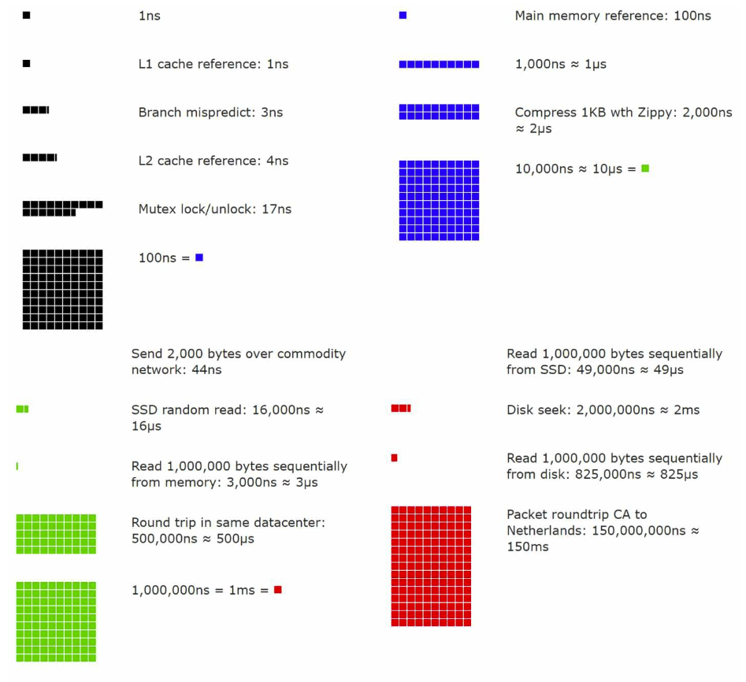
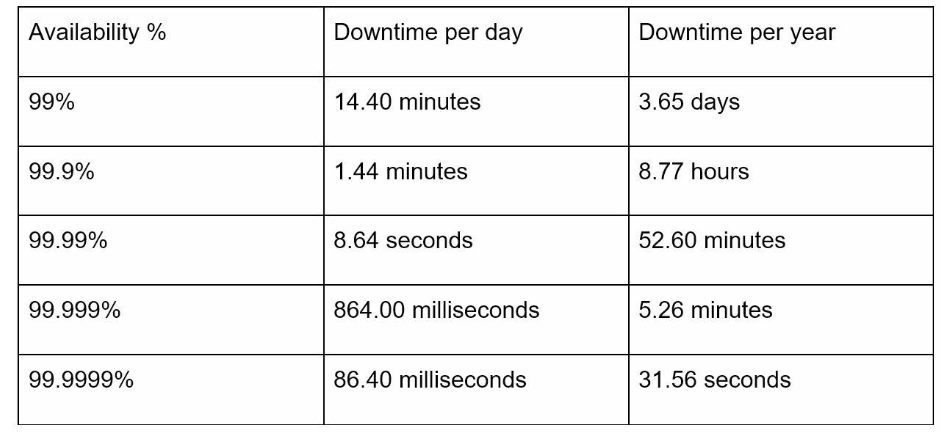

# Chapter 2. Back of the envelope estimation

Back-of-the-envelope calculations are estimates you create using a combination of thought experiments and common performance numbers to get a good feel for which designs will meet your requirements by Jeff Dean, Google Senior

### 1) Power of two
To obtain correct calculations, it is critical to know the data volume unit using the power of 2.
- A byte is a sequence of 8 bits
- An ASCII character uses one byte of memory(8 bits)

### 2) Latency numbers every programmer should know

The length of typical computer operations(released in 2010 by Dr. Dean from Google).

> Notes
ns = nanosecond, µs = microsecond, ms = millisecond
1 ns =  10^-9 seconds
1 µs = 10^-6 seconds = 1,000 ns
1 ms = 10^-3 seconds = 1,000 µs = 1,000,000 ns

> Additional resources
[Branch prediction](https://en.wikipedia.org/wiki/Branch_predictor)
[Mutex(Mutual Exclusion Lock)](https://en.wikipedia.org/wiki/Mutual_exclusion)
[What is commodity internet](https://serverfault.com/questions/206557/what-is-commodity-internet)
[How do compression algorithms compress data so fast](https://scicomp.stackexchange.com/questions/41760/how-do-compression-algorithms-compress-data-so-fast#:~:text=The%20answer%20is%20not%20simple,designed%20to%20be%20reasonably%20quick.)

- Visualization of the above table 

We can get the following with the numbers analyzed:
- Memory is fast, but the disk is slow (L1, L2 cache vs disk, ssd vs hdd)
- Avoid disk seeks if possible
- Simple compression algorithms are fast
- Compress data before sending it over the internet if possible
- Data centers are usually in different regions, and it takes time to send data between them

### 3) Availability numbers
High availability is the ability of a system to be continuously operational for a desirably long period of time

##### SLA
- A service legal agreement(SLA) is a commonly used term for service providers. It formally defines the level of uptime the service will deliver. 
- Uptime is traditionally measured in nines. The more the nines, the better

> Additional resources
[Amazon SLA](https://aws.amazon.com/legal/service-level-agreements/?aws-sla-cards.sort-by=item.additionalFields.serviceNameLower&aws-sla-cards.sort-order=asc&awsf.tech-category-filter=*all)

### 4) Example: Estimate Twitter QPS and storage requirements
> Assumptions:
- 300 million monthly active users
- 50% of users use Twitter daily (150 million)
- Users post 2 tweets per day on average (300 million tweets)
- 10% of tweets contain data (30 million tweets)
- Data is stored for 5 years

> Estimations:

Query per second(QPS) estimates:
- Daily active userS(DAU) = 300 million * 50% = 150 million
- Tweets QPS = 150 million * 2 tweets / 24 hour / 3600 seconds = ~3500(3472.22)
- Peek QPS = 2 * QPS = ~7000(6944.45)

We will only estimate media storage here
- Average tweet size:
    - tweet_id 64 bytes
    - text     140 bytes
    - media     1 MB
- Media storage: 150 million * 2 tweets * 10% * 1MB = 30TB/day (Tera byte, 1024GB = 1TB)
- 5-year media storage: 30TB * 365 * 5 = ~55PB(Peta byte, 1024TB = 1PB)

### 5) Tips
Back-of-the-envelope estimation is a process, 
> Rounding and Approximation

It is difficult to perform complicated math operations during the interview. Simplify the question!
e.g. Do '100,000/10' instead of '99987/9.1'

> Write down your assumptions

The assumption you wrote down can be referenced later!

> Label your units

Write down units to remove ambiguity!
e.g. Write 5KB or 5MB instead of '5'

> Commonly asked back-of-the-envelope estimations

Practice the commonly asked estimations!
e.g. QPS, peak QPS, storage, cache, number of servers, etc
