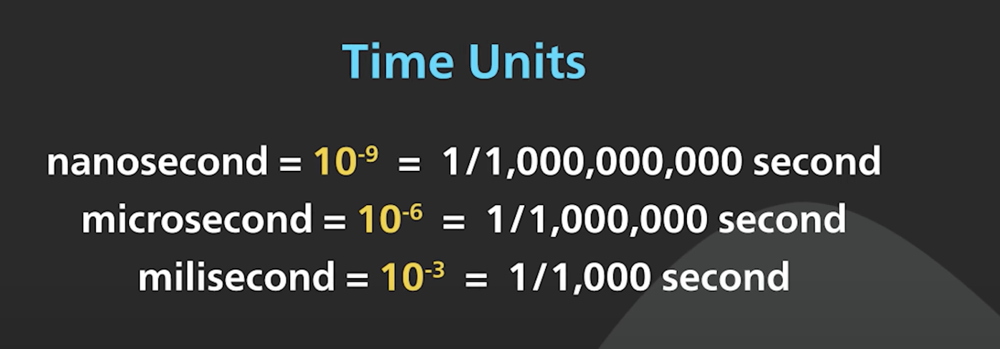

# Chapter 2. Back-of-the-envelope estimation

### 1) Power of Two (2)

**Data volume unit** using the power of 2.

8 bits = 1 byte

2^10 byte = 1KB

2^10 KB (2^20 byte) = 1MB

2^10 MB (2^30 byte) = 1GB

2^10 GB (2^40 byte) = 1TB

2^10 TB (2^50 byte) = 1PB

### 2) Latency numbers every developer should know

Length of typical computer operations.

https://colin-scott.github.io/personal_website/research/interactive_latency.html

**Latency numbers as of 2020 (서버 동작별 지연시간)**

| 동작                                                                                          | 성능            |
| --------------------------------------------------------------------------------------------- | --------------- |
| L1 캐시 참조 (L1 cache reference: 1ns)                                                        | 1 ns            |
| CPU 분기 오예측 (Branch mispredict)                                                           | 5 ns            |
| L2 캐시 참조 (L2 cache reference: 4ns)                                                        | 4ns             |
| 뮤텍스 잠금/해제 (Mutex lock/unlock: 17ns)                                                    | 17ns            |
| 주 메모리 / DRAM 참조 (Main memory reference)                                                 | 100ns           |
| Zippy(현재 Snappy)로 1KB 압축 (Compress 1KB wth Zippy)                                        | 2000ns 또는 2μs |
| 상품 네트워크를 통해 2000바이트 보내기 (Send 2,000 bytes over commodity network)              | 44ns            |
| 솔리드 스테이트 드라이브(SSD) 랜덤 읽기 (SSD random read)                                     | 16μs            |
| 주 메모리에서 순차적으로 1,000,000바이트 읽기 (Read 1,000,000 bytes sequentially from memory) | 3μs             |
| 동일한 데이터 센터에서 왕복 네트워크 요청 (Round trip in same datacenter)                     | 500μs           |
| SSD에서 순차적으로 1,000,000바이트 읽기 (Read 1,000,000 bytes sequentially from SSD)          | 49μs            |
| 디스크(하드 드라이브/자기 드라이브) 탐색 (Disk seek)                                          | 2ms             |
| 디스크에서 순차적으로 1,000,000바이트 읽기 (Read 1,000,000 bytes sequentially from disk)      | 825μs           |
| California 에서 네덜란드 왕복으로 Packet 보내기                                               | 150ms           |

**Conclusions:**

- Memory is fast but the disk is slow
- Avoid disk seeks if possible
- Simple compression algorithms are fast
- Compress data before sending it over the internet if possible
- Data centers are usually in different regions, and it takes time to send data between them.

### 3) Availability numbers

**High availability**: the ability of a system to be continuously operational. Measured as a percentage (%)

**Service level agreement**: an agreement between the service provider and the customer, and this agreement defines the level of **uptime** your service will deliver.

e.g. Amazon, Google, Microsoft’s SLA: 99.9% or above.

- Uptime is traditionally measured in nines.
- The more nines, the better. The number of nines correlate to the expected system downtime.

### Example: Estimate Twitter QPS and storage requirements

**Assumptions:**

- 300 million monthly active users
- 50% of users use Twitter daily
- Users post 2 tweets per day on average
- 10% of tweets contain media
- Data is stored for 5 years

**Estimations:**

Query per second (QPS) estimate:

- Daily active users (DAU) = 300 million \* 50% = 150 million
- Tweets QPS = 150 million \* 2 tweets / 24 hour / 3600 seconds = ~3500
- Peak QPS. = 2 \* QPS = ~7000

**Media storage required:**

- Average tweet size:
  - tweet_id: 64 bytes
  - test: 140 bytes
  - media: 1 MB
- Media storage: 150 million _ 2 _ 10% \* 1MB = 30 TB per day
- 5-year media storage: 30 TB _ 365 _ 5 = ~55 PB

### Tips

- Process > Accurate results
- Rounding and approximation
- Write down your assumption
- Label your units
- Commonly asked estimations: QPS, peak QPS, storage, cache, number of servers, etc.
