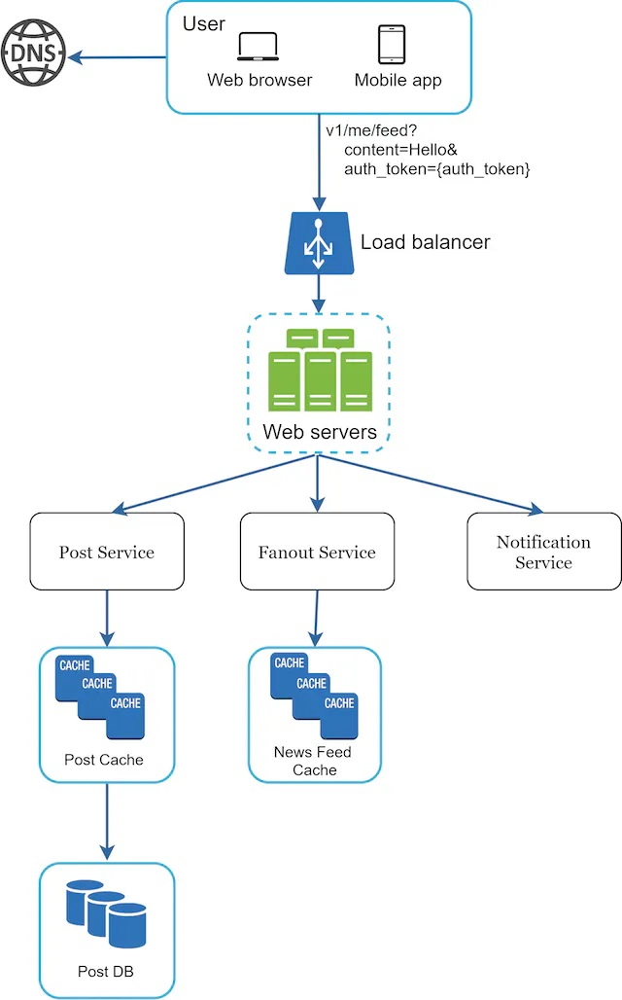
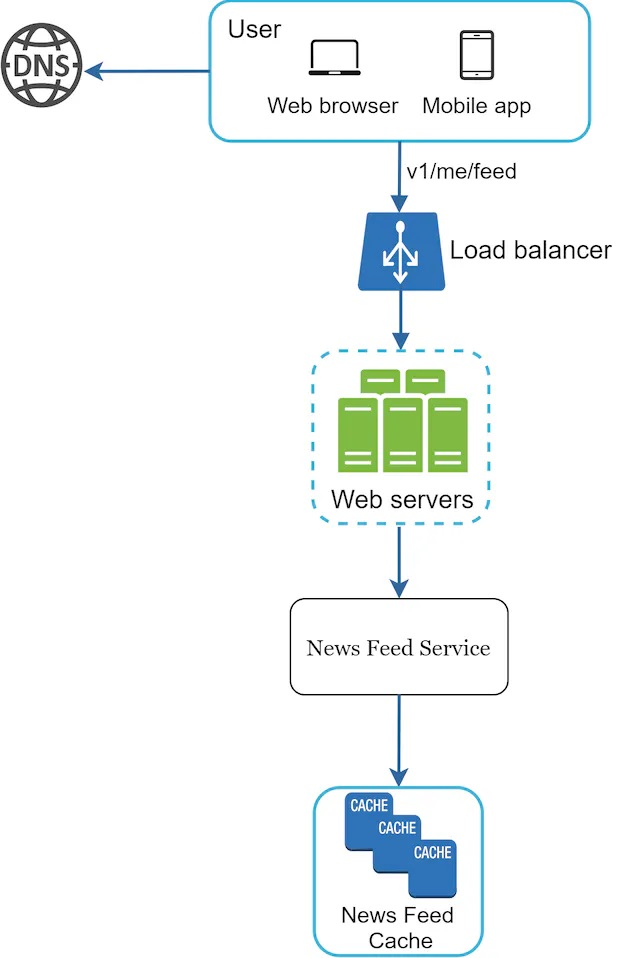
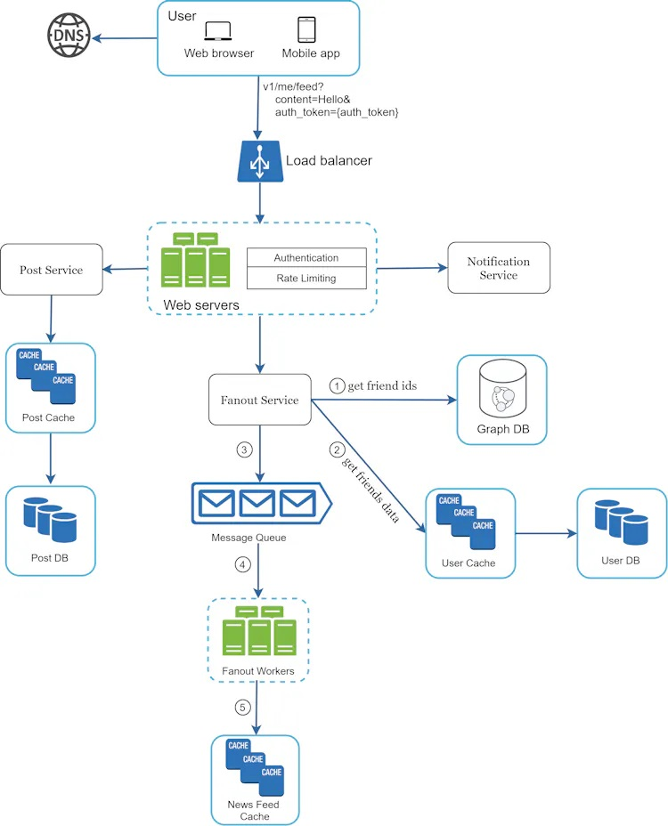
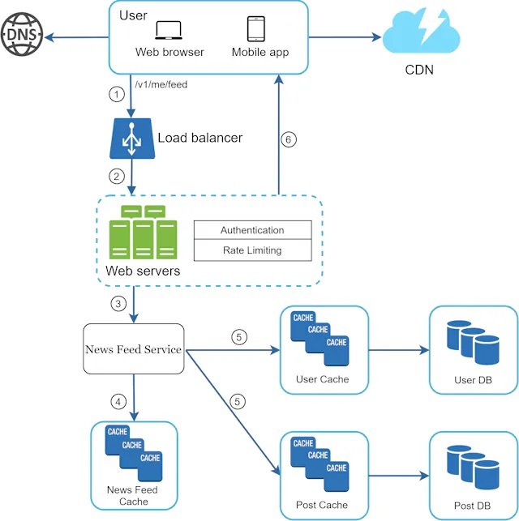

# 03. A framework for system design interviews
No one expects you to design a real-world system in an hour. The system design interview simulates real-life problem solving where two co-workers collaborate on an ambiguous problem and come up with a solution that meets their goals. 
### 4-step process for effective system design interview
#### 1. Step 1 - Understand the problem and establish design scope
- Do not jump right in to give a solution. Think deeply and ask questions to clarify requirements and assumptions.
- Ask questions to understand the exact requirements.
#### 2. Step 2 - Propose high-level design and get buy-in
- Develop a high-level design and reach an agreement with the interviewer on the design
    - Treat your interviewer as a teammate and work together
    - Draw box diagrams
    - Do back-of-the envelope calculations. Communicate with your interviewer
- Should we include API endpoints and databae shema here? -> It depends on the problem.
- High-level design example - A news feed system
    - Design is divided into 2 flows
        - Feed publishing  (질문: v1/me/feed? 이런표현은 어디서 온 표현일까?, News feed cache 는 각 follower또는 friends 들 별로 가지고 있는 news feed cache 인건가???)
        
		
        - Neewsfeed building
        
		
#### 3. Step 3 - Design deep dive
- At this step, already achieved the following objectives:
    - Agreed on the overall goals and feature scope
    - Sketched out a high-level blueprint for the overall design
    - Obtained feedback from your interviewer on the high-level design
    - Had some initial ideas about areas to focus on in deep dive based on her feedback
- You shall work with the interviewer to identify and prioritize components in the architecture. 
- Time management is essential. Try not to get into unnecessary details.
- Example - A news feed system
We will investigate two of the most important use cases:
    - Feed publishing  (질문1. Message queue 에 들어가는 data 가 friends list & new post id 가 맞나? )
    
	
    - News feed retrieval
    
	
#### 4. Step 4 - Wrap up
- The interviewer might want you to identify the system bottlenecks and discuss potential improvements. Never say your design is perfect. 
- **Dos**
    - Always ask for clarification.
    - Understand the requirements of the problem.
    - There is neither the right answer nor the best answer.
    - Communicate with your interview.
    - Suggest multiple approaches if possible
    - Once you agree with your interviewer on the blueprint, go into details on each component.Design the most critical components first.
    - Bounce ideas off the interviewer.
    - Never give up.
- **Don'ts**
    - Don't be unprepared for typical interview questions.
    - Don't jump into a solution without clarifying the requirements and assumptions
    - Don't go into too much detail. Give the high-level design first then drills down
    - If you get stuck, don't hesitate to ask for hints.
    - Communicate. Don't think in silence
    - Don't think your interview is done once you give the design. You are not done until your interviewer says you ar done. Ask for feedback early and often. 
### Time allocation on each step
- **Time management** : System design interview questions are usually very boad, and 45 minutes or an hour is not enough to cover the entire design.
    - Step 1. Understand the problem and establish design scope: **3~10 minutes**
    - Step 2. Propose high-level design and get buy-in : **10~15 minutes**
    - Step 3. Design deep dive: **10~25 minutes**
    - Step 4. Wrap: **3~5 minutes**